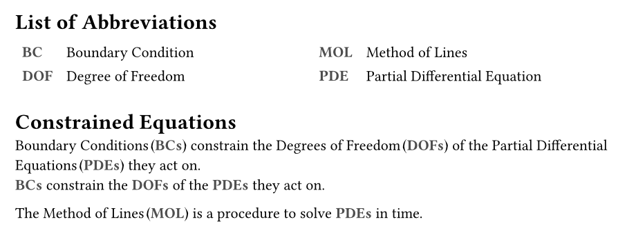

# Abbr -- eviations made simple

Short package for making the handling of abbreviations, acronyms, and
initialisms _easy_.

Declare your abbreviations anywhere, use everywhere -- they get picked up
automatically.

## Features
- Automatic plurals, with optional overrides.
- Automatic 1- or 2-column sorted list of abbreviations
- Automatic links to list of abbreviations, if included.
- styling configuration

## Getting started

```typst
#import "@preview/abbr:0.2.0"

#abbr.list()
// alternative: #abbr.load("example.csv")
#abbr.make(
  ("PDE", "Partial Differential Equation"),
  ("BC", "Boundary Condition"),
  ("DOF", "Degree of Freedom", "Degrees of Freedom"),
)

= Constrained Equations

#abbr.pla[BC] constrain the #abbr.pla[DOF] of the #abbr.pla[PDE] they act on.\
#abbr.pla[BC] constrain the #abbr.pla[DOF] of the #abbr.pla[PDE] they act on.

#abbr.add("MOL", "Method of Lines")
The #abbr.a[MOL] is a procedure to solve #abbr.pla[PDE] in time.
```



## API Reference
### Configuration
- **config**`(style, space-char)`\
Set a callable for styling the short version in the text, and a character to be
used between the long and short form. Default: `sym.space.nobreak.narrow`.

### Creation
- **add**`(short, long, long-plural)`\
Add single entry to use later.\
`long-plural` is *optional*, if not given but used, an `s` is appended to create a
plural.

- **make**`(list, of, entries)`\
Add multiple entries, each of the form `(short, long, long-plural)`.

- **load**`(filename, delimiter:",")`\
Load abbreviations from `csv` file, where each row is an entry of the form
`short,long` or `short,long,long-plural`. If you need the "`,`" character in
your `short` or `long` form, it is possible to set and use a different
`delimiter`.

### Listing
- **list**`(title)`\
Create an outline with all abbreviations in short and expanded form

### Usage
- **s**`()` - short\
force short form of abbreviation
- **l**`()` - long\
force long form of abbreviation
- **lo**`()` - long only\
force only the long form of abbreviation
- **a**`()` - auto\
first occurence will be long form, the rest short
- **pls**`()` - plural short\
plural short form
- **pll**`()` - plural long\
plural long form
- **pllo**`()` - plural long only\
only plural long form
- **pla**`()` - plural automatic\
plural. first occurence long form, then short


## Why yet another Abbreviations package?

This mostly exists because I started working on it before checking if somebody
already made a package for it. After I saw that e.g. `acrotastic` exists, I kept
convincing myself a new package still makes sense for the following reasons:
* Getting to know Typst
* More automatic handling than other packages
* Ability to keep keys as [Content] instead of having to stringify everything

Especially the last part seems to lower the friction of writing for me. It seems
silly, I know.

## Contributing

Please head over to the [hub](https://sr.ht/~slowjo/typst-packages) to find the
mailing list and ticket tracker.

Or simply reach out on IRC ([#typst on
libera.chat](https://web.libera.chat/gamja/?autojoin=#typst))!
