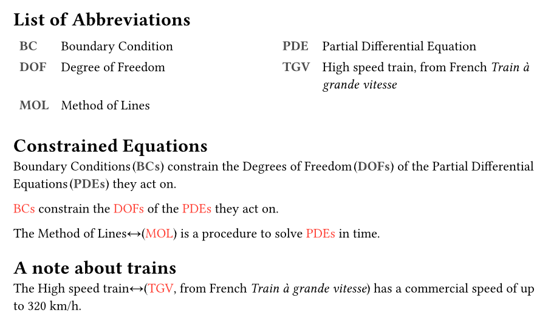

# Abbr -- eviations made simple

Short package for making the handling of abbreviations, acronyms, and
initialisms _easy_.

Declare your abbreviations anywhere, use everywhere -- they get picked up
automatically.

## Features
- Automatic plurals, with optional overrides.
- Automatic 1- or 2-column sorted list of abbreviations
- Automatic links to list of abbreviations, if included.
- styling configuration
- **NEW** Quality-of-Life improvement: reference-style usage
- **NEW** Optional alternate definitions

## Getting started

```typst
#import "@preview/abbr:0.3.0"

#show: abbr.show-rule

#abbr.list()
#abbr.load("example.csv")
#abbr.load-alt("example_alt.csv", supplement: "from French")
// alternative:
// #abbr.make(
//   ("PDE", "Partial Differential Equation"),
//   ("BC", "Boundary Condition"),
//   ("DOF", "Degree of Freedom", "Degrees of Freedom"),
//   ("TGV", "High speed train"),
// )
// #abbr.add-alt("TGV","Train à haute vitesse", supplement: "from French")

= Constrained Equations

@BC:pla constrain the @DOF:pla of the @PDE:pla they act on.

#abbr.config(style: it => text(red, it), space-char: sym.arrow.l.r)

@BC:pla constrain the @DOF:pla of the @PDE:pla they act on.

#abbr.add("MOL", "Method of Lines")
The @MOL is a procedure to solve @PDE:pla in time.

= A note about trains

The @TGV has a commercial speed of up to 320 km/h.
```



### Alternate definitions

Sometimes, especially when mixing languages between the text and abbreviations,
you might want to include two definitions for the same abbreviation. See the
example above.

## API Reference
### Configuration
- **config**`(style, space-char, pluralize-short)`\
`style` sets a callable for styling the short version in the text.\
`space-char` sets the character to be used between the long and short form.
Default: `sym.space.nobreak.narrow`.\
`pluralize-short`: If set to `false`, suppresses the pluralization
of abbreviated forms. Default: `true`.

### Creation
- **load**`(filename, delimiter:",")`\
Load abbreviations from `csv` file, where each row is an entry of the form
`short,long` or `short,long,long-plural`. If you need the "`,`" character in
your `short` or `long` form, it is possible to set and use a different
`delimiter`.

- **load-alt**`(filename, delimiter:",", supplement:"or")`\
Load alternate definitions for already existing entries from a `csv` file,
where each row is an entry of the form `short,alternate(,supplement)`. If `supplement`
is omitted from the `csv`, the supplement from the function's arguments will be used.

- **add**`(short, long, long-plural)`\
Add single entry to use later.\
`long-plural` is *optional*, if not given but used, an `s` is appended to create a
plural.

- **add-alt**`(short, alternate, supplement)`\
Add an alternate definition to an already existing entry.\
`supplement` is *optional*, if not given, `"or"` will be used as the alternate definition supplement.

- **make**`(list, of, entries)`\
Add multiple entries, each of the form `(short, long, long-plural)`.

### Listing
- **list**`(title)`\
Create an outline with all abbreviations in short and expanded form

### Usage
`abbr` now includes a show rule that automatically discovers and styles your
abbreviations, reference-style. Make sure to include
```typst
show: abbr.show-rule
```
before you use reference-style abbreviations, then they'll be available to use
as
```typst
@<abbreviation>[:<specifier>]
```
where `<abbreviation>` is a registered short form, and `<specifier>` is an
optional that defines which form shall be placed into the document. If it is
ommited, `a` is assumed.
- **s** - short\
force short form of abbreviation
- **l** - long\
force long form of abbreviation
- **lo** - long only\
force only the long form of abbreviation
- **lsf** - long, short first\
like `l`, but will display the short form before the long form
- **a** - auto\
first occurence will be long form, the rest short
- **asf** - automatic, short first\
like `a`, but will display the short form before the long form
- **pls** - plural short\
plural short form
- **pll** - plural long\
plural long form
- **pllo** - plural long only\
only plural long form
- **pla** - plural automatic\
plural. first occurence long form, then short

If the reference-style is not wanted, the specifiers are also available in the
module as functions taking the short form as a single parameter.


## Why yet another Abbreviations package?

This mostly exists because I started working on it before checking if somebody
already made a package for it.

In the meantime it's started to have a bit of a life of its own. But mostly:

It's FUN! You should also try creating a package yourself :)

## Contributing
Yes, please!

For questions or suggestions please reach out to me over IRC (mention slowjo in
[#typst on libera.chat](https://web.libera.chat/gamja/?autojoin=#typst), then
stick around, IRC is async)\
or send an email to [~slowjo/public-inbox@lists.sr.ht](mailto:~slowjo/public-inbox@lists.sr.ht).
