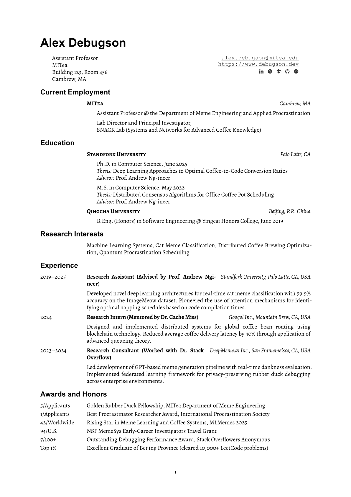
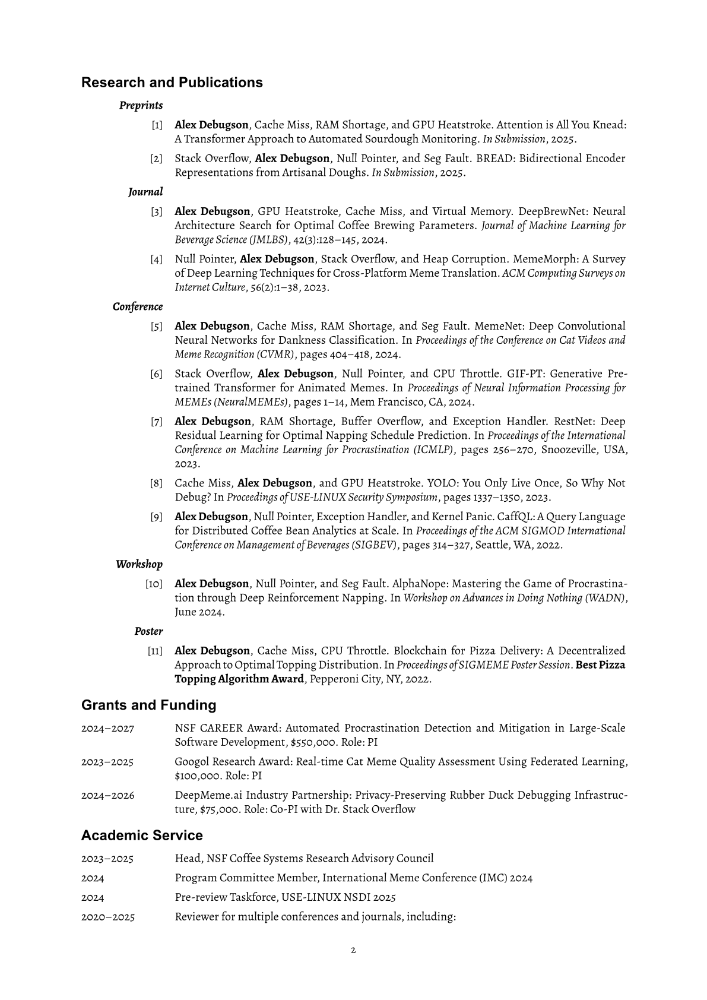
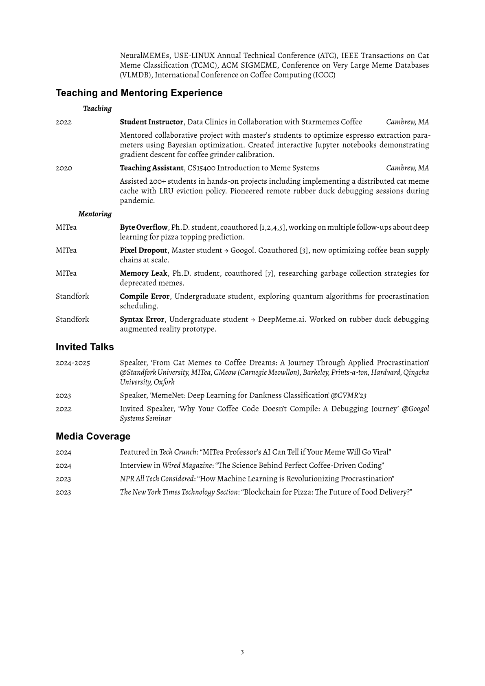

# Acadennial CV

A professional, elegant academic CV template built with [Typst](https://typst.app/). Designed for researchers and academics who value clean typography, structured content, and maintainable source code. The name "Acadennial" reflects a _perennial academic_ CV: a single, polished record that grows with your career.

<table>
<tr>
  <td>
    
  </td>
  <td>
    
  </td>
  <td>
    
  </td>
</tr>
</table>

View the full example: [examples/cv.pdf](./examples/cv.pdf)

## Features

- **Powered by Typst** — Faster compilation, simpler syntax, and easier setup than LaTeX; works locally or in the [Typst web app](https://typst.app/)
- **Highly customizable** — Configure fonts, margins, column ratios, text weights, and spacing through simple parameters
- **Three-column layout system** — Flexible grid-based layout with configurable column widths and gutters for precise alignment
- **Modern typography** — Uses Alegreya for body text and Helvetica for headings, with careful spacing and alignment
- **Structured content helpers** — Dedicated functions for employment history, research entries, and publications with consistent formatting
- **Automatic publication numbering** — Continuous numbering across preprints, journals, conferences, workshops, and posters
- **Academic social icons** — Built-in icons for Google Scholar, LinkedIn, GitHub, ORCID, X/Twitter, and custom links with customizable styling

## Quick Start

### 1. Install Required Fonts

This template uses the **Alegreya** font family. Download and install the fonts before compiling:

1. Visit [Google Fonts - Alegreya](https://fonts.google.com/specimen/Alegreya)
2. Click "Download family" to get the font files
3. **Important**: Typst currently does not support variable fonts. Install the **static** font files from the `static/` folder in the downloaded package
4. Install the fonts on your system:
   - **macOS**: Double-click each `.ttf` file and click "Install Font"
   - **Windows**: Right-click each `.ttf` file and select "Install"
   - **Linux**: Copy `.ttf` files to `~/.local/share/fonts/` and run `fc-cache -f -v`

### 2. Initialize the Template

Use the following CLI command to initialize a new project from this template:

```bash
typst init @preview/acadennial-cv
```

Or search for **acadennial-cv** on [Typst Universe](https://typst.app/universe/) to use it directly in the web app.

## Usage Guide

The typical workflow for creating your CV:

1. **Configure default column layout** — Set up `col-cfg` with your preferred column widths and gutter spacing
2. **Bind configuration to functions** — Use `.with()` to apply the configuration to all helper functions
3. **Initialize the resume** — Set up document metadata and author information
4. **Add content sections** — Use Typst headings (`==`) and helper functions to add education, experience, publications, etc.

**Best practice**: Refer to [`template/cv.typ`](./template/cv.typ) for a complete working example with all sections and helper functions.

### Basic Structure

```typst
#import "@preview/acadennial-cv:0.1.0": *

// 1. Default function configurations
#let col-cfg = (
  c1-len: 15%, c2-len: 1fr, c3-len: auto, col-gutter: 1em,
)
#let employment-head = employment-head.with(..col-cfg)
#let meta-entry-item-list = meta-entry-item-list.with(..col-cfg)
// ... bind other functions

// 2. Initialize resume
#show: resume.with(
  col-args: (c1-len: col-cfg.c1-len, c2-len: col-cfg.c2-len, col-gutter: col-cfg.col-gutter),
  author-info: (name: "Your Name", primary-info: [...], secondary-info: [...]),
)

// 3. Add content sections
== Education
#employment-head-item-list(
  (c2: "University Name", c3: "City, State", body: [Ph.D. in Computer Science, 2025]),
)

== Publications
#pubs-reset()
#pub-item-list([*Your Name*, Co-authors. Paper Title. _Conference_, 2024.])
```

### Section-Specific Customization

You can override default configurations for individual sections:

```typst
// Override text weight for a specific section
== Academic Service
#meta-entry-item-list(
  c2-text-args: (weight: "regular"),  // Non-bold titles for this section only
  (c1: "2024", c2: "Program Committee Member, Conference Name"),
)
```

For detailed function parameters and advanced customization, see the **API Reference** below.

## API Reference

### `resume()` — Document Setup

Initialize the CV document with global settings and author information.

```typst
#show: resume.with(
  // Paper and layout
  paper: "a4", // or "us-letter"
  margin: (left: 0.95in, right: 0.95in, top: 0.9in, bottom: 0.9in),

  // Typography
  text-args: (
    font-family: "Alegreya",
    font-size: 10pt,
  ),
  heading-args: (
    font-family: "Arial",
    level1-font-size: 20pt,
    level3-align: right,
  ),

  // Paragraph spacing
  par-args: (
    leading: 0.55em,
    spacing: 1em,
  ),

  // Link styling
  link-line-args: (
    stroke: 0.5pt + luma(200),
    offset: 2pt,
  ),

  // Column configuration
  col-args: (
    c1-len: 15%,
    c2-len: 1fr,
    col-gutter: 1em,
  ),

  // Author configuration
  author-args: (
    web-font-family: "Courier New",
    web-font-size: 0.95em,
  ),

  // Author information
  author-info: (
    name: "Your Name",
    primary-info: [
      Position Title \
      Department Name \
      Institution \
      City, State
    ],
    secondary-info: [
      #link("mailto:email@university.edu")[email\@university.edu] \
      #link("https://website.com")[https://website.com]
    ],
  ),
)
```

**Parameters:**
- `paper`: Page size (`"a4"` or `"us-letter"`)
- `margin`: Page margins (dictionary with `left`, `right`, `top`, `bottom`)
- `text-args`: Body text settings (`font-family`, `font-size`)
- `heading-args`: Heading styles (`font-family`, `level1-font-size`, `level3-align`)
- `par-args`: Paragraph spacing (`leading`, `spacing`)
- `link-line-args`: Link underline styling (`stroke`, `offset`)
- `col-args`: Default column configuration for all functions
- `author-info`: Author name and contact information

---

### Employment Functions

#### `employment-head(c2, c3, ...)`

Institution header without body content.

```typst
#employment-head("Stanford University", "Stanford, CA")
```

**Parameters:**
- `c2`: Institution name (displayed in small caps, bold)
- `c3`: Location (displayed in italics)
- `c1-len`, `c2-len`, `c3-len`: Column widths
- `col-gutter`: Space between columns
- `c2-text-args`: Text styling for institution name (default: `(weight: "bold")`)
- `c3-text-args`: Text styling for location (default: `(style: "italic")`)

#### `employment-head-item(c2, c3, body, ...)`

Institution header with indented body content.

```typst
#employment-head-item(
  "Stanford University",
  "Stanford, CA",
)[
  Ph.D. in Computer Science, June 2025 \
  _Thesis:_ Deep Learning for Systems \
  _Advisor:_ Prof. Name
]
```

**Additional Parameters:**
- `body`: Content to display below the header (with left padding)
- `body-pad-left`: Left padding for body content (default: `2em`)

#### `employment-head-item-list(...items)`

Batch render multiple institution items.

```typst
#employment-head-item-list(
  (c2: "Stanford", c3: "CA", body: [Ph.D. in CS, 2025]),
  (c2: "MIT", c3: "MA", body: [B.S. in CS, 2020]),
)
```

**Additional Parameters:**
- `item-spacing`: Vertical space between items (default: `1em`)

---

### Meta Entry Functions

#### `meta-entry(c1, c2, c3, ...)`

Three-column entry without body content.

```typst
#meta-entry("2024", "Best Paper Award", "Conference Name")
```

**Parameters:**
- `c1`: Left column (typically dates or labels)
- `c2`: Middle column (title or description, bold by default)
- `c3`: Right column (location or affiliation, italic by default)
- `c1-text-args`: Text styling for left column (default: `(:)` — no special styling)
- `c2-text-args`: Text styling for middle column (default: `(weight: "bold")`)
- `c3-text-args`: Text styling for right column (default: `(style: "italic")`)
- `c1-len`, `c2-len`, `c3-len`, `col-gutter`: Column configuration
- `align`: Column alignment (default: `(left, left, right)`)

#### `meta-entry-item(c1, c2, c3, body, ...)`

Three-column entry with body content.

```typst
#meta-entry-item(
  "2023–2024",
  "Research Scientist",
  "Company Inc., City, State",
)[
  Developed machine learning systems for production deployment.
  Achieved 40% latency reduction through model optimization.
]
```

#### `meta-entry-item-list(...items)`

Batch render multiple entries.

```typst
#meta-entry-item-list(
  (
    c1: "2024",
    c2: "Research Intern",
    c3: "Google, CA",
    body: [Worked on distributed systems.],
  ),
  (
    c1: "2023",
    c2: "Teaching Assistant",
    c3: "Stanford, CA",
    body: [Taught CS101 to 200+ students.],
  ),
)
```

**Configuration Override Example:**

```typst
// Override default bold text for a specific section
#meta-entry-item-list(
  c2-text-args: (weight: "regular"),  // Non-bold titles
  item-spacing: 0.8em,                // Tighter spacing
  (c1: "2024", c2: "Program Committee Member, ICML"),
  (c1: "2023", c2: "Reviewer, NeurIPS"),
)
```

---

### Publication Functions

#### `pubs-reset()`

Reset the publication counter to 1. Call this once before your first publication section.

```typst
== Publications
#pubs-reset()
```

#### `pub-item(body, ...)`

Single numbered publication item.

```typst
#pub-item[
  *Your Name*, Co-author 1, Co-author 2. Paper Title.
  In _Proceedings of ICML_, pages 1–14, 2024.
]
```

Publications are automatically numbered `[1]`, `[2]`, etc., in order of appearance.

#### `pub-item-list(...items)`

Batch render multiple publications.

```typst
=== Conference
#pub-item-list(
  [*Your Name*, Authors. Paper 1. _ICML_, 2024.],
  [*Your Name*, Authors. Paper 2. _NeurIPS_, 2023.],
)

=== Journal
#pub-item-list(
  [*Your Name*, Authors. Article Title. _Nature_, 2024.],
)
```

**Parameters:**
- `c1-len`, `c2-len`, `c3-len`: Column widths (default: publication number uses right alignment)
- `col-gutter`: Space between columns (default: `1em`)
- `item-spacing`: Vertical space between items (default: `1em`)

---

### Academic Social Icons

The template provides six pre-configured icons for academic and professional links, commonly used in the `secondary-info` section of your CV header.

#### Available Icons

```typst
#google-scholar-icon()  // Google Scholar
#linkedin-icon()        // LinkedIn
#github-icon()          // GitHub
#orcid-icon()           // ORCID
#x-icon()               // X (formerly Twitter)
#link-icon()            // Generic link/website
```

#### Usage Example

```typst
#show: resume.with(
  author-info: (
    name: "Your Name",
    secondary-info: [
      #link("mailto:email@university.edu")[email\@university.edu] \
      #link("https://yourwebsite.com")[https://yourwebsite.com] \
      #link("https://scholar.google.com/citations?user=ID")[#google-scholar-icon()]
      #link("https://linkedin.com/in/username")[#linkedin-icon()]
      #link("https://github.com/username")[#github-icon()]
      #link("https://orcid.org/0000-0000-0000-0000")[#orcid-icon()]
    ],
  ),
)
```

#### Default Configuration

Icons are pre-configured in `lib.typ` with these default settings:

```typst
#let configured-icons = configure-icon-registry(
  color: luma(20%),   // Dark gray color
  height: 0.95em,     // Icon height relative to text
  baseline: 20%,      // Vertical alignment
)
```

#### Custom Icon Styling

To customize icon appearance globally, reconfigure the icon registry at the top of your CV:

```typst
#import "@preview/acadennial-cv:0.1.0": *

// Custom icon configuration
#let custom-icons = configure-icon-registry(
  color: rgb("#2563eb"),  // Blue color
  height: 1em,            // Slightly larger
  baseline: 15%,          // Different alignment
)

// Override default icons
#let google-scholar-icon = custom-icons.at("google-scholar-icon")
#let linkedin-icon = custom-icons.at("linkedin-icon")
#let github-icon = custom-icons.at("github-icon")
#let orcid-icon = custom-icons.at("orcid-icon")
#let x-icon = custom-icons.at("x-icon")
#let link-icon = custom-icons.at("link-icon")

// Continue with resume setup...
```

#### Per-Icon Customization

You can also customize individual icons inline:

```typst
#link("https://scholar.google.com")[
  #google-scholar-icon(color: rgb("#4285f4"), height: 1.1em)
]
```

**Icon Parameters:**
- `color`: Icon color (accepts Typst color values: `luma()`, `rgb()`, etc.)
- `height`: Icon height (e.g., `0.95em`, `1em`, `12pt`)
- `baseline`: Vertical alignment offset as percentage

---

### Configuration Hierarchy

The template uses a **hierarchical configuration system** with three levels:

1. **Global defaults** (in `lib.typ`)
   ```typst
   #let default-c1-len = 15%
   #let default-c2-len = 1fr
   #let default-col-gutter = 1em
   ```

2. **Document-level defaults** (top of your CV)
   ```typst
   #let col-cfg = (c1-len: 15%, c2-len: 1fr, col-gutter: 1em)
   #let meta-entry-item-list = meta-entry-item-list.with(..col-cfg)
   ```

3. **Section-level overrides** (per function call)
   ```typst
   #meta-entry-item-list(
     c2-text-args: (weight: "regular"),  // Override for this section only
     (c1: "2024", c2: "Content"),
   )
   ```

**Priority**: Section-level > Document-level > Global defaults

**Common customizations:**
- **Column widths**: Adjust `c1-len` for wider date columns, `col-gutter` for spacing
- **Text styling**: Override `c1-text-args`, `c2-text-args`, `c3-text-args` to change weight, style, size, color
- **Spacing**: Modify `item-spacing` to control vertical spacing between entries
- **Alignment**: Change `align` parameter for different column alignments

## Contributing

Contributions are welcome! Please feel free to submit issues and pull requests.

## License

This project is licensed under the [MIT License](LICENSE).

## Acknowledgments

- The layout and tone are inspired by [Shinan Liu – A Researcher in Networking, Security, and ML Systems](https://www.shinan.info/)

- This template depends on the following Typst packages:
  - [scienceicons](https://github.com/continuous-foundation/scienceicons) (MIT License)
