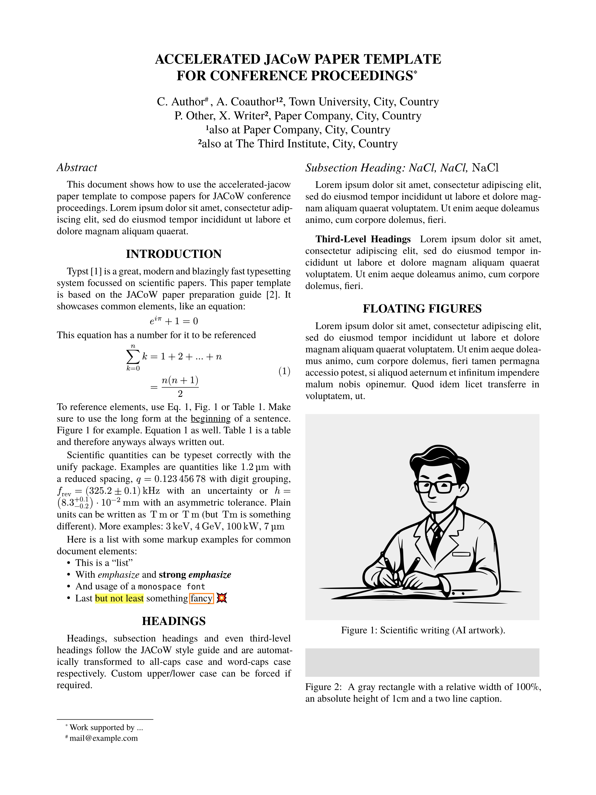

# Accelerated JACoW template for typst

Paper template for conference proceedings in accelerator physics.

Based on the JACoW guide for preparation of papers
available at https://jacow.org/.

## Usage

**Web app:**  
In the [typst web app](https://typst.app) select "start from template" and search for the accelerated-jacow template.

**CLI:**  
Run these commands inside your terminal:
```sh
typst init @preview/accelerated-jacow
cd accelerated-jacow
typst watch paper.typ
```



## Licence

Files inside the template folder are licensed under MIT-0. You can use them without restrictions.  
The citation style (CSL) file is based on the IEEE style and licensed under the [CC BY SA 4.0](https://creativecommons.org/licenses/by-sa/4.0/) compatible [GPLv3](https://www.gnu.org/licenses/gpl-3.0.html) license.  
All other files are licensed under [GPLv3](https://www.gnu.org/licenses/gpl-3.0.html).  
