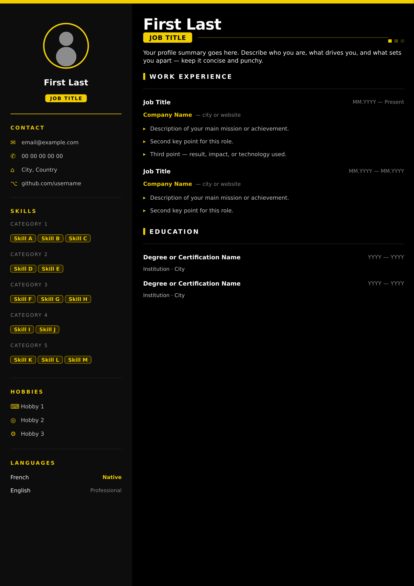
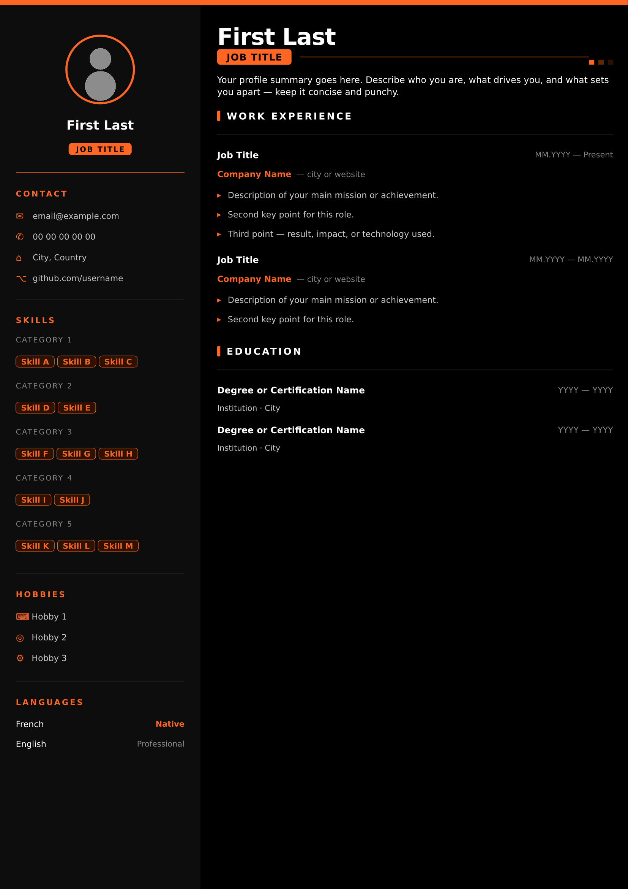
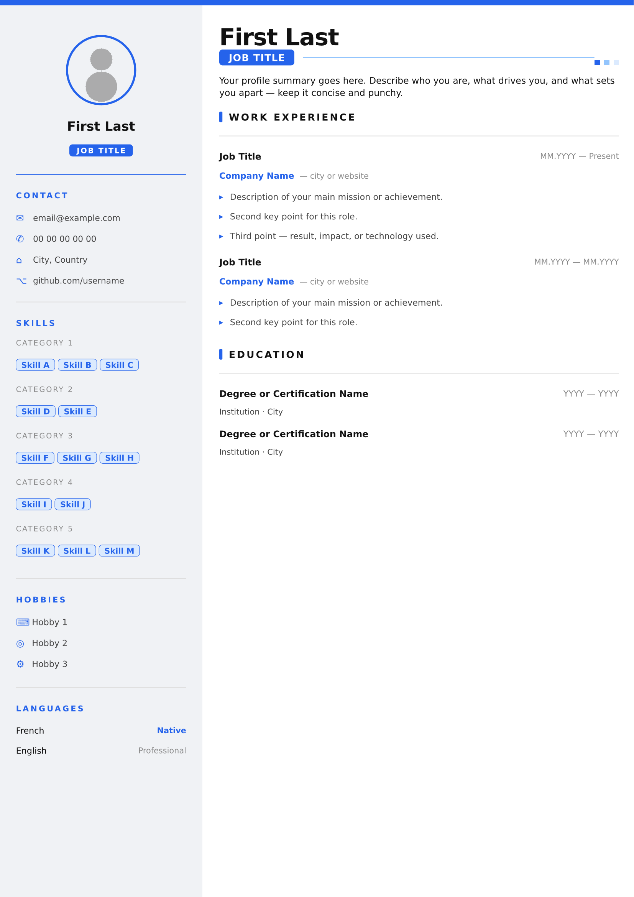

# Typst CV Template

A clean, dark-themed single-page CV template built with [Typst](https://typst.app).  
All content lives in one configuration block at the top of the file — no need to touch the layout.

## Previews

| Dark Yellow | Dark Orange | Light Blue |
|---|---|---|
|  |  |  |

## Features

- Single accent color variable — one line to retheme everything
- All personal data in a single config block at the top
- Skills, experience, education and hobbies driven by arrays — just add entries
- Compact single-page layout with sidebar
- Three ready-to-use color themes included

## Requirements

Install [Typst](https://typst.app) — via the CLI:

```bash
cargo install typst-cli
# or with the installer:
# https://github.com/typst/typst/releases
```

## Usage

1. Clone or download this repository
2. Open `cv.typ` and fill in the `CONFIGURATION` section at the top
3. Replace `photo.png` with your own photo (same folder)
4. Compile:

```bash
typst compile cv.typ cv.pdf
```

## Changing the accent color

Open `cv.typ` and edit this single line:

```typst
#let ACCENT = rgb("#F2CF00")  // ← change this value
```

That's it — the color propagates everywhere automatically.

## Included themes

| File | Theme |
|---|---|
| `cv.typ` | Dark background, yellow accent |
| `cv-orange.typ` | Dark background, orange accent |
| `cv-light.typ` | Light background, blue accent |

## License

MIT — use freely, attribution appreciated.
