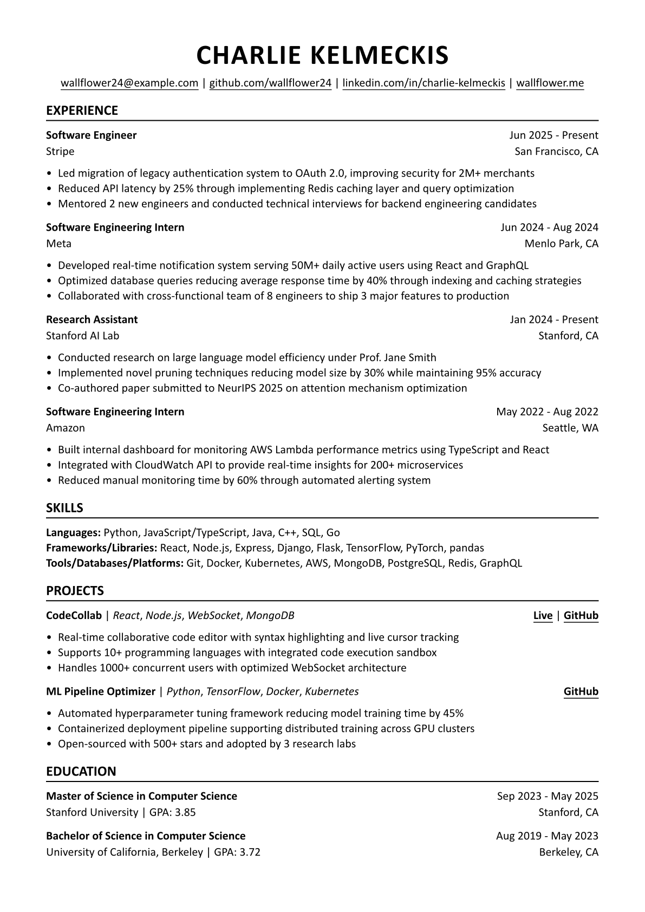

A clean, minimal Typst resume template with flexible, customizable sections.

## Getting Started

### via Typst Web App
1. Log in to your [Typst](https://typst.app/) account or create one if you haven't already.
2. From the Dashboard, select "Start from template".
3. Search for "acorn-resume" and select it.
4. Enter a project title and click "Create".

Voila! You can now start editing the template.

**Or**<br>

You can go to [Typst Universe](https://typst.app/universe/search), search for "acorn-resume" and click "Create project in app".

### via Typst CLI
Ensure you have [Typst](https://github.com/typst/typst#installation) installed, then run:

```bash
typst init @preview/acorn-resume:0.1.0
```
            
## Example Resume



## Usage
### Configuration
Customize the global document settings.

```typst
#show: resume.with(
  author: name,
  margin: (
    x: 1.5cm,
    y: 1.5cm,
  ),
  font: "Calibri",
  font-size: 11pt,
  link-style: (
    underline: true,
    color: black,
  )
)
```

### Header
Add your name and contact details in the header.

```typst
#header(
  name: name,
  contacts: (
   ("mailto:" + email, email),
   (github, "github.com/wallflower24"),
   (linkedin, "linkedin.com/in/charlie-kelmeckis"),
   (personal-site, "wallflower.me"),
  )
)
```

### Experience
Add work experience entries with role, date, organization, location and details.

```typst
#exp(
  role: "Software Engineering Intern",
  date: "Jun 2024 - Aug 2024",
  organization: "Meta",
  location: "Menlo Park, CA",
  details: [
    - Developed real-time notification system serving 50M+ daily active users using React and GraphQL
    - Optimized database queries reducing average response time by 40% through indexing and caching strategies
    - Collaborated with cross-functional team of 8 engineers to ship 3 major features to production
  ],
)
```

### Skills
List your skills as you want. For example, you can organized by category, as shown in the example.

```typst
#pad(
  top: 0.15em,
  [
    *Languages:* Python, JavaScript/TypeScript, Java, C++, SQL, Go \
    *Frameworks/Libraries:* React, Node.js, Express, Django, Flask, TensorFlow, PyTorch, pandas \
    *Tools/Databases/Platforms:* Git, Docker, Kubernetes, AWS, MongoDB, PostgreSQL, Redis, GraphQL \
  ]
)
```

### Project
Add project entries with the technologies used, demo or code links, and detailed descriptions.

```typst
#project(
  name: "CodeCollab",
  technologies: ("React", "Node.js", "WebSocket", "MongoDB"),
  live-url: "https://codecollab-demo.com",
  repo-url: "https://github.com/wallflower24/codecollab",
  details: [
    - Real-time collaborative code editor with syntax highlighting and live cursor tracking
    - Supports 10+ programming languages with integrated code execution sandbox
    - Handles 1000+ concurrent users with optimized WebSocket architecture
  ],
)
```

### Education
Add education entries including degree, dates, institution, GPA, and location. Additional details like coursework can be listed as bullet points.

```typst
#edu(
  degree: "Master of Science in Computer Science",
  date: "Sep 2023 - May 2025",
  institution: "Stanford University",
  gpa: "3.85",
  location: "Stanford, CA",
)
```