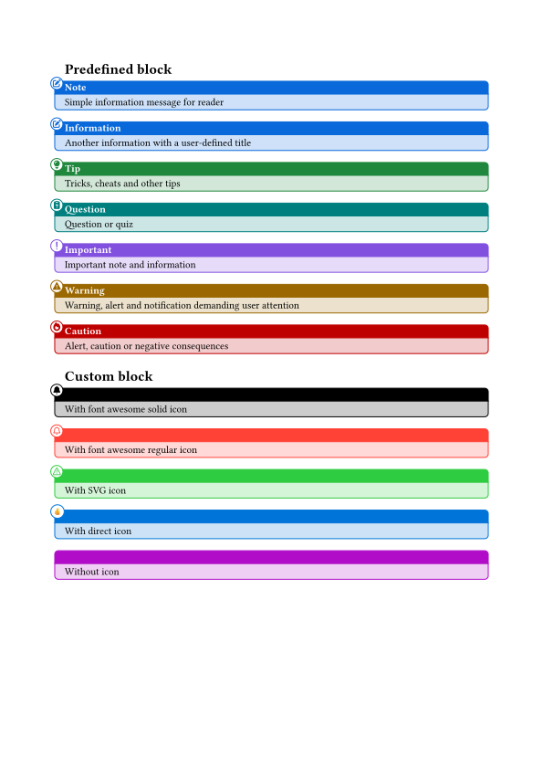

# Admonition blocks

Admonition blocks with:

- An optional icon, that can be provided through a simple character (`icon` parameter), a SVG content (`icon-svg` parameter) or a font awesome name (`icon-fa` parameter).
- The color of the block.
- A tile.
- The content.

Several predefined blocks (with color, icon and default title) are provided: `note-blk`, `tip-blk`, `question-blk`, `important-blk`, `warm-blk` and `caution-blk`.

## Example

```typ
#import "@preview/admon-blk:0.1.0": *

= Predefined block

#note-blk[Simple information message for reader]

#note-blk(title: "Information")[Another information with a user-defined title]

#tip-blk[Tricks, cheats and other tips]

#question-blk[Question or quiz]

#important-blk[Important note and information]

#warm-blk[Warning, alert and notification demanding user attention]

#caution-blk[Alert, caution or negative consequences]

= Custom block

#admon-blk(color: black, icon-fa: "bell", icon-fa-solid: true)[With font awesome solid icon]

#admon-blk(color: red, icon-fa: "bell", icon-fa-solid: false)[With font awesome regular icon]

#admon-blk(color: green, icon-svg:"<svg xmlns=\"http://www.w3.org/2000/svg\" viewBox=\"0 0 16 16\" width=\"16\" height=\"16\"><path d=\"M6.457 1.047c.659-1.234 2.427-1.234 3.086 0l6.082 11.378A1.75 1.75 0 0 1 14.082 15H1.918a1.75 1.75 0 0 1-1.543-2.575Zm1.763.707a.25.25 0 0 0-.44 0L1.698 13.132a.25.25 0 0 0 .22.368h12.164a.25.25 0 0 0 .22-.368Zm.53 3.996v2.5a.75.75 0 0 1-1.5 0v-2.5a.75.75 0 0 1 1.5 0ZM9 11a1 1 0 1 1-2 0 1 1 0 0 1 2 0Z\"></path></svg>")[With SVG icon]

#admon-blk(color: green, icon-svg:read("example_icon.svg"))[With SVG icon]

#admon-blk(color: blue, icon:"👍")[With direct icon]

#admon-blk(color: purple)[Without icon]
```


