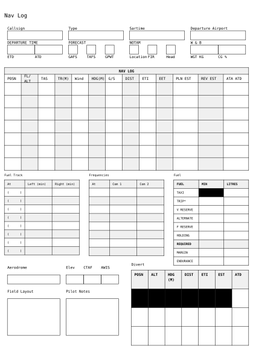

# Aero Navigator
<div align="center">Version 0.1.0</div>

A Navigation Log, developed to replace multiple pages of notes and provide a succinct template to manage all the information needed as a Cross Country Pilot!

## Getting Started

A simple, bare-bones navigation sheet will look like this.

```typ
#import "@preview/aero-navigator:0.1.0": *

#show: aero-navigator
```

<picture>
  
</picture>

## Usage

This template is very flexible and can be used in a number of ways.

```typ
#import "@preview/aero-navigator:0.1.0": *

#show: aero-navigator.with(
  callsign: "24-8569",
  type: "SLG2",
  departure: "YHEC",
  variant: "2",
  waypoint: false,
  waypoints: "",
  notes: true,
)
```
