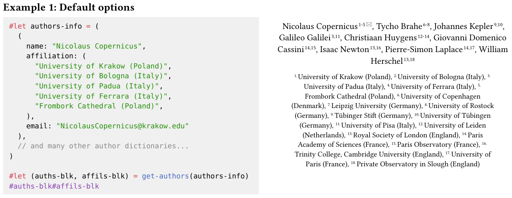

# typst-affiliation

An auto affiliation function for Typst. This library provides a single function, `get-authors`, which aims to do one thing well: extract affiliation information from a given dictionary and output two contents:
1. Authors' names with superscripted affiliation indices and an email symbol if contact information is provided.
2. A list of sorted affiliations.

## Example


## `get-authors`
The function `get-authors` is highly customizable:
### Parameters
- `authors`: An array of strings or dictionaries containing authors' information.
- `authors-join` (default: ", "): Join script for authors.
- `authors-numbering` (default: "1"): Numbering style for the superscripted number after each author.
- `authors-func` (default: `default-authors-func`): Authors style function.
- `affil-label-numbering` (default: "1."): Numbering style for the index before each affiliation.
- `affil-label-style` (default: none): Affiliation label style.
- `affil-join` (default: ", "): Join script for affiliations.
- `affil-func` (default: `default-affil-func`): Affiliation style function.
- `email-symbol` (default: "🖂"): Email symbol.

### Returns
An array of two blocks: authors' block and affiliations' block.

### Default functions
```typst
/* Default author function */
#let default-authors-func(authors-text) = {
  set align(center)
  block(text(size: 12pt, authors-text))
}

/* Default affiliation function */
#let default-affil-func(affil-text) = {
  set align(center)
  set par(justify: false)
  set block(width: 85%)
  block(text(size: 10pt, affil-text))
}
```

## Tests

To run the test, use the following command:

```bash
typst watch ./tests/tests.typ --root .