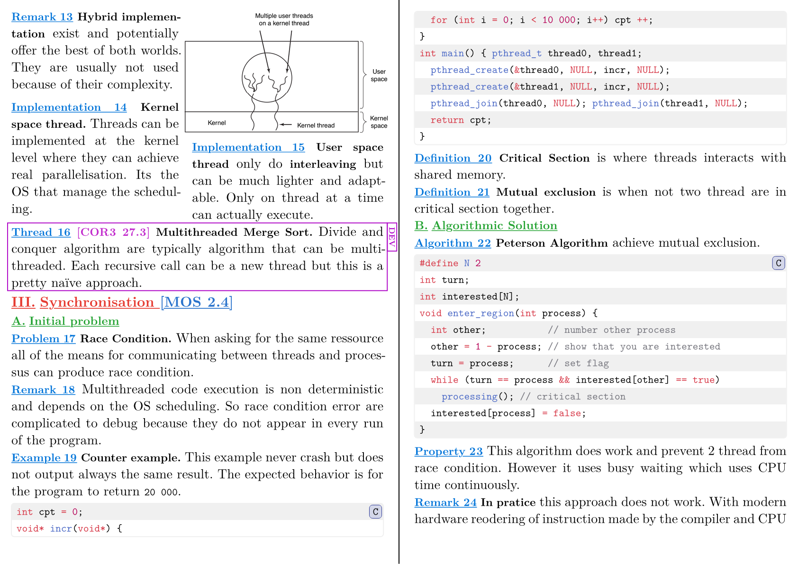
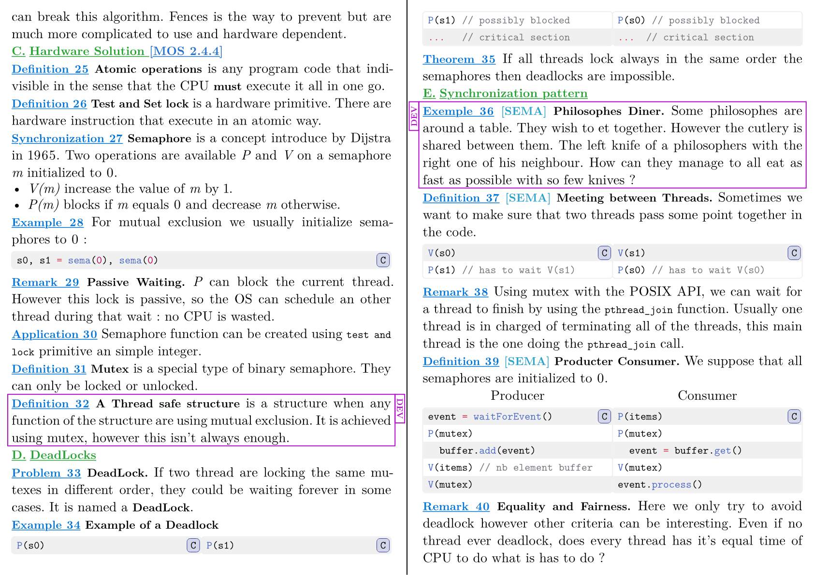
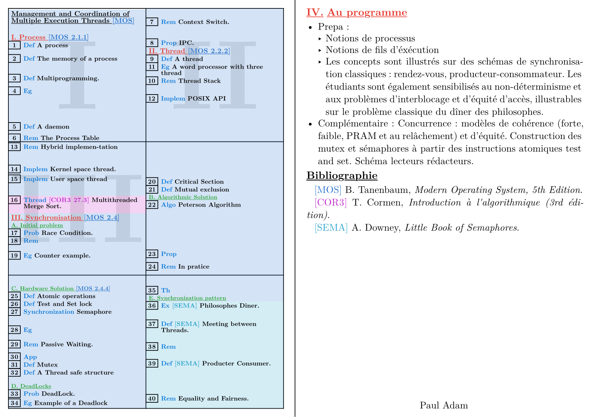

# Agregyst

Write lessons for the "concours de l'agrégation" in the usual two-column format.

## Basic uage

Start a new project with this template in the web app or locally to get a usage example.

## Example result

## Limitations

- Bibliography must use the [Hayagriva YAML format](https://github.com/typst/hayagriva/blob/main/docs/file-format.md). BibTeX files are not supported.
- The `recap` function doesn't work with more than three pages.
