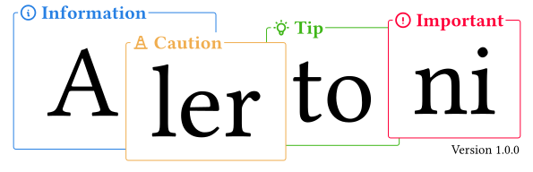
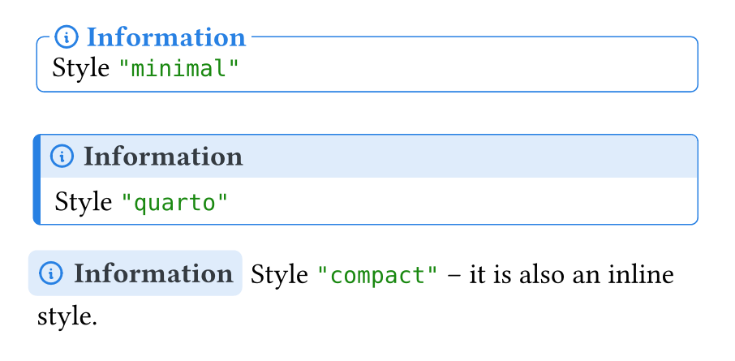
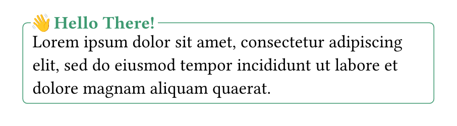

# Alertoni

A Typst package that introduces callouts with three different styles and various types. In addition, the package also supports custom styles, types and icon sets.


- Read more on how to use it and other functionality in the [Manual](./docs/manual.pdf).

## Quick Examples

```typst
#import "@preview/alertoni:1.0.0" as at
```

### All Predefined Types

```typst
#at.callout(type: "info", [])
#at.callout(type: "warning", [])
#at.callout(type: "important", [])
#at.callout(type: "caution", [])
#at.callout(type: "tip", [])
#at.callout(type: "correct", [])
#at.callout(type: "incorrect", [])
#at.callout(type: "example", [])
```


### All Predefined Styles

**Note**: you can add your own style. Refer to the manual.

```typst
#at.callout(
    style: "minimal", [Style `"minimal"`]
)

#at.callout(
    style: "quarto", [Style `"quarto"`]
)

#at.callout(
    style: "compact", [Style `"compact"`]
) -- it is also an inline style.
```



### A Custom Type

```typst
#at.new-type(
    name: "hey",
    color: olive,
    placeholder: "Hello There!",
    icon: emoji.hand.wave
)

#at.callout(type: "hey", [
    #lorem(20)
])
```




Types can also be langnuage specific and is explained in the manual.
