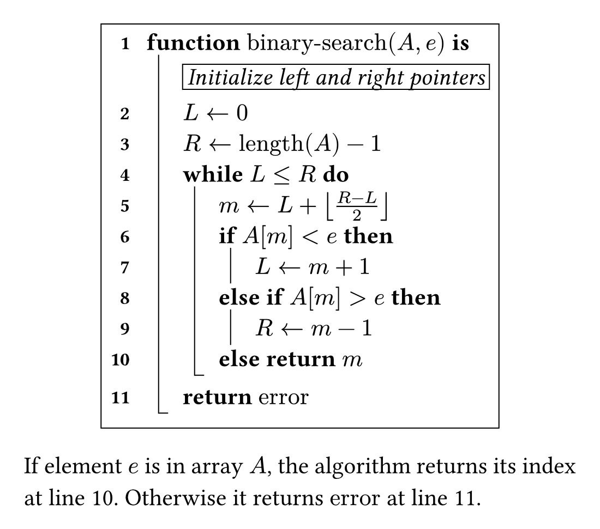
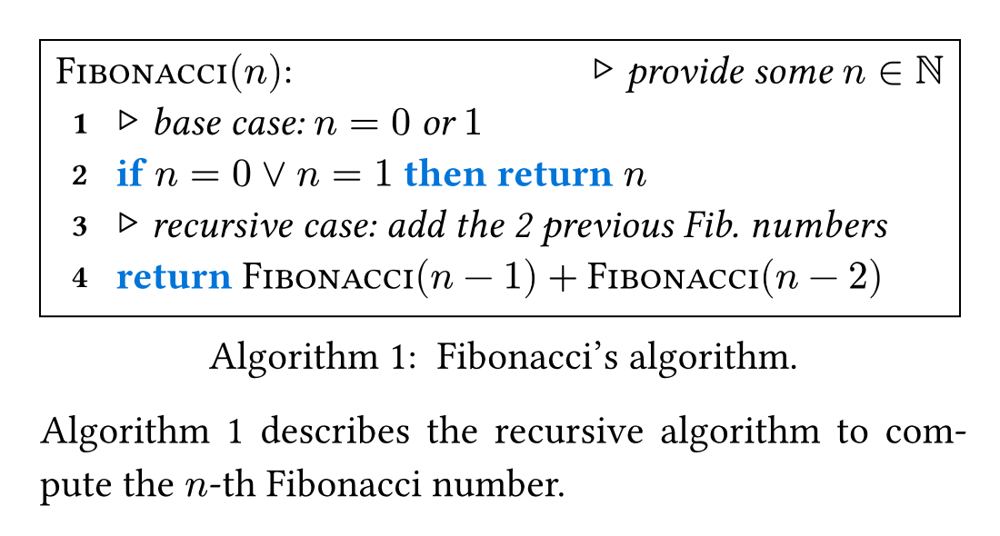

# Algol

Algol is a flexible [Typst](https://typst.app/) package for typesetting algorithms and pseudocode using light notations.
Its name is inspired by the [Algol star](https://en.wikipedia.org/wiki/Algol) of the Perseus constellation, and by the [ALGOL](https://en.wikipedia.org/wiki/ALGOL) family of programming languages.

Algorithms are written as ordinary Typst nested lists, so the source stays close to what you see on the page.
The default appearance reproduces the look and feel of the [algorithm2e](https://ctan.org/pkg/algorithm2e) LaTeX package, and nearly every visual aspect can be adjusted (see [customization parameters](#algol-customization)).

- **Light notation**: nested bullet and numbered lists, no dedicated block commands;
- **Finished and unfinished blocks**: vertical guides with or without a closing hook;
- **Line referencing**: through Typst's native reference syntax;
- **Per-line number disabling**;
- **Highly customizable**: strokes, offsets, indentation, numbering and formatting.

## Quick Start

```typst
#import "@preview/algol:0.1.0": algol, enable-line-refs, no-next-line-nb

#set page(height: auto, width: 25em, margin: 1em)
#set par(justify: true)

#show: enable-line-refs        // needed for line referencing

#align(center, algol[
- *function* $"binary-search"(A, e)$ *is* #no-next-line-nb
  - #box(stroke: .5pt, inset: .2em)[_Initialize left and right pointers_]
  - $L <- 0$
  - $R <- "length"(A) - 1$
  - *while* $L <= R$ *do*
    - $m <- L + floor((R - L) / 2)$
    - *if* $A[m] < e$ *then*
      + $L <- m + 1$
    - *else if* $A[m] > e$ *then*
      + $R <- m - 1$
    - *else* *return* $m$     <line:found-element>
  - *return* $"error"$        <line:error>
])

If element $e$ is in array $A$, the algorithm returns its index at @line:found-element, otherwise it returns $"error"$ at @line:error.
```



This example demonstrates the three main features of Algol.

**Code blocks and vertical guides.** Algol uses both "`-`" lists ([bullet lists](https://typst.app/docs/reference/model/list/)) and "`+`" lists ([numbered lists](https://typst.app/docs/reference/model/enum/)):

- "`-`" lists create _finished_ code blocks, whose left-side vertical guide ends with a hook;
- "`+`" lists create _unfinished_ code blocks, which have no hook (lines 7 and 9);
- lists of depth 0 have neither vertical guide nor hook (the list starting at line 1).

**Line referencing.** After applying the `enable-line-refs` show rule, any line can be labelled and referenced (lines 10 and 11):

- line labels must match a regex pattern (by default, they must start with `"line:"`);
- the pattern, the reference supplement and the line numbering can be [customized](#algol-customization).

**Disabling a line number.** `#no-next-line-nb` removes the number of a single line, the **next** one, not the previous one (in the example, the comment between lines 1 and 2).

## Algol Customization

<details>
<summary>Customization parameters of the "algol" function</summary>

| Parameter                        | Type                     | Default        | Description                                                                             |
|----------------------------------|--------------------------|----------------|-----------------------------------------------------------------------------------------|
| `box-stroke`                     | `stroke`                 | `.5pt + black` | Stroke of the outer box                                                                 |
| `box-inset`                      | `length` \| `dictionary` | `.4em`         | [Inset](https://typst.app/docs/reference/layout/box/#parameters-inset) of the outer box |
| `indent-length`                  | `length`                 | `1.5em`        | Indentation length of the algorithm                                                     |
| `line-spacing`                   | `length`                 | `.6em`         | Vertical spacing between the lines of the algorithm                                     |
| `line-numbering`                 | `str` \| `function`      | `"1"`          | [Numbering](https://typst.app/docs/reference/model/numbering/) of the line numbers      |
| `line-number-fmt`                | `function`               | see below      | Takes the line-number string produced by `line-numbering` and returns formatted content |
| `line-number-spacing`            | `length`                 | `1.5em`        | Horizontal spacing between the line numbers and the lines of the algorithm              |
| `guide-stroke`                   | `stroke`                 | `.5pt + black` | Stroke of the vertical guides and hooks                                                 |
| `hook-length`                    | `length`                 | `.4em`         | Length of the hooks at the bottom left of finished code blocks                          |
| `guide-left-offset`              | `length`                 | `.5em`         | Offset of the vertical guides at the left of code blocks (\*)                           |
| `guide-top-offset`               | `length`                 | `.4em`         | Offset of the vertical guides at the top of code blocks (\*)                            |
| `finished-guide-bottom-offset`   | `length`                 | `.1em`         | Offset of the vertical guides at the bottom of finished code blocks (\*)                |
| `unfinished-guide-bottom-offset` | `length`                 | `.4em`         | Offset of the vertical guides at the bottom of unfinished code blocks (\*)              |
| `finished-block-bottom-spacing`  | `length`                 | `.3em`         | Vertical spacing at the bottom of finished code blocks (impacts the line layout)        |

(\*) The "guide offset" parameters do not impact the layout of the lines of the algorithm.

</details>

<details>
<summary>Default line number formatting function for the "line-number-fmt" parameter</summary>

```typst
#let line-number-fmt-default = n-str => box(
  width: .8em,
  baseline: .65em,
  align(horizon + right, text(size: .8em)[*#n-str*]),
)
```

</details>

<details>
<summary>Customization parameters of the "enable-line-refs()" show rule</summary>

| Parameter         | Type      | Default             | Description                                                                           |
|-------------------|-----------|---------------------|---------------------------------------------------------------------------------------|
| `line-numbering`  | `str`     | `"1"`               | [Numbering](https://typst.app/docs/reference/model/numbering/) of the line references |
| `line-supplement` | `content` | `[line]`            | Supplement used before the line number in the reference                               |
| `label-pattern`   | `regex`   | `regex("^line:.*")` | Pattern for the line labels (by default, they must start with `"line:"`)              |

</details>

## User-Side Features

Algol aims to be unopinionated but customizable.
To keep its API small, it deliberately leaves the following features out, each of them takes only a couple of lines to implement on your side.

### Algorithm Keywords

Algol has no built-in keywords such as `if`, `else` or `while`.
You can emphasize your own set of keywords directly in the algorithm (as in the [quick start example](#quick-start)), or with a show rule:

```typst
#show regex("\\b(if|then|else|return)\\b"): it => text(blue, strong(it))
```

The `\b` word boundaries keep the rule from matching inside longer words (for instance the `if` in "different").

### Embedding in Figures

A figure type for Algol pseudocode is also defined on the user side:

```typst
#let algorithm = figure.with(kind: "algorithm", supplement: [Algorithm])
```

### Pseudocode Comments

Algol provides no comment functions, but they are straightforward to write:

```typst
#let lcomment(c) = [$triangle.small.r$ _ #c _]          // left-aligned comment
#let rcomment(c) = [#h(1fr) $triangle.small.r$ _ #c _]  // right-aligned comment
```

### Combining Everything

The following example puts all of the above together.

```typst
#import "@preview/algol:0.1.0": algol

#set page(height: auto, width: 25em, margin: 1em)
#set par(justify: true)
// math-compliant smallcaps font
#show smallcaps: set text(font: "Libertinus Serif")

#let algorithm = figure.with(kind: "algorithm", supplement: [Algorithm])

#let my-algol(it) = {
  show regex("\\b(if|then|else|return)\\b"): it => text(blue, strong(it))
  algol(it, stroke: 0pt)
}

#let lcomment(c) = [$triangle.small.r$ _ #c _]          // left-aligned comment
#let rcomment(c) = [#h(1fr) $triangle.small.r$ _ #c _]  // right-aligned comment

#let fib = smallcaps[Fibonacci]

#algorithm(my-algol[
$fib(n)$: #rcomment[provide some $n in NN$]
- #lcomment[base case: $n = 0$ or $1$]
- if $n = 0 or n = 1$ then return $n$
- #lcomment[recursive case: add the 2 previous Fib. numbers]
- return $fib(n - 1) + fib(n - 2)$
],
caption: [
  Fibonacci's algorithm.
]) <alg:fibonacci>

@alg:fibonacci describes the recursive algorithm to compute the $n$-th Fibonacci number.
```


