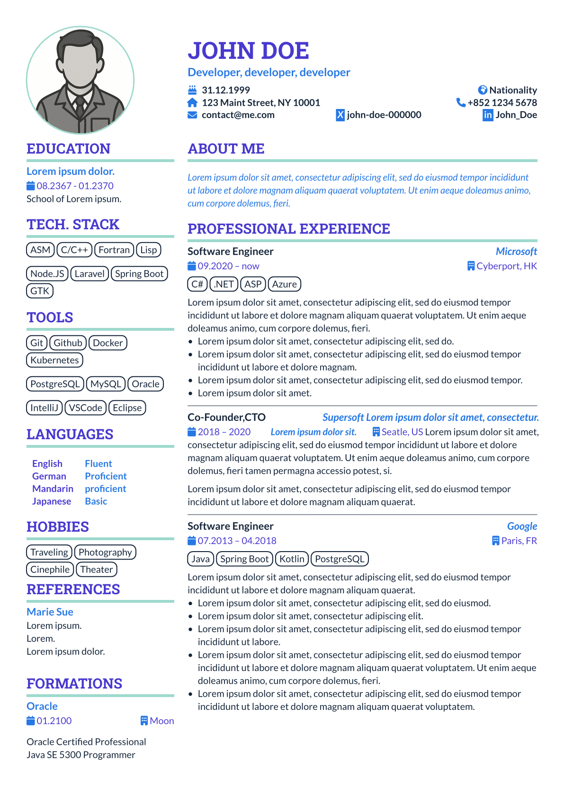

# Alpin-CV

Simple CV that stays close to Typst formatting for maximum of flexibility.

<a href="thumbnail.png">
    
</a>

A Typst CV template that aims for :
- Clean aesthetics
- 2 columns on multiple pages
- Unintrusive formatting

The template is divided in two files:
- `package.typ` : The template itself.
- `common.typ` : Common file with settings and additional utility functions, particularly when writing multiple CV with the same look. It also uses by default 4 complementary colors for the theme.

## Usage

### From Typst app

Create a new project based on the template [alpin-cv](https://typst.app/universe/package/alpin-cv).

### Locally

The default font is ["Lato"](https://fonts.google.com/specimen/Lato). Make sure it is installed on your system, or change it in [# Theme](#theme). Font Awesome is also used for calendar and location, but it's optional. If used, make sure to install it too.

Copy the [template](https://raw.githubusercontent.com/edwin-cox/typst-alpin-cv/main/template/cv.typ) to your Typst project.

### From a blank project

Import the library :

```typst
#import "@preview/alpin-cv:0.1.0": *
```

Show the root `cv` function :

```typst
#show: cv.with(
  theme: (),
  contact: 
  [
    = YOUR NAME
    == Title(s)
    *
    #grid(
      columns: (1em, 1fr), gutter: 0.5em, align: (center, left),
      CONTACT CONTENT
    )
    *
  ],
  aside: [
    ASIDE CONTENT
  ]

MAIN CONTENT
```

MAIN and ASIDE contents are standard typst text. CONTACT content is a free grid of 2 columns, for instance like:
```typst
  [_🎂_],[31.12.1999 #h(1fr) _🌍_ Chinese],
  [_🏠_],[123 Maint Street, NY 10001 #h(1fr) _📞_  +852 1234 5678],
```

Several content functions are available.

**Tags**
creates a horizontal list of tags. #tags calls #taglist by transforming a list into an array. #taglist calls #tag for each entry of the array, which creates a tag.

```typst
#tags[
  - item1
  - item2
  - item3
  - item4
  - ...
]

#taglist("items","as","array")

#tag[single tag]

```

**Calendar and location**

utility functions to add reccuring icons for calendar and location.

```typst
#cal[<whatever date>]
#loc[some location]
#calloc([<date>,<location>])
```

**Inverted text color**

For some icons not in Font Awesome, like linkedin and xing, that function simulate the same formating by swapping foreground and background colors.

```typst
#link[inverted text]
```

## Theme

Customize the theme by specifying the `theme` parameter and overriding 1 or more keys.

### Function `cv`

| Key | Type | Default
| --- | ---- | -------
| `margin` | relative | 28pt
| `col-width-side` | relative |  5.5cm
| `col-width-separator` | relative |  0.5cm
| `col-width-main` | relative |  1fr
| `image-radius` | relative |  4cm
| `image-zoom` | relative |  1
| `image-border` | relative |  0.15em
| `h1-font` | relative |  "Roboto Slab"
| `font` | relative |  "Lato"
| `font-size` | relative |  10pt
| `h1-size` | relative | 15pt
| `h2-size` | relative | 11pt
| `contact-h1-size` | relative | 25pt
| `contact-h2-size` | relative | 12pt
| `contact-font-size` | relative |  10pt
| `body-color` | color |  rgb("222")
| `body-alt-color` | color |  rgb("00a")
| `h1-color` | color |  rgb("00a")
| `icon-color` | color |  rgb("#000000")
| `icon-caption-color` | color |  rgb("222")
| `border-stroke-width` | relative |  0.2em
| `border-color` | color |  black
| `contact-h1-color` | color |  inherit
| `contact-h2-color` | color |  inherit
| `contact-body-color` | color |  inherit
| `main-h1-color` | color |  inherit
| `main-body-color` | color |  inherit
| `aside-h1-color` | color |  inherit
| `aside-body-color` | color |  inherit
| `table-inside` | relatives |  (x:6pt, y:3pt)
| `h2-above` | relative |  0.5em
| `contact-h2-above` | relative |  0.8em
| `contact-h1-below` | relative |  0.2em
| `text-margin-top` | relative |  1em
| `text-margin-bottom` | relative |  0.8em
| `h1-border-offset` | relative |  0.4em