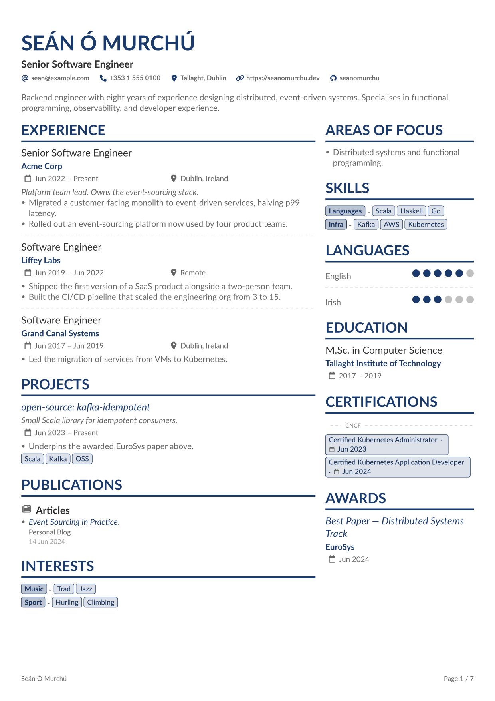
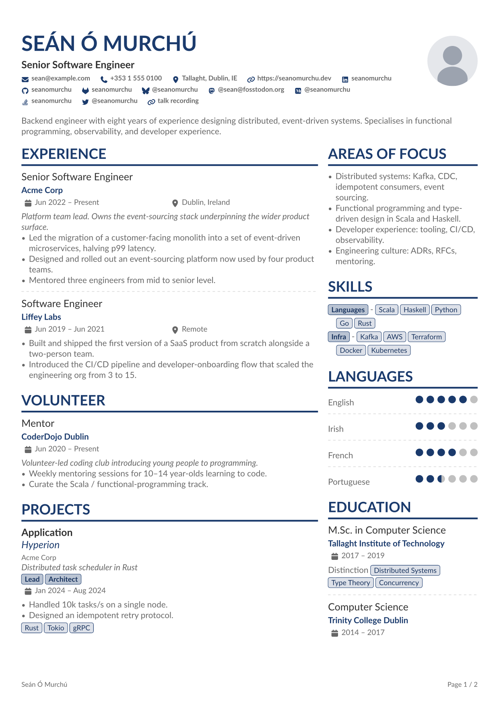
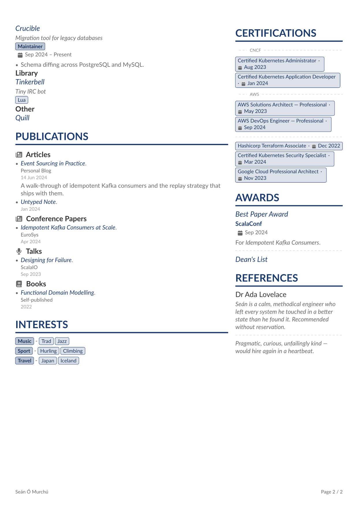

<h1 align="center">Alta CV</h1>

<p align="center">
  <a href="https://typst.app/universe/package/altacv"></a>
  <a href="https://github.com/smur89/alta-typst/releases"></a>
  <a href="https://github.com/smur89/alta-typst/actions/workflows/build.yml"></a>
  <a href="LICENSE"></a>
  <a href="https://github.com/smur89/alta-typst/stargazers"></a>
</p>

<p align="center">A Typst CV template inspired by LianTze Lim's <a href="https://github.com/liantze/AltaCV">AltaCV</a> (LaTeX). Data-driven from a <a href="https://jsonresume.org/">JSON Resume</a>-style dict; configurable theme, labels, and sections.</p>

<!-- Relative path so the GIF tracks the codebase: GitHub renders the README from main, Universe renders it from the package version's snapshot — each context sees the matching frame set. examples/ ships in the typst/packages submission but is `exclude`d from the compiler bundle (see typst.toml), so the file lives next to README on Universe without bloating the import payload. -->
<p align="center">
  
</p>

## Contents

- [Features](#features)
- [Gallery](#gallery)
- [Getting started](#getting-started)
- [Fonts](#fonts)
- [Data schema](#data-schema)
- [Configuration](#configuration)
- [Header QR code](#header-qr-code-preferencesqrcode)
- [PDF metadata](#pdf-metadata)
- [Helpers](#helpers)
- [Building the examples](#building-the-examples)
- [Credits](#credits)
- [License](#license)

## Features

- **Data-driven from [JSON Resume](https://jsonresume.org/).** Round-trips a canonical `resume.json` with three optional extensions (`focusAreas`, numeric language `rating`, publication `type` grouping).
- **Single-column ATS mode** (`columnRatio: 1`) alongside the default two-column layout, plus inverted variants with the side panel on either side.
- **Six accent palettes** — `teal`, `navy`, `crimson`, `forest`, `plum`, `charcoal` — or any `rgb(...)` value.
- **Full label localisation** via inline dict or TOML file. Every display string is overridable; see [`examples/labels-ga.toml`](examples/labels-ga.toml) for a worked Irish translation.
- **PDF metadata baked in** — title, author, subject, keywords (auto-derived from skills), and document date populate from the same data dict.
- **Optional header QR code** linking to `basics.url` (or any URL), restoring one click of digital-PDF affordance for printed CVs.

## Gallery

Every documented section rendered in a single multi-page CV. Source: [`examples/example_full.typ`](https://github.com/smur89/alta-typst/blob/v1.6.0/examples/example_full.typ) <!-- x-release-please-version -->; rendered output: [`examples/example_full.pdf`](examples/example_full.pdf).

| Page 1 | Page 2 |
| :---: | :---: |
|  |  |

## Getting started

Pick the path that matches how your data lives.

### Scaffold a new project

Best when you are starting from scratch. Copies a working starter into your project.

```bash
typst init @preview/altacv
```

The starter is [`template/cv.typ`](template/cv.typ) — an inline data dict you fill in.

### From an existing `resume.json`

Best when your CV already lives in a canonical `resume.json` ([JSON Resume schema](https://jsonresume.org/schema/)). `alta-from-json` reads, validates, and renders it in one call:

<!-- x-release-please-start-version -->
```typst
#import "@preview/altacv:1.6.0": alta-from-json

#alta-from-json(path("resume.json"))
```
<!-- x-release-please-end -->

Validation runs through [`@preview/gairm-import`](https://typst.app/universe/package/gairm-import). Dates must be ISO 8601 (`YYYY`, `YYYY-MM`, `YYYY-MM-DD`); altacv's [three extensions](#data-schema) are optional, so a vanilla `resume.json` validates without edits.

To inspect or transform the parsed dict before rendering, use `from-json-resume` directly:

<!-- x-release-please-start-version -->
```typst
#import "@preview/altacv:1.6.0": alta, from-json-resume

#alta(from-json-resume(path("resume.json")), preferences: (accent: rgb("#0a4")))
```
<!-- x-release-please-end -->

### From an inline dict

Best when you want the CV data in Typst alongside the call. Import into an existing `.typ`:

<!-- x-release-please-start-version -->
```typst
#import "@preview/altacv:1.6.0": alta

#let cv = (
  basics: (
    name: "Jane Doe",
    label: "Senior Software Engineer",
    summary: [Backend engineer with eight years' experience…],
    email: "jane@example.com",
    phone: "+353 1 555 0100",
    location: "Dublin, Ireland",
    profiles: (
      (network: "LinkedIn", username: "janedoe",     url: "https://linkedin.com/in/janedoe"),
      (network: "GitHub",   username: "janedoe",     url: "https://github.com/janedoe"),
      (network: "Website",  username: "janedoe.dev", url: "https://janedoe.dev"),
    ),
  ),
  work: (
    (
      name: "Acme Corp",
      url: "https://acme.example.com", // optional — wraps the company name in a link
      position: "Senior Software Engineer",
      location: "Dublin, Ireland",
      startDate: "Jan 2022",
      // omit endDate → renders as "Present"
      highlights: ([Led the migration…], [Designed the platform…]),
    ),
  ),
  skills: (
    (name: "Languages", keywords: ("Scala", "Python")),
    (name: "Infra",     keywords: ("Kafka", "AWS", "Kubernetes")),
  ),
  languages: (
    (language: "English", fluency: "Native"),
    (language: "Irish",   fluency: "Professional Working"),
  ),
  // … education, certificates, publications
)

#alta(cv)
```
<!-- x-release-please-end -->

For a multi-page demo exercising every section and input form, see [`examples/example_full.typ`](https://github.com/smur89/alta-typst/blob/v1.6.0/examples/example_full.typ) <!-- x-release-please-version --> (rendered in [Gallery](#gallery) above).

## Fonts

altacv needs two fonts available wherever you compile:

- **Lato** — the default body font. Overridable via `preferences.font`.
- **FontAwesome v7 desktop set** — read by [`@preview/fontawesome`](https://typst.app/universe/package/fontawesome) for the contact-bar and section icons.

Neither is vendored in the package. The Typst web app has both preinstalled.

On macOS, Homebrew covers Typst plus both fonts:

```bash
brew install typst
brew install --cask font-lato font-fontawesome
```

On other platforms, install Lato from [Google Fonts](https://fonts.google.com/specimen/Lato) and the FontAwesome v7 desktop OTFs from [fontawesome.com/download](https://fontawesome.com/download). The Debian/Ubuntu `fonts-font-awesome` package ships v6, which the Typst package does not read by default.

Run `typst fonts` to confirm both are visible; if FontAwesome is missing, icons render as tofu. Any other body font works: `#alta(cv, preferences: (font: "Inter"))`.

## Data schema

The `cv` dict follows [JSON Resume](https://jsonresume.org/schema/). An empty or missing `endDate` renders as `Present` (localisable via `labels.present`). Sections with empty input are skipped — no orphan headings. Unknown top-level keys panic.

### Extensions

Three optional fields layered on top of JSON Resume:

- **`focusAreas`** — top-level array of prose items, rendered as a bulleted "Areas of Focus" section. Distinct from JSON Resume's `interests` (structured `{name, keywords}` — also supported).
- **`languages[].rating`** — numeric 0–`preferences.maxRating` (default 5). JSON Resume uses a `fluency` string; supplying `rating` enables half-dot precision and wins over `fluency` when both are present. Fractions must be in 0.5 increments (anything else panics — the renderer only expresses full or half dots). Unknown `fluency` strings render as a small annotation in place of the dots, so a canonical `resume.json` with `"fluency": "Fluent"` works without edits.
- **`publications[].type`** — optional grouping key (e.g. `"Articles"`, `"Books"`, `"Talks"`). Entries sharing a `type` cluster under a subheading rendered verbatim from the string; entries without `type` fall under `labels.articles`. Localise via `labels.articles` or by supplying already-translated `type` values.

### Top-level keys

Recognised: `basics`, `focusAreas`, `work`, `volunteer`, `skills`, `languages`, `education`, `certificates`, `awards`, `projects`, `publications`, `interests`, `references`, `meta` (PDF metadata only — see [PDF metadata](#pdf-metadata)).

### Dates

ISO 8601 strings (`"2024"`, `"2024-06"`, `"2024-06-15"` — the JSON Resume canonical shape) are formatted according to `preferences.dateFormat` (default `"long"`: e.g. `"Jun 2024"`). Strings that do not parse as ISO (e.g. `"Jan 2022"`, `"May 2016 – Jul 2017"`) pass through verbatim, so pre-formatted data keeps rendering identically.

### `basics`

`basics.url` (JSON Resume's "personal homepage" field) renders in the contact bar with a generic `link` icon, alongside `email`, `phone`, `location`, and `profiles`. It is distinct from a `basics.profiles` entry with `network: "Website"` (a profile *on* a third-party site); supply both if you want both rendered. The same `basics.url` also drives the header QR matrix when `preferences.qrCode: auto` is set — see [Header QR code](#header-qr-code-preferencesqrcode).

`basics.location` accepts a plain string or JSON Resume's structured dict `{address, postalCode, city, countryCode, region}`. A string flows verbatim into the contact bar and the maps deep link. A dict is collapsed by joining `city`, `region`, `countryCode` with `", "`, skipping missing fields — `(city: "Dublin", region: "Leinster", countryCode: "IE")` → `Dublin, Leinster, IE`; `(city: "Tokyo")` → `Tokyo`. `address` and `postalCode` are accepted for `resume.json` round-tripping but not rendered (a CV header is not a mailing label). Unknown keys panic. The joined string also drives the maps link, so display and link stay in sync.

#### Portrait (`basics.image`)

Setting `basics.image` adds a circular portrait to the header. Three accepted source forms:

```typst
// Recommended: a path() (Typst 0.15.0+). Resolution is anchored to
// the file where path() is called — your own cv.typ — so the lookup
// stays correct even though image() ultimately runs inside the
// package.
basics: (
  image: path("avatar.png"),
  ...
)

// Equivalent: load the bytes in your own typ file. Same resolution
// guarantee, embedded as bytes instead of a reference.
basics: (
  image: read("avatar.png", encoding: none),
  ...
)

// Also accepted: a root-relative path (leading "/", anchored to the
// `--root` dir passed to `typst compile`). Bare relative strings
// without a leading "/" resolve relative to an internal package
// file and are not portable — prefer path() instead.
basics: (
  image: "/avatar.png",
  ...
)
```

JSON Resume's spec calls for a URL here, but Typst does not fetch remote URLs at compile time — vendor the asset locally.

Move the portrait with `preferences.imagePosition` (`"left"` / `"right"` for the two-column header, or `"center"` to stack it above/below the text block via `preferences.imageStackOrder`). Size via `preferences.imageSize` (default `6em`); the image is fit with `cover` and clipped to a circle, so rectangular sources crop centred rather than distort.

### Section reference

Each per-section entry follows JSON Resume's schema. Tables show the practical subset rendered. Where dates appear, `startDate` / `endDate` follow the same conventions (omit `endDate` → "Present"); `summary` accepts a string or `[...]` content for markup.

#### Work

| Field | Type | Effect |
|---|---|---|
| `position` | string | Job title. Entry heading. |
| `name` | string | Company / employer, accent colour beneath the title; wrapped in a link when `url` is supplied. |
| `url` | string | Wraps `name` in a link (visual treatment unchanged — bold accent, no italic / underline). |
| `location` | string | Rendered alongside the date range via the location-icon row. |
| `startDate` / `endDate` | string | Date range. |
| `summary` | string or content | Italic preamble between the date row and the highlights list. |
| `description` | string or content | Alternative spelling used by some exporters — rendered identically to `summary`; `summary` wins when both are supplied. |
| `highlights` | array of content | Bulleted list of accomplishments. |

#### Volunteer

Same shape as `work[]`, but with `organization` in place of `name`.

| Field | Type | Effect |
|---|---|---|
| `position` | string | Role title. Entry heading. |
| `organization` | string | Granting organisation, accent colour beneath the position; wrapped in a link when `url` is supplied. |
| `url` | string | Wraps `organization` in a link (visual treatment unchanged — bold accent, no italic / underline). |
| `location` | string | Rendered next to the date range. |
| `startDate` / `endDate` | string | Date range. |
| `summary` | string or content | Italic preamble between the date row and the highlights list. |
| `highlights` | array of content | Bulleted list of accomplishments. |

By default `volunteer` renders in the left column directly below `work`, so it reads as a continuation of the experience block. Move it via `preferences.leftColumnSections` / `preferences.rightColumnSections`.

#### Education

| Field | Type | Effect |
|---|---|---|
| `institution` | string | School name. Accent-bold beneath the qualification title; wrapped in a link to `url` when supplied. |
| `url` | string | Wraps the institution name in an accent-bold link (styling preserved, just clickable). |
| `studyType` | string | Qualification (e.g. "M.Sc. in Computer Science"). Entry heading. Falls back to `area` if absent. |
| `area` | string | Field of study. Used as the heading only when `studyType` is missing. |
| `startDate` / `endDate` | string | Date range. |
| `score` | string | Grade / classification, plain line below the date range. |
| `courses` | array of strings | Row of pill tags below the score (same treatment as `skills[].keywords` and `projects[].keywords`). |

#### Projects

| Field | Type | Effect |
|---|---|---|
| `name` | string | Project title. Heading; linked to `url` when supplied. Missing / empty `name` → entry silently skipped. |
| `entity` | string | Small body-colour subtitle directly under the title — the company / client the project belonged to, distinct from the project name. |
| `url` | string | Wraps the title in an accent-coloured link. |
| `description` | string | Italic line beneath the title (below `entity` when both are present), body colour. |
| `type` | string | Optional grouping key. When any entry sets it, projects cluster under `type` subheadings (first-occurrence order; untyped entries pool under `labels.otherProjects`, default "Other"). An all-untyped list renders flat, with no subheadings. |
| `startDate` / `endDate` | string | Date range. |
| `roles` | array of strings | Row of darker label-style pills above the keywords — your role(s) on the project, set apart from the tech keywords. |
| `highlights` | array of content | Bulleted list of accomplishments. |
| `keywords` | array of strings | Row of pill tags below the highlights. |

#### Awards

`url` is an altacv extension on top of JSON Resume.

| Field | Type | Effect |
|---|---|---|
| `title` | string | Award name. Entry heading; linked to `url` when supplied. Missing / empty `title` → entry silently skipped. |
| `awarder` | string | Granting organisation, accent colour beneath the title. |
| `date` | string | Single date (not a range). Calendar-icon row. |
| `url` | string | Wraps the title in an accent-coloured link — for a paper, conference page, or write-up. |
| `summary` | string or content | Paragraph below the date. |

#### Publications

`type` is an altacv extension on top of JSON Resume.

| Field | Type | Effect |
|---|---|---|
| `name` | string | Publication title. Bullet body; linked to `url` when supplied, italicised when not. |
| `publisher` | string | Subtitle below the title, body colour at 0.85em. |
| `releaseDate` | string | Single date (not a range). Below the publisher in a lighter shade. |
| `url` | string | Wraps the title in an accent-coloured link. |
| `summary` | string or content | Paragraph below the date. |
| `type` | string | Optional grouping key (see [Extensions](#extensions)). |

All fields are optional — omitted fields drop their line.

#### Certificates

| Field | Type | Effect |
|---|---|---|
| `name` | string | Certificate name. Rendered as a pill tag; linked to `url` when supplied. Missing / empty `name` → entry silently skipped. |
| `issuer` | string | Granting organisation. When `preferences.groupCertificates` is `true`, certs from the same issuer cluster into a single pill row prefixed by a darker issuer-label pill; singletons pool into a trailing unlabelled group. |
| `date` | string | Single date. Small body-coloured text inline to the right of the pill, sharing the same baseline. |
| `url` | string | Wraps the pill in a link to the credential. |

#### Interests

Same `{name, keywords}` shape as `skills[]`, rendered with the same pill-tag layout (`name` as a label-tag, each `keywords` entry as a regular tag). Use for personal interests / hobbies; reach for `focusAreas` instead when you want prose-style bullets.

| Field | Type | Effect |
|---|---|---|
| `name` | string | Category label, leading "label" pill on the row. |
| `keywords` | array of strings | Items in the category. Entries with an empty `keywords` array are silently skipped. |

```typst
interests: (
  (name: "Music", keywords: ("Trad", "Jazz")),
  (name: "Sport", keywords: ("Hurling", "Climbing")),
)
```

#### References

| Field | Type | Effect |
|---|---|---|
| `name` | string | Referee name, level-3 heading above the quote. Omitted entries render the quote anonymously. |
| `reference` | string or content | The referee's quote, italic, beneath the name. Missing / empty `reference` → entry silently skipped (no orphan heading). |

When `references[]` is empty (or every entry lacks a `reference`) and `preferences.referencesAvailableOnRequest` is `true`, the section renders the conventional `References available upon request.` line under the heading instead of being suppressed. The line text is `labels.referencesAvailableOnRequest`, so it localises alongside the other display strings.

### Profile networks

The `network` field of each `basics.profiles` entry is matched case-insensitively against a curated icon set. Built-in networks: `Bluesky`, `GitHub`, `GitLab`, `Link`, `LinkedIn`, `Mastodon`, `Medium`, `Stackoverflow`, `Twitter` (alias: `X`), `Website`. Use `Link` as a generic fallback for any URL without a brand. Unknown networks panic with a list of the supported set.

To add another, map the new key to its FontAwesome glyph name in `_network_icons` (`internal/icons.typ`) — see [CONTRIBUTING.md](CONTRIBUTING.md#adding-a-profile-network-icon).

Icons are resolved via [`@preview/fontawesome`](https://typst.app/universe/package/fontawesome), which renders glyphs from the desktop FontAwesome fonts. See [Fonts](#fonts) for local installation; on typst.app they are preinstalled.

### Unrendered JSON Resume fields

A verbatim `resume.json` round-trips without panicking — fields altacv doesn't use are accepted and ignored rather than erroring. The `volunteer`, `projects`, and `meta` extras once listed here now all render, so none are currently outstanding. If you supply a field that isn't rendered and want it surfaced, open or upvote an issue.

## Configuration

### `alta()` arguments

```typst
#alta(cv, labels: (:), preferences: (:))
```

`cv` is the data dict; `labels` and `preferences` are partial dicts that shallow-merge over the built-in defaults. Unknown keys panic — catches typos.

### Preferences

Override any subset of the keys below.

| Key | Default | Effect |
|---|---|---|
| `font` | `"Lato"` | Primary font family. Must be installed. |
| `bodySize` | `10pt` | Base text size. Sub-elements scale via em-multipliers. |
| `paper` | `"a4"` | Paper size string passed to Typst's `set page(paper: ...)`. `"a4"`, `"us-letter"`, `"a5"`, `"us-legal"`, and the rest of [Typst's named papers](https://typst.app/docs/reference/layout/page/#parameters-paper). |
| `margin` | `(x: 0.9cm, y: 1.5cm)` | Page margins. Anything `set page(margin: ...)` accepts. |
| `accent` | `palettes.teal` | Theme colour for headings, accent rules, tags, dots. A built-in preset — `palettes.{teal,navy,crimson,forest,plum,charcoal}` — or any `rgb(...)` value. |
| `groupCertificates` | `true` | When `true`, cluster 2+ certs from the same issuer under a darker issuer-label pill; singletons pool into a trailing unlabelled group. When `false`, render flat — each cert next to its own issuer label. Certs with no `issuer` render unlabelled either way. |
| `imageSize` | `6em` | Diameter of the circular portrait. Ignored when no `basics.image`. |
| `imagePosition` | `"right"` | Portrait position in the header — `"left"` / `"right"` (two-column header) or `"center"` (own centred row, stacked with the text block). Ignored when no `basics.image`. |
| `imageStackOrder` | `"above"` | When `imagePosition` is `"center"`: `"above"` / `"below"` the name/label/contact block. Ignored otherwise. |
| `headerTextAlign` | `"left"` | Horizontal alignment of the header text (name, label, contact bar). One of `"left"`, `"right"`, `"center"`. Applies whether or not `basics.image` is set. |
| `qrCode` | `none` | `none` (skip), `auto` (encode `basics.url`), or any non-empty URL string. See [Header QR code](#header-qr-code-preferencesqrcode). |
| `uppercaseName` | `true` | When `true` (matching AltaCV's visual ancestor), `basics.name` renders in uppercase. Set to `false` for scripts where uppercase is a different glyph set (Turkish dotless-i, etc.), scripts with no case, or when the loud look is not wanted. |
| `lastModifiedFooter` | `false` | When `true` and `meta.lastModified` is set, renders a small right-aligned `<labels.lastModified>: <meta.lastModified>` line in the page footer (timestamp passed through verbatim). PDF metadata is enriched independently — see [PDF metadata](#pdf-metadata). |
| `footerVersion` | `false` | When `true` and `meta.version` is set, appends it in parentheses to the `lastModifiedFooter` line — e.g. `Last updated: 2026-06-12 (v1.0.0)`. The version renders verbatim (no `v` is prepended). No effect unless `lastModifiedFooter` is also `true`; PDF Keywords carry `meta.version` regardless — see [PDF metadata](#pdf-metadata). |
| `referencesAvailableOnRequest` | `false` | When `true` and `references[]` is empty (or every entry has no `reference` quote), renders the conventional `labels.referencesAvailableOnRequest` line under the References heading instead of suppressing the section. |
| `dateFormat` | `"long"` | `"long"` (`"Jun 2024"`), `"short"` (`"06/2024"`), `"iso"` (passthrough), a bracketed [`datetime.display()`](https://typst.app/docs/reference/foundations/datetime/#definitions-display) template, or a closure `(year, month, day) => str`. Non-ISO source strings pass through verbatim. |
| `linkContactInfo` | `true` | `true` / `false` for uniform linking, or a partial dict keyed by `"email"` / `"phone"` / `"location"` / `"url"` / `"profiles"` to opt out per channel. |
| `mapsProvider` | `maps-providers.google` | URL template for the `basics.location` deep link; `{q}` is replaced with the URL-encoded location. Built-in: `maps-providers.{google,apple,bing,duckduckgo,osm}`. `none` suppresses the link (icon + text still render). |
| `columnRatio` | `0.65` | Left-column width as a fraction of the page, in `(0, 1]`. The right column gets the remainder minus a fixed gutter. Use `1 - r` to invert the layout, or `1` for a [single-column layout](#single-column-layout). |
| `pageFooter` | `none` | Optional page footer. `none` — no footer. `"auto"` — multi-page documents only, `basics.name` flush left and `Page N / M` flush right, `0.8em` body colour. Any **content** value (`[…]`, `align(...)`, etc.) — rendered verbatim on every page. Anything else panics. When non-`none`, takes precedence over `lastModifiedFooter`. |
| `leftColumnSections` | `("work", "volunteer", "projects", "publications")` | Sections to render in the left column, in order. Defaults put long-form / bulleted sections on the wider left. |
| `rightColumnSections` | `("focusAreas", "skills", "languages", "education", "certificates", "awards", "interests", "references")` | Sections to render in the right column, in order. Defaults put compact / horizontal sections (pill rows, dot ratings, short metadata) on the right. |
| `maxRating` | `5` | Number of dots on the language fluency scale. Positive integer. Default matches LinkedIn's 0–5 scale (and the built-in `fluency` string map); set to `6` for CEFR (A1–C2), `4` for ILR-style 0–4, etc. Fluency *strings* stay anchored to the 0–5 LinkedIn scale, so non-5 `maxRating` requires numeric `languages[].rating` values. |

Both column arrays draw from the same section keys: `"work"`, `"volunteer"`, `"focusAreas"`, `"skills"`, `"languages"`, `"education"`, `"certificates"`, `"awards"`, `"projects"`, `"publications"`, `"interests"`, `"references"`. Sections omitted from both are not rendered even if their data is present; sections listed in both render twice. Unknown keys panic. Renderers are width-agnostic — combined with `columnRatio`, this enables layouts like an inverted CV where the side-panel sections take the narrow left column.

#### Examples

Reorder the right-column sections, switch to navy, and use US Letter:

<!-- x-release-please-start-version -->
```typst
#import "@preview/altacv:1.6.0": alta, maps-providers, palettes

#alta(cv, preferences: (
  paper: "us-letter",
  accent: palettes.navy,
  groupCertificates: false,
  imageSize: 7em,
  linkContactInfo: false,           // contact bar as plain text
  mapsProvider: maps-providers.osm, // OpenStreetMap for `basics.location`
  // Move education above skills; hide publications.
  rightColumnSections: ("focusAreas", "education", "skills", "languages", "certificates"),
))
```
<!-- x-release-please-end -->

Invert the template (side panel on the narrow left, experience on the wide right):

```typst
#alta(cv, preferences: (
  // columnRatio is the LEFT column's width; 0.35 = complement of the default 0.65.
  columnRatio: 0.35,
  leftColumnSections: ("focusAreas", "skills", "languages", "education", "certificates"),
  rightColumnSections: ("work", "publications"),
))
```

Opt out of links per channel (everything stays linked except phone):

```typst
#alta(cv, preferences: (
  linkContactInfo: (phone: false),
))
```

### Single-column layout

Set `columnRatio: 1` to collapse the grid to a single full-width column — useful for ATS parsers that struggle with multi-column PDFs. Sections from both `leftColumnSections` and `rightColumnSections` stream top-to-bottom in left-then-right order. With the defaults: `work → volunteer → projects → publications → focusAreas → skills → languages → education → certificates → awards → interests → references`.

```typst
#alta(cv, preferences: (columnRatio: 1))
```

Reorder by overriding either array; both are concatenated in order:

```typst
#alta(cv, preferences: (
  columnRatio: 1,
  leftColumnSections: ("work", "education"),
  rightColumnSections: ("skills", "languages", "certificates"),
))
```

Drop the portrait via `basics.image: none` for a fully text-only header.

### Labels

All display strings the template emits. Override any subset via `labels:`; the rest fall back to English defaults. Unknown keys panic. Use for translation or local renaming.

Label keys match the JSON Resume section keys (`work`, `certificates`, …) — the data-field name and the heading-override key are the same. The default *values* still read "Experience" and "Certifications" — that is editorial.

| Key | Default |
|---|---|
| `work` | `"Experience"` |
| `volunteer` | `"Volunteer"` |
| `focusAreas` | `"Areas of Focus"` |
| `skills` | `"Skills"` |
| `languages` | `"Languages"` |
| `education` | `"Education"` |
| `certificates` | `"Certifications"` |
| `publications` | `"Publications"` |
| `awards` | `"Awards"` |
| `projects` | `"Projects"` |
| `interests` | `"Interests"` |
| `references` | `"References"` |
| `referencesAvailableOnRequest` | `"References available upon request."` |
| `articles` | `"Articles"` |
| `present` | `"Present"` |
| `lastModified` | `"Last updated"` |
| `months` | `("Jan", "Feb", "Mar", "Apr", "May", "Jun", "Jul", "Aug", "Sep", "Oct", "Nov", "Dec")` |
| `publicationIcons` | `(:)` |

`labels.months` is the twelve abbreviated month names (January–December). Consumed by the `dateFormat: "long"` formatter and the `[month repr:long]` / `[month repr:short]` template tokens. Override to localise; must keep length 12.

`labels.publicationIcons` maps `publications[].type` values to icon names. Built-in defaults (case-insensitive, singular and plural both accepted):

| `type` value | Icon |
|---|---|
| `article` / `articles` / `blog post` / `blog posts` | `newspaper` |
| `book` / `books` | `book` |
| `talk` / `talks` / `presentation` / `presentations` | `microphone` |
| `paper` / `papers` / `conference paper` / `conference papers` | `newspaper` |
| anything else | `file` |

The supplied dict layers over the defaults rather than replacing them — override only to add a custom type or remap a built-in.

Example — German, plus renaming "Skills" to "Core Technologies":

```typst
#alta(cv, labels: (
  work:         "Berufserfahrung",
  focusAreas:   "Schwerpunkte",
  skills:       "Core Technologies",
  languages:    "Sprachen",
  education:    "Ausbildung",
  certificates: "Zertifikate",
  publications: "Veröffentlichungen",
  present:      "Heute",
  months: ("Jan", "Feb", "Mär", "Apr", "Mai", "Jun", "Jul", "Aug", "Sep", "Okt", "Nov", "Dez"),
))
```

#### Translation workflow

The defaults live in [`internal/labels-en.toml`](internal/labels-en.toml) — a plain resource file a translator can be handed without learning Typst syntax. For full translations, copy that file, translate the values, and load it at the call site with the built-in `toml(...)`:

```typst
// Inline partial overrides — best for one-off renames or a few keys.
#alta(cv, labels: (work: "Berufserfahrung", skills: "Core Technologies"))

// File-based — best for full translations or strings owned by a translator.
#alta(cv, labels: toml("labels-ga.toml"))
```

`toml(...)` resolves the path relative to the calling `.typ` file, so the translation lives next to the CV source. The returned dict flows through the same `labels:` argument and shallow-merges over the English defaults — unknown keys still panic, partial files still work. See [`examples/labels-ga.toml`](examples/labels-ga.toml) and the demo CV in [`examples/example_ga.typ`](https://github.com/smur89/alta-typst/blob/v1.6.0/examples/example_ga.typ) <!-- x-release-please-version --> for a worked Irish translation.

## Header QR code (`preferences.qrCode`)

Printed CVs lose the clickability of digital PDFs. A QR matrix in the header rescues one link (the homepage) so a phone camera takes the reader straight there. Off by default; opt in via `preferences.qrCode`:

```typst
#alta(
  (basics: (
    name: "Jane Doe",
    url: "https://janedoe.dev",  // canonical home page
    // …
  )),
  preferences: (qrCode: auto),  // encode basics.url
)
```

`preferences.qrCode` accepts three shapes:

- `none` (default) — no QR rendered.
- `auto` — encode `basics.url`. Panics if `basics.url` is missing or empty.
- any non-empty string — treat it as the URL to encode directly. Useful when the printed CV should point at a tracked landing page distinct from `basics.url`.

The QR sits on the side of the header opposite the portrait (so the default `imagePosition: "right"` puts the QR on the left). With `imagePosition: "center"`, the QR pins the header's top-left corner, riding the photo row when the photo is on top and the text row otherwise. The matrix inherits `preferences.accent`, renders at roughly `3.5em`, and is wrapped in `link()` so digital readers can click through.

QR generation is delegated to [`@preview/zebra`](https://typst.app/universe/package/zebra).

## PDF metadata

The rendered PDF carries metadata in its document properties — what your OS shows in "Get Info" / "Properties" and what indexing services read. Fields populate from the data dict; each is only written when its source is non-empty.

| PDF field | Source | Notes |
|---|---|---|
| Title | `basics.name + " --- CV"` | Always set. |
| Author | `basics.name` | Always set; canonical (ignores `preferences.uppercaseName`). |
| Subject | `basics.summary` | Same content rendered in the document header. |
| Keywords | `skills[].keywords`, then `meta.canonical`, `meta.version` | Skill keywords flattened across groups, de-duplicated, insertion order preserved; `meta.canonical` (document URL) and `meta.version` are appended verbatim when present. Typst exposes no dedicated PDF field for either, so Keywords is their machine-readable home. |
| Date (CreationDate / ModDate) | `meta.lastModified` | ISO 8601 — `YYYY-MM-DD` or `YYYY-MM-DDTHH:MM:SSZ`; only the calendar part is used. Falls back to compile time when absent or unparseable. |

To also surface "last updated" in the rendered document, set `preferences.lastModifiedFooter: true` (and `preferences.footerVersion: true` to append `meta.version`).

```typst
meta: (
  lastModified: "2026-06-12",              // → PDF date + optional footer
  canonical: "https://example.com/cv.json", // → PDF Keywords
  version: "v1.0.0",                         // → PDF Keywords + optional footer suffix (footerVersion)
)
```

## Helpers

`alta()` uses these internally; importing them lets you compose a custom section, or preview a single helper in isolation:

| Helper | Purpose |
|---|---|
| `icon(name, size: auto, shift: auto, fill: auto)` | Render a FontAwesome glyph (delegated to `@preview/fontawesome`). `name` is any key from the built-in icon set (utility or network). |
| `name(body)` | Bold accent-coloured line — the company / institution row under a role. |
| `term(period, location: none)` | Two half-width boxes for a date range and optional location, each with a leading icon. |
| `rating(label, value)` | Label on the left, filled / half-filled / empty dots on the right. `value` is numeric 0–`preferences.maxRating` (default 5); fractions must be in 0.5 increments (`2.3` panics). Drives the language fluency dots; works for any row on the configured scale. Shares a name with the `languages[].rating` data field — the function is not auto-fed; pass the value explicitly. |
| `tag(body, label: false, trailing: true)` | Pill-style tag. `label: true` for a darker, bold "category" variant. `trailing: false` suppresses trailing horizontal space — use for the last tag in a row so it does not push the next line's leading edge inward. |
| `divider()` | Dashed grey rule used between entries within a section. |
| `styled-link(content, dest: none)` | Accent-coloured italic styling for entry titles (publications, awards, projects). Wraps in a link when `dest` is supplied. |
| `palettes` | Dict of curated accent presets — `teal`, `navy`, `crimson`, `forest`, `plum`, `charcoal`. Use as `accent: palettes.navy`. |
| `maps-providers` | Dict of map deep-link URL templates — `google`, `apple`, `bing`, `duckduckgo`, `osm`. Use as `mapsProvider: maps-providers.osm`. |

<!-- x-release-please-start-version -->
```typst
#import "@preview/altacv:1.6.0": alta, tag, divider, palettes, maps-providers
```
<!-- x-release-please-end -->

The contact bar is rendered from `basics.email`, `basics.phone`, `basics.location`, `basics.url`, `basics.profiles`. Visual separators are stripped from the `tel:` dialable part. Suppress or swap deep links via `preferences.linkContactInfo` and `preferences.mapsProvider`.

## Building the examples

```sh
typst compile --root . examples/example_full.typ examples/example_full.pdf
```

To regenerate the preview artefacts (the canonical CV render, the animated GIF that cycles through preference variations, the multi-page gallery PNGs, and the Universe package-card thumbnail):

```sh
make cv             # examples/cv.pdf + examples/cv.png from template/cv.typ
make example-full   # examples/example_full.pdf + examples/example_full-{1,2,…}.png
make thumbnail      # thumbnail.png (Universe package card, 250 PPI)
make preview-gif    # examples/preview.gif (requires ffmpeg)
```

The GIF is sourced from `examples/preview-frames.typ` — one page per variation, stitched by ffmpeg with `palettegen` / `paletteuse` for higher-quality colour quantisation. Add a frame by appending a preferences dict to the `frames` array in that file.

## Credits

- **[LianTze Lim — AltaCV](https://github.com/liantze/AltaCV)** (LPPL). The visual ancestor: the two-column layout, accent palette, and section structure originate in LianTze's LaTeX class.
- **[George Honeywood — alta-typst](https://github.com/GeorgeHoneywood/alta-typst)** (MIT, © 2023). Prior Typst implementation; the grid layout, pill tags, and half-fill skill dots originate there.

## License

[MIT](LICENSE). Copyright © 2023 George Honeywood, © 2026 Shane Murphy.
