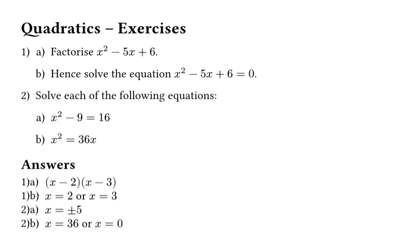
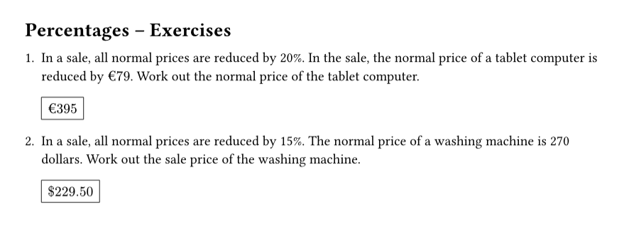

# answerly

A Typst package for recording and displaying answers to questions in worksheets and textbooks.

## Overview

`answerly` allows you to embed answers directly next to each question using `#ans[...]`, and the package tracks which question number each answer belongs to. Answers can then be displayed either in a separate section, or inline alongside each question.

## Setup

`answerly` requires the excellent [`itemize`](https://typst.app/universe/package/itemize) package to be active to facilitate the correct labelling of questions. This is not included as a direct dependency, and must enabled separately.

```typst
#import "@preview/answerly:0.1.0": *
#import "@preview/itemize:0.2.0": default-enum-list

#show: default-enum-list
```

## Basic Usage

Place `#ans[...]` after each question to record its answer:

```typst
+ + Factorise $x^2 - 5x + 6$. #ans[$(x - 2)(x - 3)$]

  + Hence solve $x^2 - 5x + 6 = 0$. #ans[$x = 2$ or $x = 3$]

+ Solve $x^2 - 9 = 16$. #ans[$x = plus.minus 5$]
```

Then call `#display-answers()` to display the complete list of answers:

```typst
== Answers
#display-answers()
```

## Examples

### Simple Example

```typst
#import "@preview/answerly:0.1.0": *
#import "@preview/itemize:0.2.0": default-enum-list

#set enum(numbering: "1)a)i)")
#show: default-enum-list

= Quadratics -- Exercises

+ + Factorise $x^2 - 5 x + 6$. #ans[$(x - 2)(x - 3)$]

  + Hence solve the equation  $x^2 - 5 x + 6 = 0$. #ans[$x = 2$ or $x = 3$]

+ Solve each of the following equations:

  + $x^2 - 9 = 16$ #ans[$x = plus.minus 5$]

  + $x^2 = 36 x$ #ans[$x = 36$ or $x = 0$]

== Answers

#display-answers(clear: false)
```



### Inline Answers

Apply `inline-answers` as a show rule to display answers as they appear, boxed inline:

```typst
#import "@preview/answerly:0.1.0": *
#import "@preview/itemize:0.2.0": default-enum-list

#show: default-enum-list
#show: inline-answers

= Percentages -- Exercises

+ In a sale, all normal prices are reduced by 20%. In the sale, the normal price of a tablet computer is reduced by $euro 79$. Work out the normal price of the tablet computer. #ans[$euro 395$]

+ In a sale, all normal prices are reduced by 15%. The normal price of a washing machine is 270 dollars. Work out the sale price of the washing machine. #ans[$dollar 229.50$]
```



## Functions

### `ans(body)`

Records `body` as the answer to the current question. The answer is stored alongside a label derived from the current enum numbering position (e.g. `1)a)`).

`ans` must be called within an enum item while the `itemize` package is active. If `inline-answers` is also active, the answer is rendered inline at its call site as well as being recorded.

### `display-answers(clear: true)`

Displays all recorded answers as in an answer grid.

By default, the function also removes the answers displayed from the stored list. This allows for multiple sections of answers to be created in a single document.

| Parameter | Type   | Default | Description                                        |
| --------- | ------ | ------- | -------------------------------------------------- |
| `clear`   | `bool` | `true`  | Whether to clear the answers list after displaying |

Note that options for styling the answers display are intentionally ommitted; users seeking more control are encouraged to use [`get-answers()`](#get-answers) to handle the display of answers manually.

### `inline-answers(formatter, doc)`

A show rule that causes `ans` to render answers inline at their call site, in addition to recording them. Apply with `#show: inline-answers`.

| Parameter   | Type                | Default                            | Description                                 |
| ----------- | ------------------- | ---------------------------------- | ------------------------------------------- |
| `formatter` | `content → content` | `body => rect(stroke: .5pt, body)` | Controls how each answer is rendered inline |

A custom formatter can be supplied via `.with`:

```typst
#let highlight = body => box(fill: yellow.lighten(60%), inset: 2pt, body)
#show: inline-answers.with(formatter: highlight)
```

The `formatter` only affects inline display — it does not change how answers appear when `display-answers` is called.

### `clear-answers()`

Clears the recorded answers list. Called automatically by `display-answers` when `clear: true`.

```typst
+ Section A question. #ans[Answer.]
#clear-answers()
+ Section B question. #ans[Answer.]
#display-answers()   // Only shows the Section B answer.
```

### `get-answers()`

Returns the raw list of recorded answers. Must be called inside a `context` block. Each entry is a dictionary the following contents:

| Key      | Type                  | Description                                   |
| -------- | --------------------- | --------------------------------------------- |
| `label`  | `string` or `content` | The formatted question number (e.g. `"1)a)"`) |
| `answer` | `content`             | The recorded answer content                   |

This function is provided to allow users full control over the display of answers and is the intended choice for users wishing to customize this.
