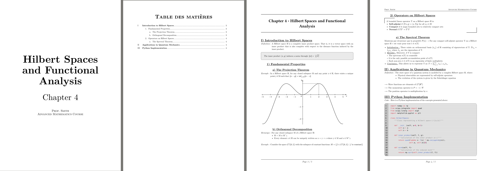

# Ape for Typst

  

Tired of documents that look like they were formatted by a troop of baboons? Try Ape for Typst!

  

This Typst package provides a comprehensive set of tools for structuring and styling academic course documents across various disciplines. It simplifies the process of creating good looking and consistent layouts, allowing students to focus on content creation.

_It mainly supports French (especially for shortcuts)._

**Key Features:**

  

*  **Flexible Title Numbering:** Offers a variety of numbering styles for headings and subheadings

*  **Table of Contents Customization:** Provides enhanced outline

*  **Front Page Design:** Offers a pre-designed front page templates

*  **Easy Integration:** Simple to integrate into your Typst documents with clear and concise functions and components.

*  **Helpful function:** function to highlight information (in boxes), shortcuts, plotting, etc.

  


  

**Functionalities:**


* Starting a new document
```typst
#import "@preview/ape:0.4.2": *

#show: doc.with(
  lang: "en",

  title: "Title",
  authors: ("Author1", "Author2"),
  style: "numbered",

  title-page: true,
  outline: true,
  smallcaps: true,
)
```


*Exemple 1 : (Style : numbered)*


*Exemple 2 : (Style : colored)*

*Soon...*


## Further informations
Some shortcuts are currently only available in french.

* Available style
  - Numbered (or numbered-book)
  - Plain
  - Colored
  - Presentation

* Formatting Functions
  - `para(name, content)`: Create a named paragraph with custom content
  - `rq(content)`: Create a "Remarque" (note) paragraph
  - `ex(content)`: Create an "Exemple" (example) paragraph
  - `arrow-list(items)`: Create a list with arrow bullets
  - `inbox(content)`: Create a box with gray background and border
    - There are a lot of varient accesible with `inbox2`, `inbox3`, `inbox4`

* Drawing and Plotting
  - `plotting(functions, domain, samples, steps, axis-style, axis, size)`: Plot mathematical functions with customizable options
  - `point(coordinates)`: Draw a point at given coordinates
  - `point-name(coordinates, name, offset)`: Draw a named point with custom offset
  - `quadratic(a, b, c)`: Calculate roots of quadratic equation
  - `base(coordinates, name1, name2, angle)`: Draw a base with custom angle
  - `spring(x0, y0, xf, yf, repetitions, amplitude)`: Draw a spring

* Mathematical Shortcuts
  - `recurrence(property, domain, initialization, heredity, conclusion)`: Format mathematical recurrence proofs
  - `dt`, `dx`, `dtheta`: Differential notations
  - `ar(content)`: Arrow notation
  - `nar(content)`: Norm of arrow notation
  - `dot2`, `dot3`: Double and triple dot notations
  - `grad`: Gradient notation
  - `cste`: Constant notation