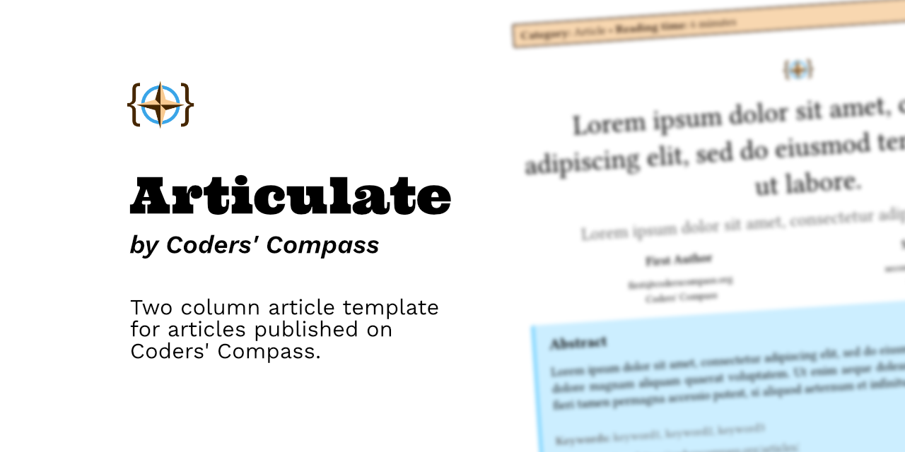
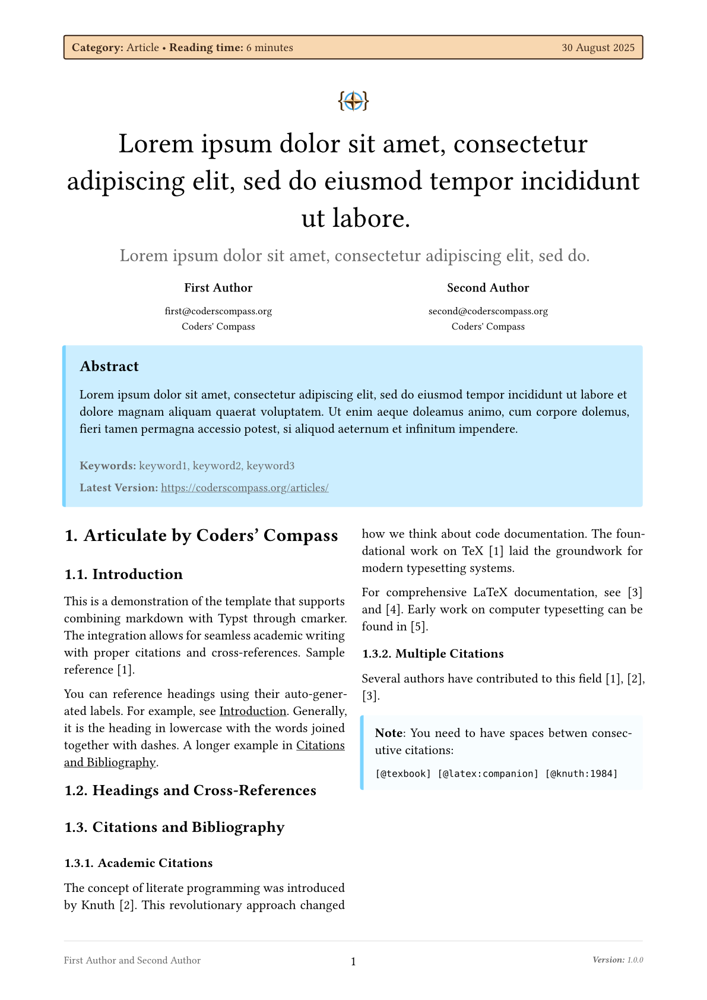
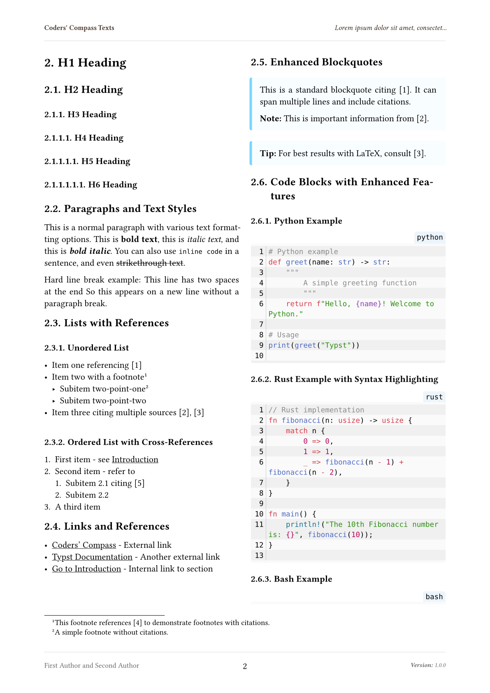

# The `articulate-coderscompass` Package
<div align="center">Version 0.1.7</div>

Template for a two column article layout for the [Coders' Compass website](https://coderscompass.org). It allows users to write articles in markdown or Typst, which can then be rendered to a PDF suitable for print.

Uses Coders' Compass branding and styling.



## Getting Started

1. Start with the [main.typ](template/main.typ) file which imports the `articulate-coderscompass` package and demonstrates its usage.
2. Open it in the [Typst Web App](https://typst.app) or use the [Typst CLI](https://github.com/typst/typst) to render it.




## Usage

```typst
#import "@preview/articulate-coderscompass:0.1.7": *

#show: articulate-coderscompass.with(
  title: lorem(15),
  subtitle: lorem(10),
  authors: (
    (name: "First Author", email: "first@coderscompass.org", affiliation: "Coders' Compass"),
    (name: "Second Author", email: "second@coderscompass.org", affiliation: "Coders' Compass"),
    // (name: "Third Author", email: "third@coderscompass.org", affiliation: "Coders' Compass"),
  ),
  abstract: [
    #lorem(40)
  ],
  keywords: (
    "keyword1",
    "keyword2",
    "keyword3",
  ),
  version: "1.0.0",
  reading-time: "6 minutes",
  date: datetime.today(),
  bibliography: bibliography("refs.bib", style: "institute-of-electrical-and-electronics-engineers")
)

#render-markdown(read("content.md"))

// Or write Typst directly

= Article Title

Content here.

```

Refer to the [manual](docs/manual.pdf) for detailed documentation on available features and customization options.

You don't have to use the `render-markdown` function. Write Typst directly if you prefer. The reason we use markdown is to have a single manuscript source which can be rendered to both HTML (for the website) and PDF (for print).

## Development

Follow the instructions in the official [Typst package repository](https://github.com/typst/packages?tab=readme-ov-file#local-packages) to symlink this package for local development. On MacOS this is what I use:

```bash
ln -s ~/path/to/articulate-coderscompass ~/Library/Application\ Support/typst/packages/preview/articulate-coderscompass/<current-version>
```

Convenience commands for developers and contributors to compile the template, generate the manual, and create thumbnail images.

```bash
# Compiling the template
typst c template/main.typ

# Generating the manual
typst c docs/manual.typ docs/manual.pdf --root .

# Thumbnail images
typst c docs/thumbnail.typ --format=png assets/images/page-{p}.png --root .

# Running tests with tytanic
tt run
tt run test1
tt run unit1
```

Remember to copy any changes to `template/main.typ` to the test case in `tests/test1/test.typ`. Also ensure that the contents file is copied over.

## License

This project is **mostly** licensed under the [MIT License](LICENSE). This includes _all code files_ and the _documentation (manual)_.

Only exception: the Coders' Compass branding assets, specifically the [logo](assets/images/cc-icon.png). All rights reserved on the branding assets (logo), Coders' Compass.

## Acknowledgements

- [Typst](https://typst.app) - The typesetting system powering this package.
  - [cmarker](https://typst.app/universe/package/cmarker/) - Handles markdown rendering.
  - [mitex](https://typst.app/universe/package/mitex) - LaTeX math rendering support.
  - [zebraw](https://typst.app/universe/package/zebraw) - Robust syntax highlighting for code blocks.
  - [tidy](https://typst.app/universe/package/tidy) - Documentation generation.

- [Typst Package Template](https://github.com/typst-community/typst-package-template) - Template for creating Typst packages.
- [tytanic](https://github.com/typst-community/tytanic) - Test runner for Typst projects.

## Contact

For questions, or suggestions, please reach out to the [Coders' Compass team](https://coderscompass.org/contact/).
