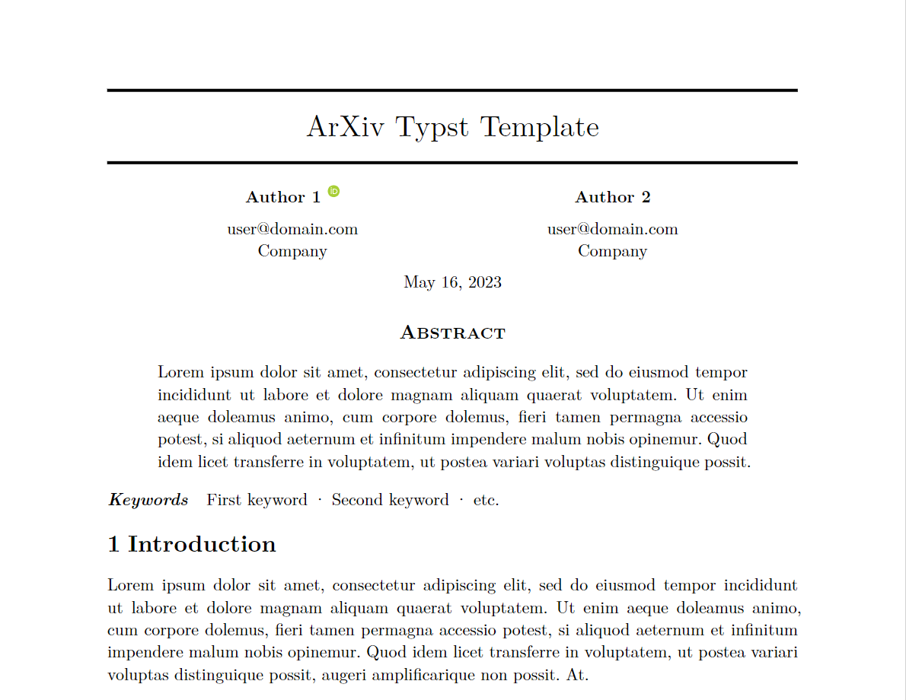

# arxivify

A Typst template based on popular LateX template used in NeurIPS, arXiv and bio-arXiv. Inspired by [arxiv-style](https://github.com/kourgeorge/arxiv-style)



## Usage

**Import**

```
#import "@preview/arxivify:0.1.0": arxivify, arxivify_appendices
```

**Main body**

```
#show: arxivify.with(
  title: "ArXiv Typst Template",
  authors: (
    (name: "Author 1", email: "user@domain.com", affiliation: "Company", orcid: "0000-0000-0000-0000"),
    (name: "Author 2", email: "user@domain.com", affiliation: "Company"),
  ),
  // Insert your abstract after the colon, wrapped in brackets.
  // Example: `abstract: [This is my abstract...]`
  abstract: lorem(55),
  keywords: ("First keyword", "Second keyword", "etc."),
  date: "May 16, 2023",
)
```

**Appendix**

```
#show: arxivify_appendices
=

== Appendix section

#lorem(100)

```
