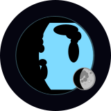
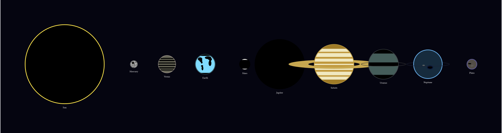
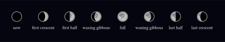
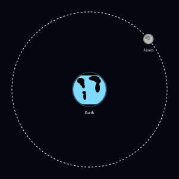
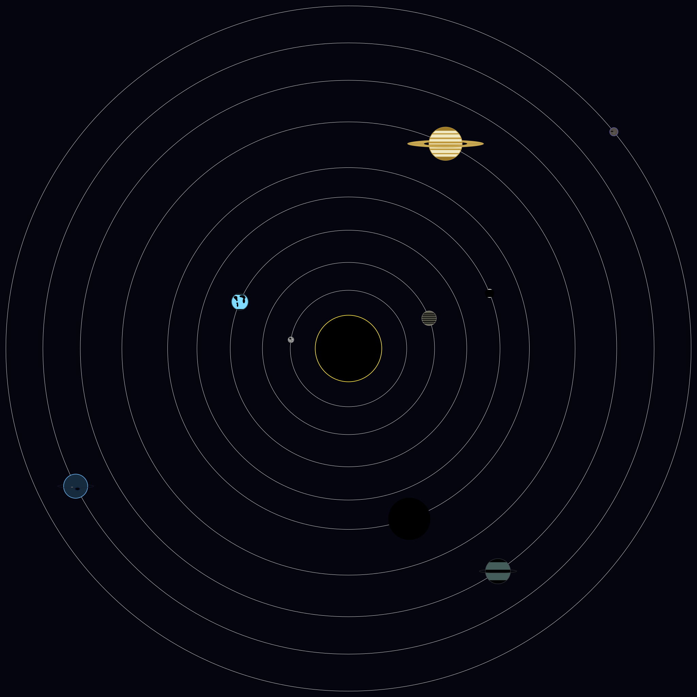

<h1 align="center">
  <br/>
  <strong>astro</strong>
</h1>
<p align="center">
Generate beautiful astronomical diagrams in Typst.
</p>

## Usage

Import the package at the top of your Typst document:

```typst
#import "@preview/astro:0.1.0": *
```

`astro` is built on top of [CeTZ](https://github.com/cetz-package/cetz), so all bodies must be drawn inside a `cetz.canvas` block:

```typst
#import "@preview/astro:0.1.0": *
#import "@preview/cetz:0.5.0"

#cetz.canvas({
  earth()
})
```

## Examples

### Planets

You have many celestial bodies to choose from. The current implementation includes all primary planets and one dwarf planet:

| Function | Body |
|----------|------|
| `sun()` | Sun |
| `mercury()` | Mercury |
| `venus()` | Venus |
| `earth()` | Earth |
| `moon()` | Moon |
| `mars()` | Mars |
| `jupiter()` | Jupiter |
| `saturn()` | Saturn |
| `uranus()` | Uranus |
| `neptune()` | Neptune |
| `pluto()` | Pluto |

```typst
#import "@preview/astro:0.1.0": *
#import "@preview/cetz:0.5.0"
#import cetz.draw: *

#set page(width: auto, height: auto, fill: rgb("#050510"))

#cetz.canvas({
  let gap = 3
  let x = 0
  for (body, fn) in (
    ("sun", sun),
    ("mercury", mercury),
    ("venus", venus),
    ("earth", earth),
    ("mars", mars),
    ("jupiter", jupiter),
    ("saturn", saturn),
    ("uranus", uranus),
    ("neptune", neptune),
    ("pluto", pluto),
  ) {
    let r-body = dr.at(body)
    fn(center: (x, 0))
    x = x + r-body + gap
  }
})
```



Each body function accepts a `center` parameter to set its position on the canvas and a `name` parameter to control the label rendered beneath it:

```typst
earth(center: (0, 0), name: "Earth")
```

### Adding Phases

For any celestial body, you can add a lunar phase overlay by passing `phase: <PHASE>` when calling the body:

```typst
moon(phase: "first crescent")
```

The following phases are supported:

| Phase | Description |
|-------|-------------|
| `"new"` | Fully shadowed |
| `"first crescent"` | Thin crescent on the right |
| `"first half"` | Right half lit |
| `"waxing gibbous"` | Mostly lit, shadow on left |
| `"full"` | Fully lit (default) |
| `"waning gibbous"` | Mostly lit, shadow on right |
| `"last half"` | Left half lit |
| `"last crescent"` | Thin crescent on the left |

```typst
#import "@preview/astro:0.1.0": *
#import "@preview/cetz:0.5.0"
#import cetz.draw: *

#set page(width: auto, height: auto, fill: rgb("#050510"), margin: 20pt)

#cetz.canvas({
  let x = 0
  let r = dr.at("moon")
  for phase in (
    "new",
    "first crescent",
    "first half",
    "waxing gibbous",
    "full",
    "waning gibbous",
    "last half",
    "last crescent",
  ) {
    moon(center: (x, 0), phase: phase, name: phase)
    x = x + 2 * r + 1
  }
})
```



### Orbits

You can compose celestial bodies freely on a CeTZ canvas to diagram orbital systems. Bodies accept a `center` parameter for positioning, allowing you to recreate any arrangement:

```typst
#import "@preview/astro:0.1.0": *
#import "@preview/cetz:0.5.0"
#import cetz.draw: *

#set page(width: auto, height: auto, fill: rgb("#050510"), margin: 20pt)

#cetz.canvas({
  let center-e = (0, 0)
  let center-m = (3.5, 3)
  let r = cetz.vector.dist(center-e, center-m)

  circle(center-e, radius: r, stroke: (dash: "dashed", paint: rgb("#fff")))

  earth(center: center-e)
  moon(center: center-m)
})
```



### Solar System

Combine orbits and bodies to build a full solar system diagram:

```typst
#import "@preview/astro:0.1.0": *
#import "@preview/cetz:0.5.0"
#import "@preview/suiji:0.5.1": *
#import cetz.draw: *

#set page(width: auto, height: auto, fill: rgb("#050510"), margin: 20pt)

#cetz.canvas({
  let center = (0, 0)
  let gap = 3
  let x = 0

  let rng = gen-rng-f(4)
  for (body, fn) in (
    ("sun", sun),
    ("mercury", mercury),
    ("venus", venus),
    ("earth", earth),
    ("mars", mars),
    ("jupiter", jupiter),
    ("saturn", saturn),
    ("uranus", uranus),
    ("neptune", neptune),
    ("pluto", pluto),
  ) {
    let (rng2, theta) = uniform-f(rng, low: 0.0, high: 2 * calc.pi)
    rng = rng2
    let a = center.at(0) + x * calc.cos(theta)
    let b = center.at(1) + x * calc.sin(theta)

    circle((0, 0), radius: x, stroke: (paint: rgb("#fff")))
    fn(center: (a, b), name: "")

    x = x + dr.at(body) + gap
  }
})
```



## Documentation

You can find full documentation for this project [here](https://astro.anvaratayev.com).
