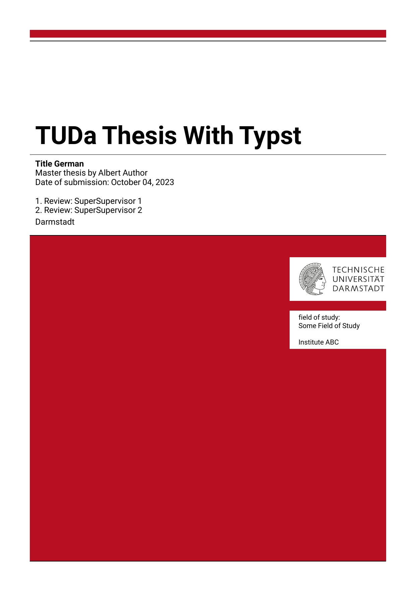

# Typst Template for the Corporate Design of TU Darmstadt :book:
This **unofficial** template can be used to write in [Typst](https://github.com/typst/typst) with the corporate design of [TU Darmstadt](https://www.tu-darmstadt.de/).

#### Disclaimer
Please ask your supervisor if you are allowed to use typst and this template for your thesis or other documents.
Note that this template is not checked by TU Darmstadt for correctness.
Thus, this template does not guarantee completeness or correctness.
Also, note that submission in TUbama requires PDF/A which typst currently can't export to (https://github.com/typst/typst/issues/2942).
You can use a converter to convert from the typst output to PDF/A, but check that there are no losses during the conversion. CMYK color space support may be required for printing which is also currently not supported by typst (https://github.com/typst/typst/issues/2942), but this is not relevant when you just submit online.


## Implemented Templates
The templates imitate the style of the corresponding latex templates in [tuda_latex_templates](https://github.com/tudace/tuda_latex_templates).
Note that there can be visual differences between the original latex template and the typst template (you may open an issue when you find one).

For missing features, ideas or other problems you can just open an issue :wink:. Contributions are also welcome.

| Template | Preview | Example | Scope |
|----------|---------|---------|-------|
| [tudapub](https://github.com/JeyRunner/tuda-typst-templates/blob/main/templates/tudapub/tudapub.typ) |  | [example_tudapub.pdf](https://github.com/JeyRunner/tuda-typst-templates/blob/main/example_tudapub.pdf) <br/> [example_tudapub.typ](https://github.com/JeyRunner/tuda-typst-templates/blob/main/example_tudapub.typ) | Master and Bachelor thesis |

## Usage
Create a new typst project based on this template locally.
```bash
typst init @preview/athena-tu-darmstadt-thesis
cd athena-tu-darmstadt-thesis
```
Or create a project on the typst web app based on this template.

<details>
<summary>Or do a manual installation of this template.</summary>
For a manual setup create a folder for your writing project and download this template into the `templates` folder:

```bash
mkdir my_thesis && cd my_thesis
mkdir templates && cd templates
git clone https://github.com/JeyRunner/tuda-typst-templates templates/
```
</details>

### Logo and Font Setup
Download the tud logo from [download.hrz.tu-darmstadt.de/protected/ULB/tuda_logo.pdf](https://download.hrz.tu-darmstadt.de/protected/ULB/tuda_logo.pdf) and put it into the `logos` folder.
Now execute the following script in the `logos` folder to convert it into an svg:

```bash
cd logos
./convert_logo.sh
```

Also download the required fonts `Roboto` and `XCharter`:
```bash
cd fonts
./download_fonts.sh
```
Now you can install all fonts in the folders in `fonts` on your system.

<details>
<summary>Create a main.typ file for the manual template installation.</summary>
Create a simple `main.typ` in the root folder (`my_thesis`) of your new project:

```js
#import " templates/tuda-typst-templates/templates/tudapub/tudapub.typ": tudapub

#show: tudapub.with(
  title: [
    My Thesis
  ],
  author: "My Name",
  accentcolor: "3d"
)

= My First Chapter
Some Text
```

</details>

### Compile you typst file

```bash
typst --watch main.typ --font-path fonts/
```

This will watch your file and recompile it to a pdf when the file is saved. For writing, you can use [Vscode](https://code.visualstudio.com/) with these extensions: [Typst LSP](https://marketplace.visualstudio.com/items?itemName=nvarner.typst-lsp) and [Typst Preview](https://marketplace.visualstudio.com/items?itemName=mgt19937.typst-preview). Or use the [typst web app](https://typst.app/) (here you need to upload the logo and the fonts).

Note that we add `--font-path` to ensure that the correct fonts are used.
Due to a bug (typst/typst#2917 typst/typst#2098) typst sometimes uses the font `Roboto condensed` instead of `Roboto`.
To be on the safe side, double-check the embedded fonts in the pdf (there should be no `Roboto condensed`).
What also works is to uninstall/deactivate all `Roboto condensed` fonts from your system.


## Todos
* [ ] some bug seems to insert an empty page at the end of the document when content (title page) appears before this second 'set page'
* [ ] numbering/labeling of sub-equations (that are aligned with the other sub-equations)
* [x] remove page numbers in footer before ~~and at table of contents~~
* [x] fix first-level heading page is wrong
  * in the outline, the page of the first-level heading is sometimes the previous page of the heading. Just appears in combination with `figure_numbering_per_chapter`.
* [ ] fix referencing figures respect figure numbering when using `figure_numbering_per_chapter`
* [ ] first-level headings should be referenced as 'Chapter' not as 'Sections'
* [ ] add pages for:
  * [x] abstract
  * [ ] list of figures, tables, ... other
  * [ ] list of abbreviations (glossary)
  * [x] references
* [ ] references list: use same citation style is 'numeric' in latex
* [ ] reduce vertical spacing between adjacent headings when there is no text in between (looks better, latex template also does this)
* [x] add arguments for optional pages:
  * after title page
  * before outline table of contents
  * after outline table of contents
* [ ] fix equation numbering per chapter (somehow increases in steps of 2)
* [x] provide some default page margins (small, medium, large)
* [ ] ~~make all font sizes relative to the main text font size (e.g. headings)~~
* [ ] switch to kebab case for template, function args