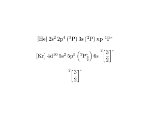

# AtoState

Conveniently typeset atomic state configurations in [typst](https://typst.app/).

Import the package with

```typ
#import "@preview/atostate:1.0.0": atostate, atoterm
```

and use it by calling one of those functions in math mode:

```typ
$ #atostate("[He] 2s2.2p4.(3P).3s.(2P).np:1P*") $

$ #atostate("[Kr] 4d10.5s2.5p5.(2P<3/2>*).6s:2[3/2]*") $

$ #atoterm("2[3/2]*") $
```

<picture>
  
</picture>

See the [user's guide](docs/Users.pdf) for more in-depth (and guaranteed up-to-date) documentation, including an explanation of the syntax, or the [developer's guide](docs/Developers.pdf) for internal details of how the package works.