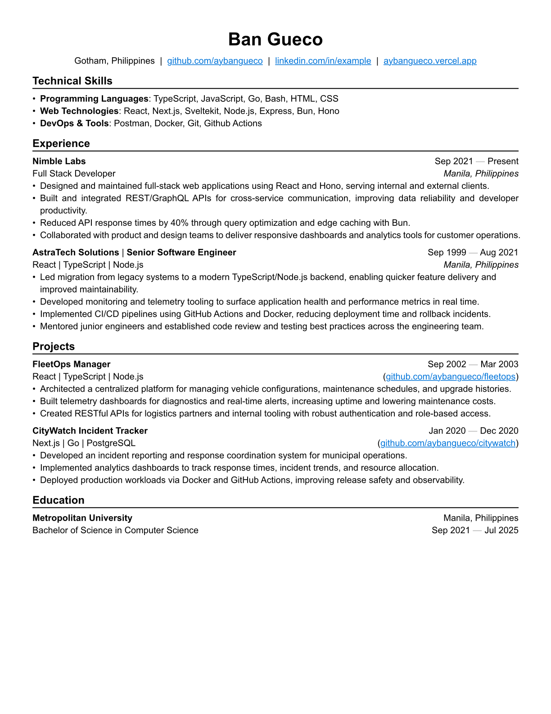
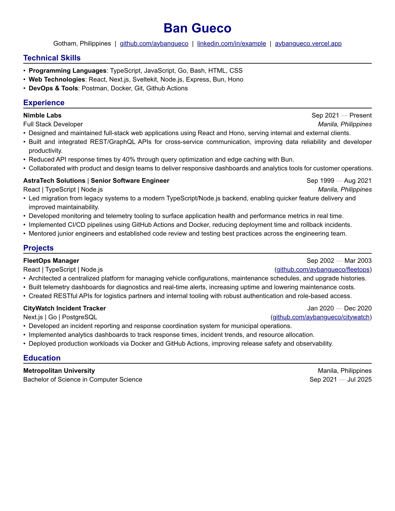

# ats-friendly-resume v0.1.1

ATS friendly resume designed for developers. This was for personal use, there are alternatives but I feel like building my own from scratch and make it more ats friendly.

## Quick Start

Use these to quickly build your resume

```typ
#import "@preview/ats-friendly-resume:0.1.1": *

// Your personal information replace mine with yours (pls don't steal my identity)
#let name = "Ban Gueco"
#let location = "Gotham, Philippines"
// #let email = "example@gmail.com"
// #let phone = "012345672"
#let linkedin = "linkedin.com/in/example"
#let github = "github.com/aybangueco"
#let portfolio = "aybangueco.vercel.app"

#show: resume.with(
  author: name,
  author-position: center,
  // Personal information
  // Below these lines are optional
  // Feel free to comment out and remove them
  location: location,
  // email: email,
  // phone: phone,
  linkedin: linkedin,
  github: github,
  portfolio: portfolio,
  personal-info-position: center,
  // Document formatting and values
  // These are already defined by default, feel free to omit or edit them
  color-enabled: false,
  text-color: "#000080",
  font: "New Computer Modern",
  paper: "us-letter",
  author-font-size: 20pt,
  font-size: 10pt,
  lang: "en",
)

== Technical Skills
- *Programming Languages*: TypeScript, JavaScript, Go, Bash, HTML, CSS
- *Web Technologies*: React, Next.js, Sveltekit, Node.js, Express, Bun, Hono
- *DevOps & Tools*: Postman, Docker, Git, Github Actions

== Experience

// Experience section
// tech-used is optional so feel free to omit it.

#work(
  company: "Nimble Labs",
  role: "Full Stack Developer",
  dates: dates-util(start-date: "Sep 2021", end-date: "Present"),
  location: "Manila, Philippines",
)
- Designed and maintained full-stack web applications using React and Hono, serving internal and external clients.
- Built and integrated REST/GraphQL APIs for cross-service communication, improving data reliability and developer productivity.
- Reduced API response times by 40% through query optimization and edge caching with Bun.
- Collaborated with product and design teams to deliver responsive dashboards and analytics tools for customer operations.

#work(
  company: "AstraTech Solutions",
  role: "Senior Software Engineer",
  dates: dates-util(start-date: "Sep 1999", end-date: "Aug 2021"),
  tech-used: "React | TypeScript | Node.js",
  location: "Manila, Philippines",
)
- Led migration from legacy systems to a modern TypeScript/Node.js backend, enabling quicker feature delivery and improved maintainability.
- Developed monitoring and telemetry tooling to surface application health and performance metrics in real time.
- Implemented CI/CD pipelines using GitHub Actions and Docker, reducing deployment time and rollback incidents.
- Mentored junior engineers and established code review and testing best practices across the engineering team.

== Projects

// Projects section
// tech-used is optional so feel free to omit it.

#project(
  name: "FleetOps Manager",
  dates: dates-util(start-date: "Sep 2002", end-date: "Mar 2003"),
  tech-used: "React | TypeScript | Node.js",
  url: "github.com/aybangueco/fleetops",
)
- Architected a centralized platform for managing vehicle configurations, maintenance schedules, and upgrade histories.
- Built telemetry dashboards for diagnostics and real-time alerts, increasing uptime and lowering maintenance costs.
- Created RESTful APIs for logistics partners and internal tooling with robust authentication and role-based access.

#project(
  name: "CityWatch Incident Tracker",
  dates: dates-util(start-date: "Jan 2020", end-date: "Dec 2020"),
  tech-used: "Next.js | Go | PostgreSQL",
  url: "github.com/aybangueco/citywatch",
)
- Developed an incident reporting and response coordination system for municipal operations.
- Implemented analytics dashboards to track response times, incident trends, and resource allocation.
- Deployed production workloads via Docker and GitHub Actions, improving release safety and observability.

== Education

#edu(
  institution: "Metropolitan University",
  location: "Manila, Philippines",
  degree: "Bachelor of Science in Computer Science",
  dates: dates-util(start-date: "Sep 2021", end-date: "Jul 2025"),
)
```

## Example

### No Color


### Colored

