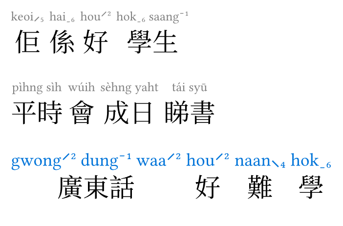
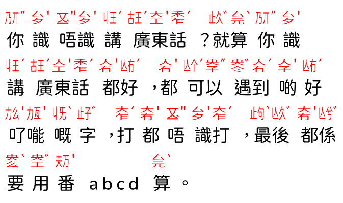

## auto-canto

This Typst package provides automatic Cantonese segmentation and romanization
(Jyutping (粵拼) and Yale (耶魯)) by wrapping the
[`rust-canto`](https://crates.io/crates/rust-canto) Rust crate as a WebAssembly
plugin. It integrates seamlessly with the
[`pycantonese-parser`](https://github.com/VincentTam/pycantonese-parser/)
package to render beautiful Cantonese text with ruby characters.

---

### Features

* **Automatic Segmentation**: Breaks Cantonese sentences into meaningful words
using a dictionary-based trie.
* **Multiple Romanizations**: Supports both **Jyutping** and **Yale** (numeric
or diacritics).
* **High Performance**: Powered by a Rust-compiled WASM plugin for fast
processing.
* **Typst Integration**: Provides a `quick-render` function that handles both
segmentation and styling in one go.

---

### Usage

To use this package, ensure the `rust_canto.wasm` file is in your project directory.

```typst
#import "@preview/auto-canto:0.2.0": quick-render

// 36pt font
// use Libertinus Serif first (for ruby text)
// before falling back to Noto Serif CJK HK (for Chinese characters)
#set text(36pt, font: ("Libertinus Serif", "Noto Serif CJK HK"))

// 1. Basic rendering (defaults to Jyutping)
#quick-render("佢係好學生")

// 2. Rendering with Yale romanization
#quick-render("平時會成日睇書", romanization: "yale")

// 3. Customizing the underlying parser's style
#let my-style = (rb-size: 0.7em, rb-color: blue)
#quick-render("廣東話好難學", style: my-style)
```



Live demo on YouTube: https://youtu.be/ivUu91eDfvY

#### Jyutcitzi (粵切字) support (optional)

This package can render Jyutcizi above Chinese characters, provided that the
user has imported the
[`se-jyutcitzi`](https://typst.app/universe/package/se-jyutcitzi) Typst package.

To ensure that a clean dependency, the user has to pass the `jyutcitzi()`
function from `se-jyutcitzi` package to the `jyutcit-ruby()` function in this
package.

```typ
#import "@preview/se-jyutcitzi:0.3.2": *
#import "@preview/auto-canto:0.2.0": *
// #set page(height: auto, width: auto, margin: 1pt)
#set text(24pt, font: "Chiron GoRound TC")
#set par(justify: true)

// Customize Jyutcitzi display
#let default-style = (
  rb-color:    rgb("#ff0000"),  // Annotation text color
  rb-size:     0.8em,   // Annotation text size
  word-sep:    0.2em,   // Chinese words separation
  char-jp-sep: 0.2em,   // vertical space between words and Jyutping above
)

#let mytxt = [
  你識唔識講廣東話？就算你識講廣東話都好，都可以遇到啲好𠮩𠹌嘅字，打都唔識打，最後都係要用番 abcd 算!
]
#jyutcit-ruby(mytxt, jyutcitzi: jyutcitzi)
```



---

### API Reference

#### `quick-render(it, ..args)`

The primary high-level function. It fetches data from the WASM plugin and
forwards it to the parser.

* `it`: The item containing the Cantonese string to process.
* `..args`: Named arguments forwarded to [`render-word-groups`](https://github.com/VincentTam/pycantonese-parser/blob/7ed67e5d/src/renderer.typ#L10-L15)
(e.g. `romanization`, `style`).

#### `jyutcit-ruby(it, jyutcitzi: none, style: (:))`

Renders Cantonese text with **Jyutcitzi** annotations above each word.

* **Note**: Requiresthe
[`jyutcitzi`](https://github.com/VincentTam/jyutcitzi/blob/f0083491/lib.typ#L5)
function from the `se-jyutcitzi` package passed as an argument.
* `it`: The item containing the Cantonese string to process.
* `jyutcitzi`: Named argument for the Jyutcitzi function.
* `style`: a dictionary for the following four keys
  - `rb-color`: ruby text color
  - `rb-size`: ruby text size (in em)
  - `word-sep`: horizontal separation between words (in em)
  - `char-jp-sep`: vertical separation between ruby text and main text (in em)

#### `annotate(txt)`

Returns the raw segmented data as an array of dictionaries.

* **Return format**: `array` of `{word: str, jyutping: str, yale: array}`.

#### `to-yale-numeric(jp-str)` / `to-yale-diacritics(jp-str)`

Utility functions to convert space-delimited Jyutping strings into Yale format.

* `numeric`: "gwong2 dung1 waa2" → "gwong2 dung1 wa2".
* `diacritics`: "gwong2 dung1 waa2" → "gwóngdūngwá".

---

### Project Structure

* `lib.typ`: The main entry point containing the Typst wrappers.
* `rust_canto.wasm`: The WebAssembly binary compiled from the `rust-canto`
crate.
* `typst.toml`: Package metadata and dependencies.

### License

MIT

### Contributing

Contributions are welcome! Please open an issue or submit a pull request.
