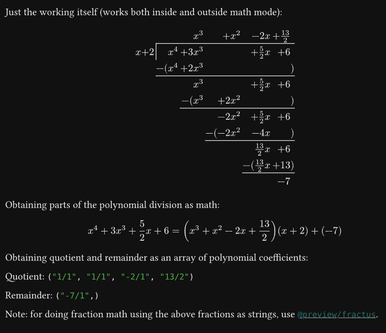

# auto-div

For automatic polynomial division.

Currently, only integer and fractional coefficients are supported. More number systems planned for future releases.

## Quick start

For example, to evaluate $x^4 + 3x^3 + \frac{5}{2} x + 6$ divided by $x + 2$, specify the coefficients `(1, 3, 0, "5/2", 6)` and `(1, 2)` respectively.

```typst
#import "@preview/auto-div:0.1.0": poly-div, poly-div-working

Just the working itself (works both inside and outside math mode):

$ #poly-div-working((1, 3, 0, "5/2", 6), (1, 2)) $

Obtaining parts of the polynomial division as math:

#let result = poly-div((1, 3, 0, "5/2", 6), (1, 2))
$
  result.dividend = (result.quotient) (result.divisor) + (result.remainder)
$

Obtaining quotient and remainder as an array of polynomial coefficients:

Quotient: #result.quot-coeff

Remainder: #result.rem-coeff
```



> 💡 To do calculations with the returned coefficients' fraction strings, use [`fractus`](https://typst.app/universe/package/fractus/).

## Methods

### `poly-div`

Polynomial long division.

If only displaying the working of a polynomial long division without needing results in an array of numbers, use
`poly-div-working` instead.

#### Parameters

- `dividend` (`array`, positional): Coefficients of the dividend. Last element is x^0. For fractional coefficients, specify as strings e.g. "15/4", otherwise use integers.
- `divisor` (`array`, positional): Coefficients of divisor. Last element is for x^0. For fractional coefficients, specify as strings e.g. "15/4", otherwise use integers.
- `var` (`content`, named): The variable of the polynomial. Default is $x$.

#### Returns

Returns a dict: `(working:, quotient:, remainder:, quot-coeff:, rem-coeff:)`:

- `working` (`content`): displayable content showing the working (as a table)
- `dividend` (`math.equation`): the dividend as a math equation object
- `divisor` (`math.equation`): the divisor as a math equation object
- `quotient` (`math.equation`): the quotient as a math equation object
- `remainder` (`math.equation`): the remainder as a math equation object
- `quot-coeff` (`array`): the coefficients of the quotient polynomial as an array of fraction strings
- `rem-coeff` (`array`): the coefficients of the remainder polynomial as an array of fraction strings

### `poly-div-working`

Same as `poly-div`, but returns only the `working`.