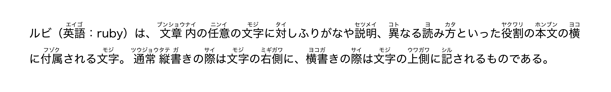

# auto-jrubby

**auto-jrubby** is a Typst package that provides automatic Japanese morphological analysis and furigana (ruby) insertion.

It leverages a Rust-based WASM plugin to tokenize text using [Lindera](https://github.com/lindera/lindera) (a morphological analysis library) and uses the [rubby](https://typst.app/universe/package/rubby) package to render the furigana.

## Features

- **Automatic Furigana Generation:** Automatically determines readings for Kanji based on context and renders them as ruby text.
- **Smart Okurigana Alignment:** Intelligent handling of mixed Kanji/Hiragana words (e.g., `食べる` is rendered with ruby `た` over `食`, leaving `べる` untouched).
- **Morphological Analysis Table:** Visualize the text structure (Part of Speech, Detailed POS, Readings, Base forms) via a formatted data table.
- **Customizable Styling:** Supports custom ruby sizing and positioning via the `rubby` package backend.
- **High Performance:** Powered by a Rust WASM plugin using **Lindera** (IPADIC) for fast and accurate tokenization.

## Usage

### Basic Furigana

To automatically add readings to Japanese text:
```typst
#import "@preview/auto-jrubby:0.1.0": *
#set text(font: "Hiragino Sans", lang: "ja")

#let sample = "ルビ（英語: ruby）は、文章内の任意の文字に対しふりがなや説明、異なる読み方といった役割の本文の横に付属される文字。"
#show-ruby(sample)
```



### Morphological Analysis Table

To debug or display the linguistic structure of the text:
```typst
#import "@preview/auto-jrubby:0.1.0": *
#set text(font: "Hiragino Sans", lang: "ja")

#show-analysis-table("すももも桃も桃のうち")
```


## API Reference

### `show-ruby`

Renders the input text with automatic furigana.
```typc
#let show-ruby(input-text, size: 0.5em, ruby-func: auto)
```

**Parameters:**

  - `input-text` (string): The Japanese text to analyze and render.
  - `size` (length): The font size of the ruby text. Defaults to `0.5em`.
  - `ruby-func` (function | auto): A custom ruby function from the `rubby` package.
      - If `auto`, it uses the default configuration (`get-ruby(size: size)`).
      - If provided, it allows advanced customization of ruby positioning (e.g., specific `pos` or `alignment`).

### `show-analysis-table`

Renders a table displaying the morphological breakdown of the text.
```typc
#let show-analysis-table(input-text)
```

**Parameters:**

  - `input-text` (string): The text to analyze.

**Table Columns:**

1.  **Surface Form (表層形):** The word as it appears in the text.
2.  **Part of Speech (品詞):** Grammatical category (Noun, Verb, etc.).
3.  **Details (詳細):** Sub-category (e.g., Proper Noun, Suffix).
4.  **Reading (読み):** Katakana reading.
5.  **Base Form (基本形):** The dictionary form of the word.

### `tokenize`

Low-level function that returns the raw JSON data from the WASM plugin. Useful if you want to process the analysis data manually.
```typc
#let tokenize(input-text)
```

**Returns:** An array of dictionaries containing `surface`, `pos`, `sub_pos`, `reading`, `base`, and `ruby_segments`.

## Under the Hood

This package uses **Lindera** (a Rust port of Kuromoji) with the **IPADIC** dictionary embedded in the WASM binary.

1.  The text is passed from Typst to the Rust WASM plugin.
2.  Lindera tokenizes the text and retrieves readings.
3.  A custom algorithm aligns the readings with the surface form to separate Okurigana (kana endings of verbs/adjectives) from the Kanji stems.
4.  Typst receives the structured data and renders it using `rubby`.

## License

This project is distributed under the AGPL-3.0-or-later License. See [LICENSE](https://www.google.com/search?q=LICENSE) for details.