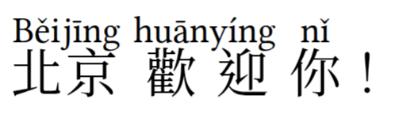
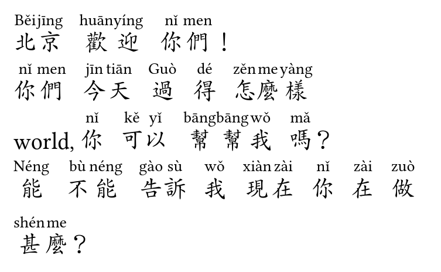
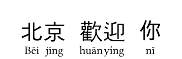

# auto-mando

`auto-mando` is a Typst package for automatic Mandarin annotation of Chinese
characters (漢字). It leverages the high-performance Rust-based WASM plugin
from [`rust-mando`](https://crates.io/crates/rust-mando) to segment text and
apply ruby annotations in either **pīnyīn** or **zhùyīn** (bopomofo /
注音符號).

## Features

* **Automatic Segmentation**: Accurately splits Chinese sentences into words to
  ensure correct annotation placement.
* **Pīnyīn Ruby**: Places pīnyīn above (or below) each character via the
  `rubby` package.
* **Zhùyīn Ruby**: Places bopomofo to the right of each character by default
  (traditional Taiwanese textbook style), with top/bottom/left as alternatives.
* **Tone Styles**: Supports tone marks (`nǐ`, default) and tone numbers (`ni3`)
  for pīnyīn; tone marks are always used for zhùyīn.
* **Content-Aware**: Processes both plain strings and Typst content blocks,
  preserving line breaks and paragraph breaks.

## Usage

### Basic Pīnyīn Example

```typst
#import "@preview/auto-mando:0.2.0": pinyin-ruby

#set text(font: ("Libertinus Serif", "Noto Serif CJK TC"), size: 18pt)
#set par(leading: 1.5em)  // prevent annotation overlap between lines

#pinyin-ruby[北京歡迎你！]
```



### Basic Zhuyin Example

```typst
#import "@preview/auto-mando:0.2.0": zhuyin-ruby

#set text(font: ("Libertinus Serif", "Noto Serif CJK TC"), size: 18pt)
#set par(leading: 1.5em)

#zhuyin-ruby[北京歡迎你！]
```

Bopomofo is placed to the **right** of each character by default, matching
the layout used in Taiwanese elementary school textbooks.


### Customizing Word Separation

```typst
#import "@preview/auto-mando:0.2.0": pinyin-ruby
#set text(24pt, font: ("Libertinus Serif", "AR PL KaitiM Big5"))
#set par(leading: 1.5em)

#pinyin-ruby(word-sep: 0.7em)[
  北京歡迎你們！

  你們今天過得怎麼樣

  world, 你可以幫幫我嗎？

  能不能告訴我現在你在做甚麼？
]
```



### Pīnyīn Tone Styles

```typst
#pinyin-ruby(style: "numbers")[北京]  // → bei3jing1
```

### Customising Ruby Styles

Both functions accept a `ruby-styles` dictionary that controls the appearance
of the annotation. You only need to supply the keys you want to change — the
rest are filled in from the defaults.

**Pīnyīn** defaults (`pos` must be `top` or `bottom`):

| key | default |
|-----|---------|
| `size` | `0.7em` |
| `dy` | `0pt` |
| `pos` | `top` |
| `alignment` | `"center"` |
| `auto-spacing` | `true` |

```typst
// Smaller annotation below the characters
#pinyin-ruby(
  ruby-styles: (size: 0.5em, pos: bottom),
)[北京歡迎你]
```



**Zhùyīn** defaults (`pos` may be `top`, `bottom`, `left`, or `right`):

| key | default |
|-----|---------|
| `size` | `0.33em` |
| `dy` | `0pt` |
| `pos` | `right` |
| `alignment` | `"center"` |
| `auto-spacing` | `true` |

```typst
// Bopomofo above the characters instead of to the right
#zhuyin-ruby(
  ruby-styles: (size: 0.5em, pos: top),
)[北京歡迎你]
```

> **Note on line spacing**: At larger font sizes, ruby annotations may overlap
> the line above. Add `#set par(leading: 1.5em)` (or a larger value) before
> your annotated text.

## API Reference

### `pinyin-ruby(it, style: "marks", ruby-styles: (...), word-sep: 0.25em)`

Annotates Chinese text with pīnyīn ruby.

* `it` — string or content block.
* `style` — `"marks"` (default) or `"numbers"`.
* `ruby-styles` — partial or full style dictionary (see table above).
* `word-sep` — horizontal gap between consecutive Chinese words (default
  `0.25em`). Pass `0em` to disable.

### `zhuyin-ruby(it, ruby-styles: (...), word-sep: 0.25em)`

Annotates Chinese text with zhùyīn (bopomofo) ruby.

* `it` — string or content block.
* `ruby-styles` — partial or full style dictionary (see table above).
  Set `pos: right` (default) for traditional right-side bopomofo, or
  `pos: top` / `bottom` for above/below placement.
* `word-sep` — horizontal gap between consecutive Chinese words (default
  `0.25em`). Pass `0em` to disable.

### `pinyin-to-zhuyin(syllable)`

Converts a single pinyin syllable with tone number (e.g. `"pin1"`) to a
bopomofo string (e.g. `"ㄆㄧㄣˉ"`). Useful for building custom renderers.

### `syllables-to-zhuyin(syllables)`

Converts an array of pinyin-number syllables to an array of bopomofo strings,
one per syllable.

### `flat(txt, style: "marks")`

Returns a space-separated pīnyīn string (non-Chinese tokens omitted). Useful
for metadata or search indexing.

### `segment(txt, style: "marks")`

Low-level function returning an array of `{word, pinyin}` dictionaries.
`pinyin` is `none` for non-Chinese tokens (punctuation, spaces, Latin).

### `render-segments-pinyin(segs, ruby-styles: (...), word-sep: 0.25em)`
### `render-segments-zhuyin(segs, ruby-styles: (...), word-sep: 0.25em)`

Low-level renderers that operate on the array returned by `segment()`. Use
these if you need to pre-process segments before rendering.

## Technical Details

* **WASM Backend**: Powered by `rust_mando.wasm` for fast, memory-efficient
  processing.
* **Dependencies**: [`rubby:0.10.2`](https://typst.app/universe/package/rubby)
  for top/bottom ruby placement.
* **Compiler Requirements**: Typst `0.14.0` or higher.
* **License**: MIT.

## Author

Vincent Tam ([GitHub](https://github.com/VincentTam)).
