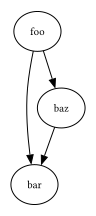
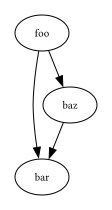
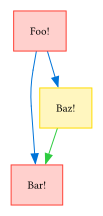
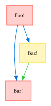
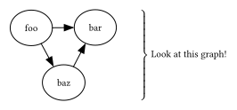

# autograph


A [Typst](https://typst.app/) package for drawing graphs with automatic layout, built on top of [fletcher](https://github.com/Jollywatt/typst-fletcher) and [diagraph-layout](https://github.com/Robotechnic/diagraph-layout).

## Usage Examples



```typ
#import "@preview/autograph:0.1.0": diagram, node, edge
#diagram(
  bezier: true,
  node(<foo>),
  node(<bar>),
  node(<baz>),
  edge(<foo>, <bar>),
  edge(<foo>, <baz>),
  edge(<baz>, <bar>),
)
```

autograph's syntax is somewhat of a hybrid between fletcher and dot ([Graphviz](https://graphviz.org/)).

In fact, it uses Graphviz's layout engine via [diagraph-layout](https://github.com/Robotechnic/diagraph-layout) to determine the concrete node positions and edge paths and uses fletcher to render the layout.

The `autograph.diagram` function is a wrapper around `fletcher.diagram` that works as a drop-in replacement with some additional features.

For comparison's sake, here is same graph written with dot, rendered with [diagraph](https://github.com/Robotechnic/diagraph):



````typ
#import "@preview/diagraph:0.3.6": *
#raw-render(
  ```dot
  digraph {
    foo -> bar
    foo -> baz
    baz -> bar
  }
  ```
)
````

autograph also supports flexibly styling your graph with fletcher. The example below shows how you can customize the look for your nodes and edges. See the fletcher [manual](https://github.com/typst/packages/raw/main/packages/preview/fletcher/0.5.8/docs/manual.pdf?raw=true) to find out more about styling.

Here, we disabled the `bezier` option because **styling with `bezier: true` has some limitations (see below)**. You can achieve a somewhat similar look by playing around with the edge's `corner-radius` option (or the diagram's `edge-corner-radius` option). However, it has to be manually tuned and also isn't real Bézier. If you omit the option from the example below, the edges will look a bit rough.



```typ
#import "@preview/autograph:0.1.0": diagram, node, edge
#import "@preview/fletcher:0.5.8": shapes
#diagram(
  node-shape: shapes.rect,
  node-fill: red.lighten(75%),
  node-stroke: 1pt + red,
  edge-stroke: 1pt + blue,
  edge-corner-radius: 75pt,
  node(<foo>, [Foo!]),
  node(<bar>, [Bar!]),
  node(<baz>, [Baz!], stroke: yellow, fill: yellow.lighten(75%)),
  edge(<foo>, <bar>),
  edge(<foo>, <baz>),
  edge(<baz>, <bar>, stroke: green),
)
```

If you want to achieve the same styling with `bezier: true`, you will have to use a workaround: Since the Bézier curves are drawn with fletcher's CeTZ integration, we cannot use fletcher primitives to style them, i.e. the diagram's `edge-stroke` option is ignored (among others).

You can however use CeTZ primitives to style the edges individually. In the example below, each edge is styled explicitly. See the CeTZ [online manual](https://cetz-package.github.io/docs/basics/styling) to find out more about what options you can pass.



```typ
#import "@preview/autograph:0.1.0": diagram, node, edge
#import "@preview/fletcher:0.5.8": shapes
#let edge-style(color) = (
  stroke: 1pt + color,
  mark: (end: ">", fill: color, scale: 1.5)
)
#diagram(
  bezier: true,
  node-shape: shapes.rect,
  node-fill: red.lighten(75%),
  node-stroke: 1pt + red,
  node(<foo>, [Foo!]),
  node(<bar>, [Bar!]),
  node(<baz>, [Baz!], stroke: yellow, fill: yellow.lighten(75%)),
  edge(<foo>, <bar>, ..edge-style(blue)),
  edge(<foo>, <baz>, ..edge-style(blue)),
  edge(<baz>, <bar>, ..edge-style(green)),
)
```

Since autograph's diagram works as a drop-in replacement for fletcher's diagram, you can also use fletcher nodes and edges and refer to the autograph nodes via their labels.


```typ
#import "@preview/autograph:0.1.0" as autograph: diagram
#import "@preview/fletcher:0.5.8" as fletcher: shapes
#diagram(
  engine: "neato",
  autograph.node(<foo>),
  autograph.node(<bar>),
  autograph.node(<baz>),
  autograph.edge(<foo>, <bar>),
  autograph.edge(<foo>, <baz>),
  autograph.edge(<baz>, <bar>),
  fletcher.node(
    enclose: (<foo>, <bar>, <baz>),
    shape: shapes.brace.with(
      dir: right,
      length: 100% - 3em,
      sep: 10pt,
      label: [Look at this graph!]
    )
  ),
)
```




Alternatively, you may want to wrap your autograph elements and your fletcher elements in two separate blocks, like shown below:


```typ
#import "@preview/autograph:0.1.0" as autograph: diagram
#import "@preview/fletcher:0.5.8" as fletcher
#diagram(
  engine: "circo",
  node-fill: white,
  {
    import autograph: node, edge
    (
      node(<foo>),
      node(<bar>),
      node(<baz>),
      edge(<foo>, <bar>),
      edge(<foo>, <baz>),
      edge(<baz>, <bar>),
    )
  },
  {
    import fletcher: shapes, node, edge
    (
      node(
        enclose: (<foo>, <bar>, <baz>),
        shape: shapes.rect,
        stroke: 1pt + blue,
        inset: 0.5em,
        fill: blue.lighten(75%),
        outset: 0.5em,
        name: <group>,
      ),
      node(
        (rel: (6.5em, 0em), to: <group.east>),
        stroke: none,
        fill: none,
        inset: 0mm,
        outset: 0.5em,
        text(red)[Look at this graph!],
        name: <caption>,
      ),
      edge(
        <caption>, <group>, "->", stroke: red,
      ) ,       
    )
  }
)
```


## How It Works

autograph uses [diagraph-layout](https://github.com/Robotechnic/diagraph-layout) to layout the graph. Internally, diagraph-layout uses Graphviz.

To draw a graph with autograph, we perform the following steps:
1. For each node we want to draw, we need to acquire its exact dimensions it will have in the final diagram (this is crucial for step 2). To do so, we do the following for each node:
    - Create a dummy fletcher diagram containing a single fletcher node. This is necessary, because node dimensions are influenced by arguments like `node-inset`.
    - Measure the size of the diagram using [`measure`](https://typst.app/docs/reference/layout/measure/)
2. We acquire the layout using diagraph-layout's `layout-graph` function. Here, we pass the `width` and `height` of each node we measured before.
3. We guarantee that the order of the nodes and edges will be preserved and that the first node that was supplied will be positioned at `(0pt, 0pt)`. Since diagraph-layout makes no such guarantees, we need to reorder the nodes and edges and shift all points.
4. We draw the nodes as fletcher nodes at the exact positions we acquired before.
5. We draw the edges. Depending on the value of the `bezier` parameter, we use fletcher edges or CeTZ functions. Since this is quite complicated, more on that below...

### Bézier Curves

In Graphviz, edges are rendered as [Bézier curves](https://en.wikipedia.org/wiki/B%C3%A9zier_curve), so by extension, diagraph-layout gives us the edges as a list of Bézier control points. A single Bézier segment consists of 4 control points. The first and last determine the start and end of the curve, and the two middle
ones determine its curvature. If we have more than one segment, we simply get a longer list of control points where the condition `(len - 1) % 3 == 0` holds, so the list can have the length 4, 7, 10, 13, 16, ...

For example, we might get a list of 10 control points:
```
(p0, p1, p2, p3, p4, p5, p6, p7, p8, p9)
```
This stands for a Bézier curve with 3 segments:
```
((p0, p1, p2, p3), (p3, p4, p5, p6), (p6, p7, p8, p9))
```

### Drawing Bézier Curves with fletcher

fletcher currently (as of v0.5.8) does not support Bézier edges. This is a feature that is planned for v0.6.0. Therefore, for `bezier: false`, we simply draw the edges using the individual Bézier segments' start and end points. In the example above, this is:
```
(p0, p3, p6, p9)
```
As has been shown in one of the examples above, we can make this look a bit nicer with the `corner-radius` argument.

By the way, we are discarding the start and end nodes of the edge that Graphviz gave us and use the fletcher nodes instead. Since the node rendering is not 100% accurate, this gives a nicer rendering.

### Drawing Bézier Curves with CeTZ

When we want to have actual Bézier, we need to hack a little and use fletcher's CeTZ integration. The drawing works fine, but CeTZ doesn't care about our defined edge styles and everything that has to do with marks becomes a bit annoying.

This is just a workaround for the moment, and when fletcher supports Bézier curves, I will remove the CeTZ part.

## Limitations / Planned Features

- It would be nice to add a `graph` function in which we can optionally enclose our nodes and edges. This would allow us to have multiple graphs that are rendered independently from each other. The `graph` function should have an optional parameter `origin` that puts the root node to that location (instead of `(0pt, 0pt)`). This may also come in handy when we're only dealing with one graph.
- Everything about Bézier stated above...
- We're currently not supporting edge labels.
- We're currently not supporting undirected graphs.
- We're currently unable to set node, edge, and graph attributes. For example, it would be nice to set the drawing direction (`rankdir`) among other things. In some cases, attributes should be set automatically. For example, when we set `node-shape: rect` in the diagram, we should also pass `shape=box` to Graphviz to improve rendering in some edge cases.
- We're currently applying some default styles to the diagrams to get the ellipse-shaped nodes and arrow-shaped edges. It's not hard to turn those off but it might be convenient to turn all of them off with a single argument.
- Missing something? Create an [Issue](https://github.com/felsenhower/typst-autograph/issues/new)!
