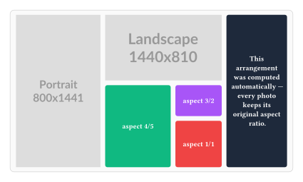
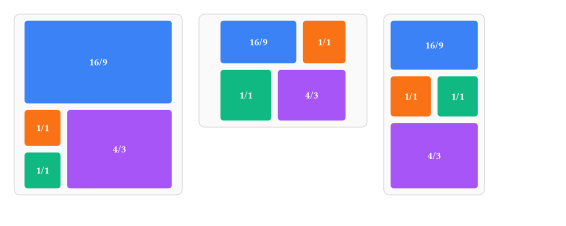

# automosaic

Automatic aspect-ratio-preserving nested tree layouts for (mostly photo) mosaics.

 \
_(Figure code see [`docs/figure1.typ`](docs/figure1.typ))_

Lays out grids of images (or arbitrary content) that fill an available box while
preserving every element's aspect ratio and keeping uniform gaps, and lets you either
build the layout tree yourself or have one searched for automatically.

## Usage


### Auto-Layout: Automatically find optimal arrangement and compute cell sizes to fill available space while preserving aspect ratios

```typ
#import "@preview/automosaic:0.1.0": *

context display-auto-layout(
  (
    image("a.jpg"),
    image("b.jpg"),
    image("c.jpg"),
    (body: image("d.jpg"), weight: 2),                    // specify a weight (default: 1) to give this element more space in the auto-layout
    // (body: [Some Text], aspect: 0, constant-size: 3cm) // work-around for text or other content which can't be scaled the same way as images
  ),
  gap: 0.6em,
  selector: "1",                // best-scoring layout
  // selector: "1.", "1..", ... // equally well-scored reorderings of the same layout
  // selector: "2", "3", ...    // next-best layouts, in descending order of score
)
```

 \
_(Figure code see [`docs/figure3.typ`](docs/figure3.typ))_

### Manual-Layout: Manually specify the coarse arrangement and automatically compute the cell sizes

A layout consists of alternating nested horizontally and vertically stacked containers, specified by nested arrays. To specify additional parameters, see [`display-content-tree`](#display-content-treeitems-axis-horizontal-gap-05em) below.

```typ
#import "@preview/automosaic:0.1.0": *

context display-content-tree(
  (
    image("a.jpg"), // top level
    (
      image("b.jpg"), // sub-group
      (
        image("c.jpg"), // subsub-group
        image("d.jpg"),
      ),
    ),
  ),
  axis: "horizontal",
  gap: 0.6em,
)
```

 \
_(Figure code see [`docs/figure2.typ`](docs/figure2.typ))_

## Details

### Item format

Both functions take items in the same format. Each item is either plain `content` or a
`dictionary`:

- `content` — a leaf with its aspect ratio auto-measured (e.g. `image("a.jpg")`)
- `(body: ..., aspect: float)` — a leaf with an explicit aspect ratio
- `(body: ..., aspect: 0, constant-size: length)` — a fixed-size leaf; `constant-size`
  becomes the width in a horizontal row or the height in a vertical stack
- `(body: ..., stretchable_: true)` — a leaf that absorbs leftover space along its
  parent's axis (combinable with `constant-size` for a minimum size)
- for `display-auto-layout` only: add `weight: float` (default `1`) to any of the above
  to give that item more/less space relative to the others
- for `display-content-tree` only: a nested `array` is a sub-group, whose axis is the
  opposite of its parent's

### `display-content-tree(items, axis: "horizontal", gap: 0.5em)`

Manually specify a nested array describing the tree; cell sizes are computed
automatically to fill the available space while preserving aspect ratios.

| Parameter | Default | Description |
| --- | --- | --- |
| `items` | — | Nested array describing the tree (see [Item format](#item-format) above). |
| `axis` | `"horizontal"` | Axis of the top-level group; alternates automatically at every nesting level below it. |
| `gap` | `0.5em` | Uniform gap between siblings at every level. |

For finer control than the array shorthand gives you — different gaps per level, or
assembling a tree piecemeal — build content-dicts directly with `make-content-dict` /
`add-body-to-content-dict`, then call `resolve-aspect`, `resolve-stretchable`, and
`fit-content-dict` yourself.

### `display-auto-layout(items, gap: 0.5em, selector: "1", fill-weight: 1.0, max-items: 8)`

Give it a *flat* list of items and it enumerates every way to recursively split them into
an alternating horizontal/vertical tree, scores each one by how closely each item's
rendered area matches its weight (plus a reward for filling the available box), and
renders the best-scoring tree:

```typ
#import "@preview/automosaic:0.1.0": *

#context box(width: 100%, height: 5cm)[
  #display-auto-layout(
    (
      (body: image("a.jpg"), weight: 2),
      image("b.jpg"),
      image("c.jpg"),
    ),
    gap: 0.5em,
    selector: "1",
  )
]
```

| Parameter | Default | Description |
| --- | --- | --- |
| `items` | — | Flat array of items (see [Item format](#item-format) above). |
| `gap` | `0.5em` | Uniform gap between siblings at every level. |
| `selector` | `"1"` | Which ranked tree to render — `"1"` is the best-scoring, `"2"` the second-best, and so on; trailing dots (`"1."`, `"1.."`) step through equal-cost reorderings of the same tree (e.g. mirroring which side the odd-one-out sits on). |
| `fill-weight` | `1.0` | How strongly page-fill is rewarded relative to matching the given `weight`s. |
| `max-items` | `8` | Caps the item count, since the number of possible trees grows very fast. |

## Limitations

The true behaviour of text content is not accounted for. Text requires a constant/minimum _area_ constraint instead of the constant _aspect_ constraint implemented here. However, text can still be inserted with workarounds, which may need some manual tuning after the automatic layout creation.