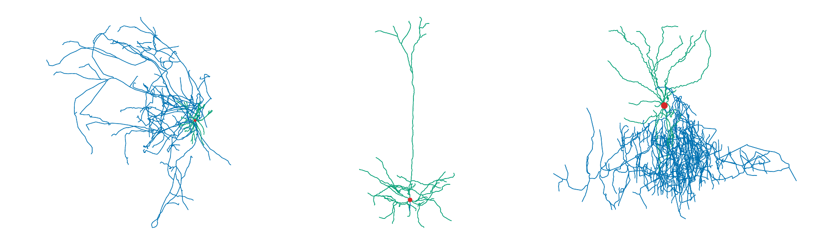
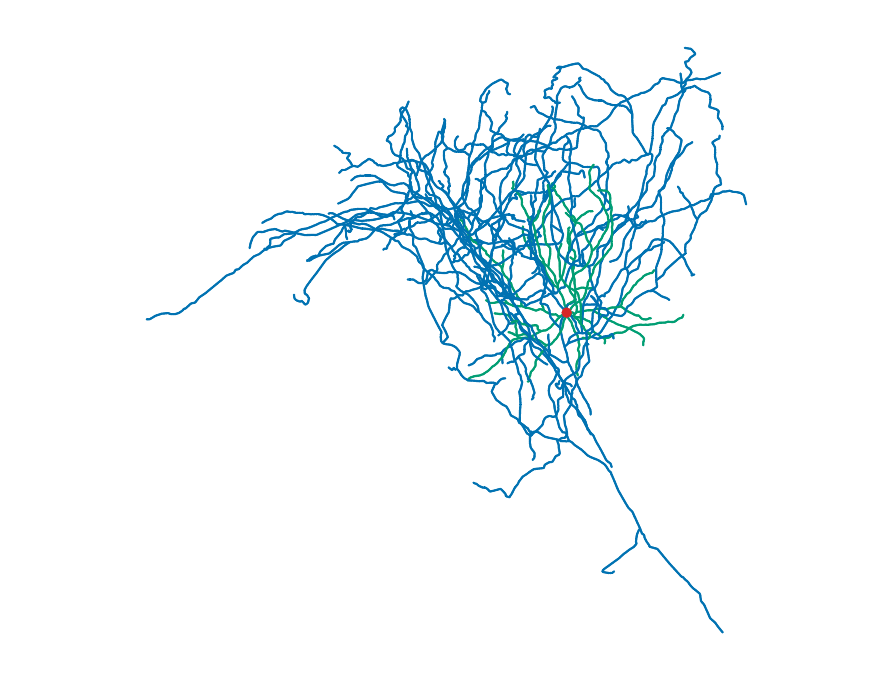
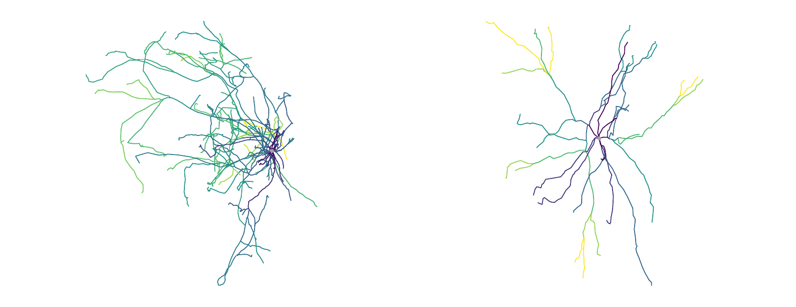
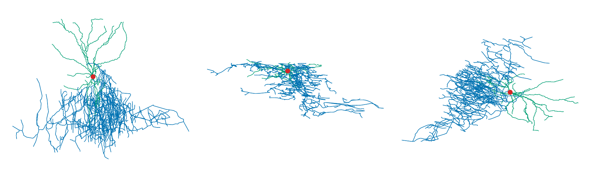
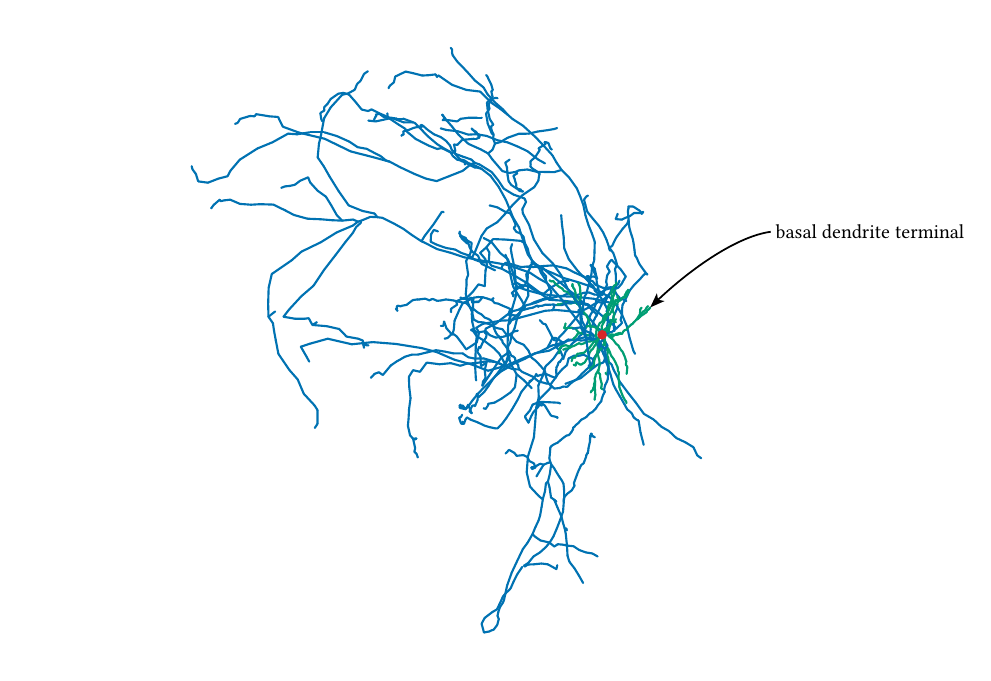

# Axodendron

Axodendron validates, analyzes, transforms, and renders neuronal morphologies from SWC data inside Typst. It provides publication-ready morphology figures, quantitative measurements, and document-native annotations through a concise Typst API.



## Quick start

```typ
#import "@preview/axodendron:0.1.0" as swc

#set page(width: auto, height: auto, margin: 3mm)

// Example: https://neuromorpho.org/api/neuron/id/62495
#let cell = swc.load(
  read("Sst-IRES-Cre_Ai14-188740-03-02-01_491119369_m.kp12.swc", encoding: none),
  profile: "incf-strict",
)

#swc.render(cell)
```

On Typst 0.15.0 and later, you may instead pass `path("Sst-IRES-Cre_Ai14-188740-03-02-01_491119369_m.kp12.swc")` directly to `swc.load`.



The image is the actual output of [`examples/readme.typ`](examples/readme.typ), using `Sst-IRES-Cre_Ai14-188740-03-02-01_491119369_m.kp12.swc` from [NeuroMorpho.Org record 62495](https://neuromorpho.org/api/neuron/id/62495), Allen Cell Types, [DOI 10.1016/j.neuron.2015.02.022](https://doi.org/10.1016/j.neuron.2015.02.022), under [CC BY 4.0](https://creativecommons.org/licenses/by/4.0/). README snippets treat the directory containing the selected SWC as the caller root; the bundled reproducible source uses `data/...` only because its `.typ` file is kept separately under `examples/`.

Read the SWC at the call site and pass its bytes to `load`, because a package function cannot resolve an ordinary path relative to the caller. SWC coordinates and radii are plain numbers in `cell.units` (`"um"` by convention); Typst lengths such as `120mm` and `4pt` are used only for page layout.

## Analysis and transformations

`analyze` returns versioned morphology summary, topology, section, tortuosity, path-distance, radial-distance, branch-order, and Strahler fields in one WASM call. The example below colors both results by analyzed branch order, then uses the pure `prune` transformation to remove type 2 axon nodes and their descendant subtrees without mutating `cell`.

```typ
#import "@preview/axodendron:0.1.0" as swc

#set page(width: auto, height: auto, margin: 3mm)

// Example: https://neuromorpho.org/api/neuron/id/85226
#let cell = swc.load(
  read("AA0109.CNG.swc", encoding: none),
  profile: "incf-strict",
)
#let metrics = swc.analyze(cell)
#let dendrites = swc.prune(cell, kinds: (2,))
#let dendrite-metrics = swc.analyze(dendrites)

#grid(
  columns: (auto, auto),
  gutter: 3mm,
  swc.render(
    cell,
    color-by: metrics.branch_order,
    width: 110mm,
    height: 82.5mm,
    canvas-width: 880,
    canvas-height: 660,
  ),
  swc.render(
    dendrites,
    color-by: dendrite-metrics.branch_order,
    width: 110mm,
    height: 82.5mm,
    canvas-width: 880,
    canvas-height: 660,
  ),
)
```



This is the actual output of [`examples/analysis.typ`](examples/analysis.typ): the complete morphology is on the left and the automatically refitted dendritic result is on the right. It uses `AA0109.CNG.swc` from [NeuroMorpho.Org record 85226](https://neuromorpho.org/api/neuron/id/85226), MouseLight, [DOI 10.1002/jnr.23978](https://doi.org/10.1002/jnr.23978) and [DOI 10.25378/janelia.5526706](https://doi.org/10.25378/janelia.5526706), under [CC BY 4.0](https://creativecommons.org/licenses/by/4.0/).

All transformations return a new cell with transform reports, old/new ID mappings, and interpolation lineage where applicable. Selection never invents bridging edges, resampling preserves topology boundaries, and node-aligned analysis fields carry a morphology fingerprint so fields from a different cell are rejected by `render`.

## Rendering

Named projections are `"xy"`, `"xz"`, and `"yz"`; arbitrary orthographic views use a `(direction:, up:)` camera dictionary. The example below renders the same cell in XY, XZ, and oblique views with matched canvas and Typst aspect ratios.

The default `color-by: "type"` mapping uses red for soma, green for basal and apical dendrites, and blue for axon; exact fallback and scalar-palette rules, scientific definitions, and the complete public API are collected in the [Axodendron manual](https://github.com/rice8y/axodendron/blob/v0.1.0/package/docs/documentation.pdf).

```typ
#import "@preview/axodendron:0.1.0" as swc

#set page(width: auto, height: auto, margin: 3mm)

// Example: https://neuromorpho.org/api/neuron/id/102520
#let cell = swc.load(
  read("Vipr2-IRES2-Cre_Ai14-310513-05-02-01_637021223_m.CNG.swc", encoding: none),
  profile: "incf-strict",
)

#grid(
  columns: (auto, auto, auto),
  gutter: 3mm,
  swc.render(
    cell,
    projection: "xy",
    width: 82mm,
    height: 72mm,
    canvas-width: 820,
    canvas-height: 720,
  ),
  swc.render(
    cell,
    projection: "xz",
    width: 82mm,
    height: 72mm,
    canvas-width: 820,
    canvas-height: 720,
  ),
  swc.render(
    cell,
    projection: (
      direction: (x: 1, y: 1, z: 1),
      up: (x: 0, y: 0, z: 1),
    ),
    width: 82mm,
    height: 72mm,
    canvas-width: 820,
    canvas-height: 720,
  ),
)
```



This is the actual output of [`examples/rendering.typ`](examples/rendering.typ), ordered XY, XZ, and oblique from left to right. It uses `Vipr2-IRES2-Cre_Ai14-310513-05-02-01_637021223_m.CNG.swc` from [NeuroMorpho.Org record 102520](https://neuromorpho.org/api/neuron/id/102520), Allen Cell Types, [DOI 10.1016/j.neuron.2015.02.022](https://doi.org/10.1016/j.neuron.2015.02.022), under [CC BY 4.0](https://creativecommons.org/licenses/by/4.0/).

`geometry: "tapered"` is radius-aware, `"skeleton"` draws centerlines, and `radius-mode` selects readable or physically proportional widths. Canvas fitting includes painted radii, outlines, and soma extent; keep the Typst `width / height` ratio equal to `canvas-width / canvas-height` so native overlays and physical scale bars remain calibrated.

## CeTZ leader labels

Axodendron can pass the final fitted position of a requested SWC node to [CeTZ](https://github.com/cetz-package/cetz) without making CeTZ a mandatory dependency. Import CeTZ explicitly, pass the module to `render`, and build an arrow label with `cetz-label`; the node is protected from display simplification and registered as a named CeTZ anchor in the same render call.

```typ
#import "@preview/axodendron:0.1.0" as swc
#import "@preview/cetz:0.5.2"

#set page(width: auto, height: auto, margin: 3mm)

// Example: https://neuromorpho.org/api/neuron/id/85226
#let cell = swc.load(
  read("AA0109.CNG.swc", encoding: none),
  profile: "incf-strict",
)

#swc.render(
  cell,
  width: 120mm,
  height: 90mm,
  cetz: cetz,
  cetz-labels: (swc.cetz-label(
    node: 447,
    offset: (x: 17mm, y: -9mm),
    controls: (
      (x: 12mm, y: -10mm),
      (x: 5mm, y: -5mm),
    ),
    text(size: 8pt)[basal dendrite terminal],
  ),),
)
```



This is the actual output of [`examples/cetz.typ`](examples/cetz.typ), using type-3 terminal node 447 from `AA0109.CNG.swc`, [NeuroMorpho.Org record 85226](https://neuromorpho.org/api/neuron/id/85226), MouseLight, [DOI 10.1002/jnr.23978](https://doi.org/10.1002/jnr.23978) and [DOI 10.25378/janelia.5526706](https://doi.org/10.25378/janelia.5526706), under [CC BY 4.0](https://creativecommons.org/licenses/by/4.0/). A leader is straight by default, `via` adds explicit line segments, and one or two `controls` select a quadratic or cubic CeTZ Bezier curve. Curvature and routing are never inferred automatically and should be verified in the final PDF.

For caller-owned CeTZ drawings, use `anchor-nodes: (447, ...)` with `return-report: true`, retrieve exact top-left-relative lengths and normalized coordinates through `node-anchor`, and compose them with `cetz-annotate`.

## Public API

| Function | Purpose |
| --- | --- |
| `load`, `from-text`, `diagnostics`, `metadata` | Parse SWC, validate topology, and retain provenance |
| `analyze`, `sholl`, `sholl-2d` | Compute versioned 3D morphometrics and 2D/3D Sholl intersections |
| `select-nodes`, `select-kinds`, `subtree`, `path` | Select induced forests, descendant trees, or a unique path |
| `reroot`, `prune`, `resample`, `simplify` | Return traceable topology-preserving transformations |
| `export-swc` | Produce deterministic canonical SWC |
| `render`, `node-anchor` | Produce compact deterministic SVG and expose requested fitted node coordinates |
| `label`, `marker`, `legend`, `color-bar`, `scale-bar` | Construct native Typst publication-figure annotations |
| `cetz-label`, `cetz-annotate` | Construct optional CeTZ leader labels without a mandatory package dependency |

## Validation

`profile: "incf-strict"` enforces sequential positive IDs, parent-before-child ordering, the `-1` root sentinel, and a single connected root. `profile: "permissive"` accepts structurally valid rooted forests and arbitrary positive IDs. Both profiles reject malformed rows, non-finite geometry, duplicate IDs, missing parents, self-parenting, and cycles; no profile silently repairs input.

## Examples

Typst sources live directly under [`examples/`](examples/), while all input morphologies live separately under [`examples/data/`](examples/data/); `.typ` and `.swc` files are never mixed at one directory level.

- [`examples/basic.typ`](examples/basic.typ) demonstrates analysis, labels, scalar coloring, Sholl analysis, and a two-panel figure with the attributed AA0109 reconstruction.
- [`examples/cetz.typ`](examples/cetz.typ) uses a routed CeTZ arrow to label an exact projected terminal node in the AA0109 reconstruction.
- [`examples/overview.typ`](examples/overview.typ) lays out three real morphologies in parallel without frames or figure-level decoration and produces the overview image.
- [`examples/readme.typ`](examples/readme.typ) renders the attributed Sst morphology used by Quick start.
- [`examples/analysis.typ`](examples/analysis.typ) visualizes branch-order analysis and a pure pruning transformation.
- [`examples/rendering.typ`](examples/rendering.typ) compares named and arbitrary orthographic projections.
- [`examples/data/`](examples/data/) contains the four attributed NeuroMorpho.Org examples listed in [`THIRD_PARTY_NOTICES.md`](THIRD_PARTY_NOTICES.md).

## License

Axodendron source is [MIT](LICENSE) licensed. The compiled WASM dependencies, optional CeTZ example dependency, and real-world SWC examples retain the licenses and attribution listed in [`THIRD_PARTY_NOTICES.md`](THIRD_PARTY_NOTICES.md).
