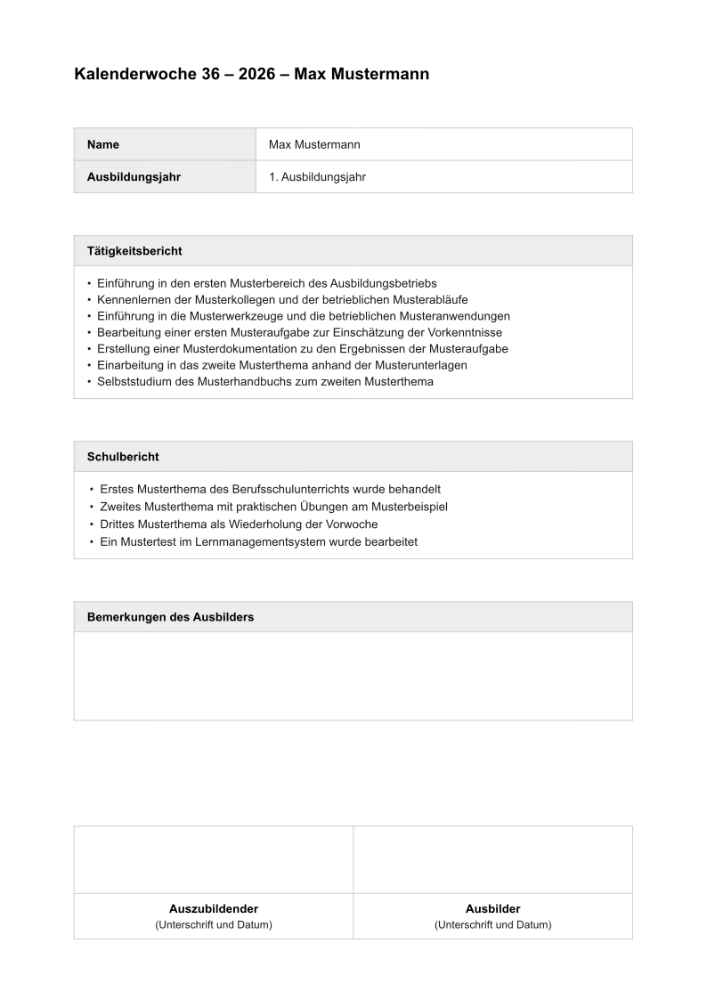
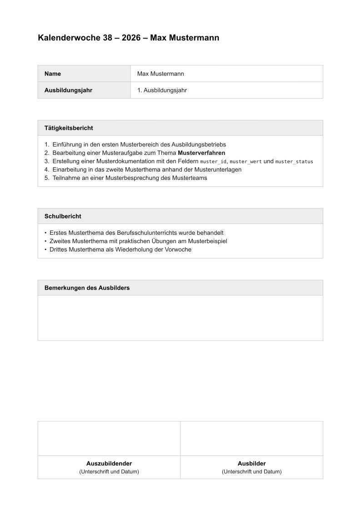
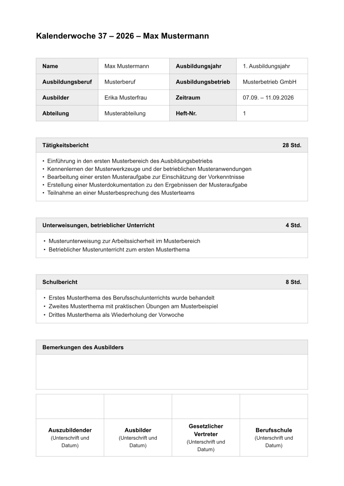
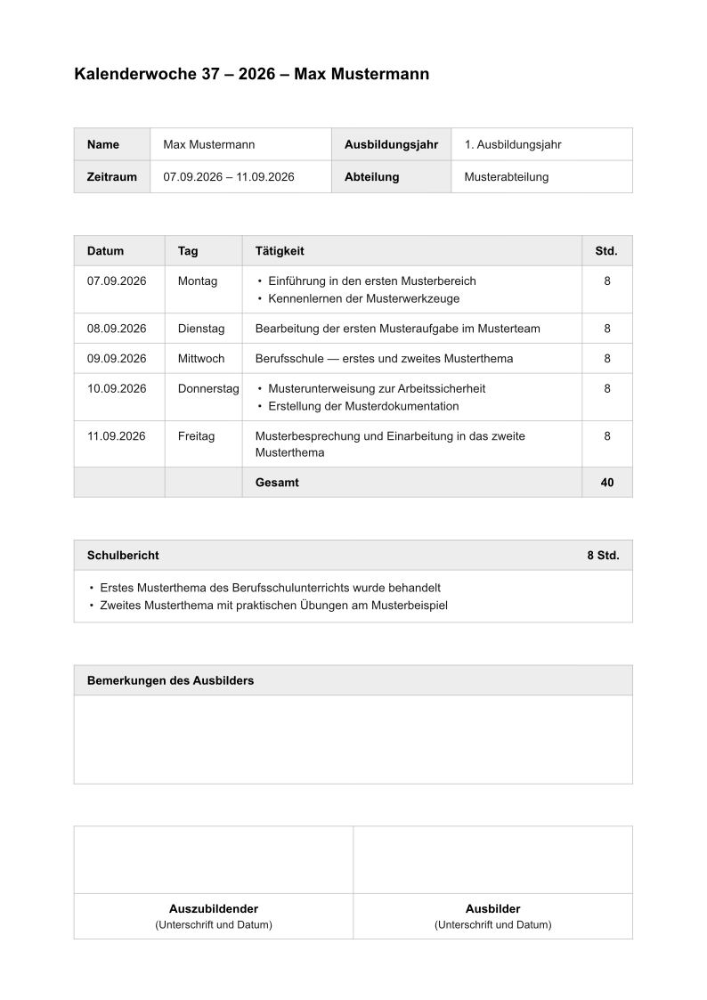
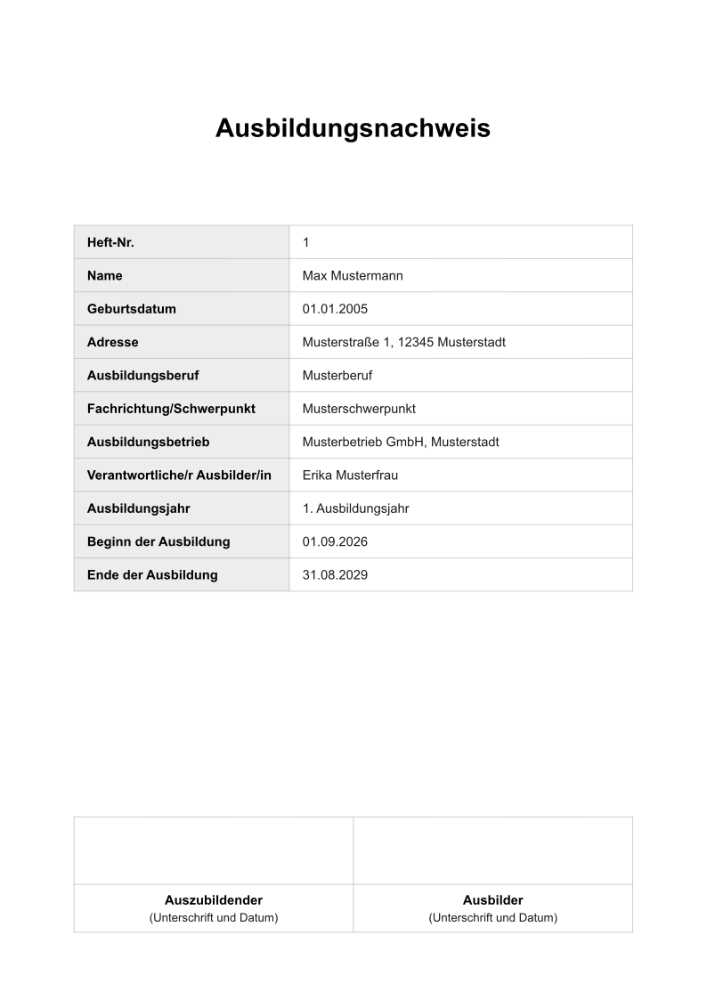
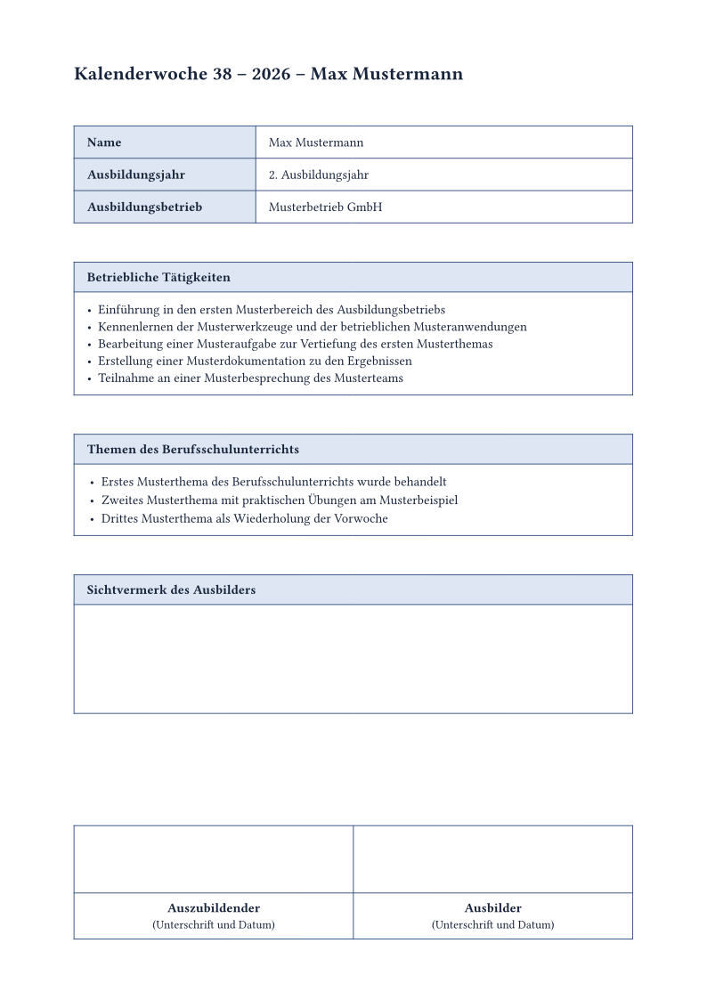

# azubinachweis

*Auf Deutsch lesen: **[README.de.md](README.de.md)*** — the German version is
the one most users of this package will want.

Single-page training record sheet (*Ausbildungsnachweis*) for the German
apprenticeship system (*Ausbildung*) — as a weekly report (*Wochenbericht*), a
daily report (*Tagesbericht*), or a cover sheet (*Deckblatt*).

Every chamber of commerce (*IHK*), employer and vocational school
(*Berufsschule*) wants the record book (*Berichtsheft*) slightly differently:
with or without hours (*Stunden*), one row per day or one bullet list per week,
two signature fields or four, "Tätigkeitsbericht" here and "Betriebliche
Tätigkeiten" there. So instead of one fixed form, this package gives you the
parts: every field is optional and appears only once filled, every label can be
overridden, and fonts, colours and spacing are exposed as parameters. Adapt the
sheet to whatever your employer expects without rebuilding the layout — for any
apprentice (*Azubi*), in any trade.

Sections size themselves to their content: where there is text, the box is
exactly as tall as the text; where there is none, a fixed-height writing area
is left for filling in by hand.

**A note on language.** The output, the labels and the parameter names are all
German, because the document itself is a German administrative form. English
renderings below are explanations, not names — the German term in parentheses
is the actual thing, and it is what appears on the page and in your code.

## Quick start

```typ
#import "@preview/azubinachweis:0.1.0": nachweis

#show: nachweis.with(
  name: "Max Mustermann",
  ausbildungsjahr: "1. Ausbildungsjahr",
  kalenderwoche: "37",
  jahr: "2026",
  schulbericht: (
    "Erstes Musterthema des Berufsschulunterrichts wurde behandelt",
    "Zweites Musterthema mit praktischen Übungen am Musterbeispiel",
  ),
)

- Einführung in den ersten Musterbereich des Ausbildungsbetriebs
- Bearbeitung einer Musteraufgabe zur Einschätzung der Vorkenntnisse
- Teilnahme an einer Musterbesprechung des Musterteams
```

The document body becomes the activity report (*Tätigkeitsbericht*). Every
other section is passed as an argument.

### Sections as content blocks

If you would rather write ordinary Typst markup than strings in arrays, append
the sections as content blocks to the call, in the order they appear in the
document:

```typ
#nachweis(name: "Max Mustermann", kalenderwoche: "38", jahr: "2026")[
  + Erste Mustertätigkeit mit *Auszeichnung*
  + Zweite Mustertätigkeit
][
  - Erstes Musterthema
  - Zweites Musterthema
]
```

| Function | 1st block | 2nd block | 3rd block |
| --- | --- | --- | --- |
| `nachweis` | activity report (*Tätigkeitsbericht*) | school report (*Schulbericht*) | trainer's remarks (*Bemerkungen des Ausbilders*) |
| `tagesbericht` | school report (*Schulbericht*) | trainer's remarks (*Bemerkungen*) | — |
| `deckblatt` | free addition (*Zusatz*) | — | — |

This gives you numbering, emphasis, links, footnotes and code inside the report
text, with nothing to escape. An empty block `[]` skips a section, and named
arguments still work alongside:

```typ
#nachweis(taetigkeiten: ("From an array",))[][
  - This school report comes from the second block
]
```

Both spellings are equivalent; `#show:` acts as a single first block. So what
`nachweis` receives as the document body is the activity report
(*Tätigkeitsbericht*).

That is also the **minimal setup**: title line, name and training year
(*Ausbildungsjahr*), the activity report (*Tätigkeitsbericht*), the school
report (*Schulbericht*), an empty area for the trainer's remarks
(*Bemerkungen*) and two signature fields. Nothing more is needed — everything
else (hours, instruction periods, employer, trainer, further signatures)
appears only once passed. For even less, drop `ausbildungsjahr`; to lose the
header table entirely, drop `name` too and set the title with `titel`.

## What the package provides

The three document functions can be called either with `#show: ….with(..)` or
directly with content blocks — both are equivalent.

| Export | Kind | Purpose |
| --- | --- | --- |
| `nachweis` | document function | weekly report (*Wochenbericht*): sections with bullet lists |
| `tagesbericht` | document function | daily report (*Tagesbericht*): one table row per date, hours column and total |
| `deckblatt` | document function | cover sheet (*Deckblatt*) of the record book (*Berichtsheft*) |
| `standard-bezeichnungen` | dictionary | all labels as defaults, individually overridable |
| `standard-unterschriften` | array | `("Auszubildender", "Ausbilder")` |

## Examples

Each example is available as source and as a finished PDF in
[`examples/`](https://github.com/AyloRyd/azubinachweis/tree/v0.1.0/examples).

### Minimal

The base layout with no extras: name, training year (*Ausbildungsjahr*),
calendar week (*Kalenderwoche*) and year, plus the three sections. A weekly
report (*Wochenbericht*) needs no more than this.

[`minimal.typ`](examples/minimal.typ) · [PDF](examples/minimal.pdf)



### Content blocks

The same four entries, but with the sections as content blocks after the call —
with numbering, emphasis and code inside the report text.

[`content-blocks.typ`](examples/content-blocks.typ) · [PDF](examples/content-blocks.pdf)



### Weekly report with everything

All header rows, per-section hours (*Stunden*), the additional section for
instruction periods and in-house lessons (*Unterweisungen, betrieblicher
Unterricht*) and four signature fields — including the legal guardian
(*Gesetzlicher Vertreter*) and the vocational school (*Berufsschule*). The
two-column header (`kopfspalten: 2`) keeps it all on one page.

[`weekly-report.typ`](examples/weekly-report.typ) · [PDF](examples/weekly-report.pdf)



### Daily report

One table row per date, with weekday (*Tag*), hours column (*Stunden*) and a
total row (*Gesamt*).

[`daily-report.typ`](examples/daily-report.typ) · [PDF](examples/daily-report.pdf)



### Cover sheet

Title page of the record book (*Berichtsheft*) with all master data.

[`cover-sheet.typ`](examples/cover-sheet.typ) · [PDF](examples/cover-sheet.pdf)



### Custom appearance

Same structure, different design: serif font, blue borders, coloured header
cells, larger writing areas and custom labels.

[`custom-style.typ`](examples/custom-style.typ) · [PDF](examples/custom-style.pdf)



## `nachweis` — weekly report (*Wochenbericht*)

### Header data (*Kopfdaten*)

Empty fields do not appear in the table.

| Parameter | Meaning | Default |
| --- | --- | --- |
| `name` | name of the apprentice (*Auszubildender*) | `""` |
| `ausbildungsjahr` | training year (*Ausbildungsjahr*), e.g. `"1. Ausbildungsjahr"` | `""` |
| `kalenderwoche` | calendar week number (*Kalenderwoche*) | `""` |
| `jahr` | year (*Jahr*) | `""` |
| `zeitraum` | period covered (*Zeitraum*), e.g. `"07.09. – 11.09.2026"` | `none` |
| `abteilung` | department or training area (*Abteilung*, on IHK forms *Ausbildungsbereich*) | `none` |
| `beruf` | occupation being trained for (*Ausbildungsberuf*) | `none` |
| `fachrichtung` | specialisation (*Fachrichtung/Schwerpunkt*) | `none` |
| `betrieb` | training company (*Ausbildungsbetrieb*) | `none` |
| `ausbilder` | responsible trainer (*Verantwortliche/r Ausbilder/in*) | `none` |
| `heft-nr` | number of the record book (*Heft-Nr.*) | `none` |

### Content

| Parameter | Meaning | Default |
| --- | --- | --- |
| `taetigkeiten` | activity report (*Tätigkeitsbericht*); also the 1st content block or document body | `""` |
| `unterweisungen` | instruction periods and in-house lessons (*Unterweisungen, betrieblicher Unterricht*); section appears only when filled | `none` |
| `schulbericht` | topics covered at vocational school (*Schulbericht*, on IHK forms *Themen des Berufsschulunterrichts*) | `""` |
| `bemerkungen` | trainer's remarks (*Bemerkungen des Ausbilders*); leave empty for handwritten notes | `""` |
| `weiteres` | additional closing section (*Weitere Berichte*); appears only when filled | `none` |
| `stunden` | hours per section (*Stunden*), e.g. `(betrieb: 28, unterweisung: 4, schule: 8)` | `(:)` |

Every content parameter accepts three forms:

```typ
schulbericht: "No school this week",                  // a single sentence
schulbericht: ("First point", "Second point"),        // a bullet list
schulbericht: [Arbitrary #strong[markup]],            // your own content
```

Or as a content block after the call — see [Sections as content
blocks](#sections-as-content-blocks).

### Structure and labels

| Parameter | Meaning | Default |
| --- | --- | --- |
| `titel` | title line; `auto` builds it from calendar week (*Kalenderwoche*), year and name | `auto` |
| `bezeichnungen` | overrides individual labels (*Bezeichnungen*), e.g. `(schule: "Berufsschule")` | `(:)` |
| `unterschriften` | array of signature fields (*Unterschriften*); `()` omits them | `("Auszubildender", "Ausbilder")` |
| `kopfspalten` | header fields (*Kopfdaten*) per row: `1` or `2`. Two halves the header height | `1` |
| `kopfspalte` | width of the label column. `auto` means `5.4cm` in single-column mode, growing with long custom labels; in two-column mode as narrow as the labels allow | `auto` |
| `unterschrifthoehe` | height of the signature fields (*Unterschriften*) | `2cm` |

### Appearance

| Parameter | Meaning | Default |
| --- | --- | --- |
| `schrift` | font family or families (*Schrift*) | `("Arial", "Helvetica", "Liberation Sans", "DejaVu Sans")` |
| `schriftgroesse` | base font size (*Schriftgröße*) | `10pt` |
| `titelgroesse` | size of the title line (*Titelgröße*) | `14pt` |
| `linie` | border colour (*Linie*) | `#b5b5b5` |
| `kopfgrau` | background of the header cells (*Kopfzellen*) | `#ededed` |
| `kopftext` | text colour of the header cells | `#000000` |
| `fliess` | body text colour (*Fließtext*) | `#1a1a1a` |
| `rahmen` | border thickness (*Rahmen*) | `0.5pt` |
| `luft` | vertical spacing between sections (*Luft*) | `0.85cm` |
| `polster` | cell padding (*Polster*) | `11pt` |
| `mindesthoehe` | height of empty sections (*Mindesthöhe*), i.e. the writing area | `2cm` |
| `rand` | page margins (*Rand*) | `(x: 2.2cm, top: 2cm, bottom: 1.8cm)` |

## `tagesbericht` — daily report (*Tagesbericht*)

Recommended by the chambers for the skilled trades and technical occupations
(*gewerblich-technische Ausbildungsberufe*), where the weekly report
(*Wochenbericht*) is the usual choice for commercial ones (*kaufmännische*).

Takes every parameter of `nachweis` (except `unterweisungen`) plus:

| Parameter | Meaning | Default |
| --- | --- | --- |
| `tage` | array of days (*Tage*), see below | `()` |
| `summe` | total row (*Gesamt*) beneath the hours column | `true` |
| `spalten` | column widths (*Spalten*) `(datum: .., tag: .., stunden: ..)` | `(datum: 2.7cm, tag: 2.3cm, stunden: 1.5cm)` |
| `vorspann` | optional text above the table (*Vorspann*) | `none` |

Each day is a dictionary. `tag` (weekday) and `stunden` (hours) are optional —
if no day has them, that column is dropped.

```typ
tage: (
  (
    datum: "07.09.2026",      // date
    tag: "Montag",            // weekday
    inhalt: ("Erste Mustertätigkeit", "Zweite Mustertätigkeit"),   // activities
    stunden: 8,               // hours
  ),
  (datum: "08.09.2026", tag: "Dienstag", inhalt: "Eine Mustertätigkeit", stunden: 8),
)
```

## `deckblatt` — cover sheet (*Deckblatt*)

| Parameter | Meaning | Default |
| --- | --- | --- |
| `heft-nr` | number of the record book (*Heft-Nr.*) | `none` |
| `name` | name of the apprentice (*Auszubildender*) | `""` |
| `geburtsdatum` | date of birth (*Geburtsdatum*) | `none` |
| `adresse` | address (*Adresse*) | `none` |
| `beruf` | occupation being trained for (*Ausbildungsberuf*) | `none` |
| `fachrichtung` | specialisation (*Fachrichtung/Schwerpunkt*) | `none` |
| `betrieb` | training company (*Ausbildungsbetrieb*) | `none` |
| `ausbilder` | responsible trainer (*Verantwortliche/r Ausbilder/in*) | `none` |
| `ausbildungsjahr` | training year (*Ausbildungsjahr*) | `none` |
| `beginn`, `ende` | start and end of training (*Beginn/Ende der Ausbildung*) | `none` |
| `unterschriften` | signature fields (*Unterschriften*); empty = none | `()` |
| `zusatz` | free addition below the table (*Zusatz*); also as a content block | `none` |

Labels and appearance as for `nachweis`; `titelgroesse` is `22pt` here.

## Overriding labels

`standard-bezeichnungen` holds every piece of text in the layout. Individual
entries are replaced via `bezeichnungen`:

```typ
#show: nachweis.with(
  bezeichnungen: (
    taetigkeiten: "Betriebliche Tätigkeiten",
    schule: "Themen des Berufsschulunterrichts",
    bemerkungen: "Sichtvermerk",
    stunden: "Stunden",
  ),
)
```

Keys: `name`, `ausbildungsjahr`, `zeitraum`, `abteilung`, `beruf`,
`fachrichtung`, `betrieb`, `ausbilder`, `heft`, `adresse`, `geburtsdatum`,
`beginn`, `ende`, `taetigkeiten`, `unterweisungen`, `schule`, `bemerkungen`,
`weiteres`, `datum`, `tag`, `taetigkeit`, `stunden`, `summe`,
`unterschrift-zusatz`, `deckblatt-titel`.

This is also the way to run the sheet in another language: replace the labels
and keep the layout.

## Glossary

| German | What it means |
| --- | --- |
| *Ausbildung* | the German dual apprenticeship: paid work at a company plus vocational school |
| *Ausbildungsnachweis* | the record sheet an apprentice must keep, signed by the trainer |
| *Berichtsheft* | the collected sheets, i.e. the record book as a whole |
| *Azubi*, *Auszubildender* | the apprentice |
| *Ausbilder* | the trainer at the company responsible for the apprentice |
| *Ausbildungsbetrieb* | the company providing the training |
| *Berufsschule* | the vocational school attended alongside the work |
| *IHK* | chamber of industry and commerce; issues the forms and sets the rules |
| *Wochenbericht* / *Tagesbericht* | the weekly and daily formats of the sheet |
| *Tätigkeitsbericht* | what the apprentice did at the company |
| *Unterweisungen* | formal instruction periods and in-house lessons |
| *Schulbericht* | what was covered at vocational school |
| *Gesetzlicher Vertreter* | legal guardian, who co-signs while the apprentice is a minor |
| *Heft-Nr.* | running number of the sheet within the record book |

## Fonts

The layout is designed for a humanist sans-serif and looks, in order, for
Arial, Helvetica, Liberation Sans, DejaVu Sans. If none of them is present — in
the web app, for instance — Typst silently falls back to Libertinus Serif; the
document stays correct but looks different. Fonts cannot be shipped inside a
package, so either install one of those families (or upload it to your web app
project), or pick a family you already have:

```typ
#show: nachweis.with(
  schrift: ("Inter", "Libertinus Serif"),
  // … the remaining arguments
)
```

## Managing several weeks

One file per week (`kw36.typ`, `kw37.typ`, … for *Kalenderwoche*), each with
its own `#show` call. Build one:

```sh
typst compile kw37.typ
```

Or all of them:

```sh
for f in kw*.typ; do typst compile "$f"; done
```

## When it does not fit on one page

Adjust in this order:

1. `kopfspalten: 2` — halves the height of the header table
2. `luft: 0.6cm` — tighter spacing between sections
3. `mindesthoehe: 1.5cm` and `unterschrifthoehe: 1.5cm` — smaller writing areas
4. `schriftgroesse: 9.5pt`

## Licence

MIT — see [LICENSE](LICENSE).
