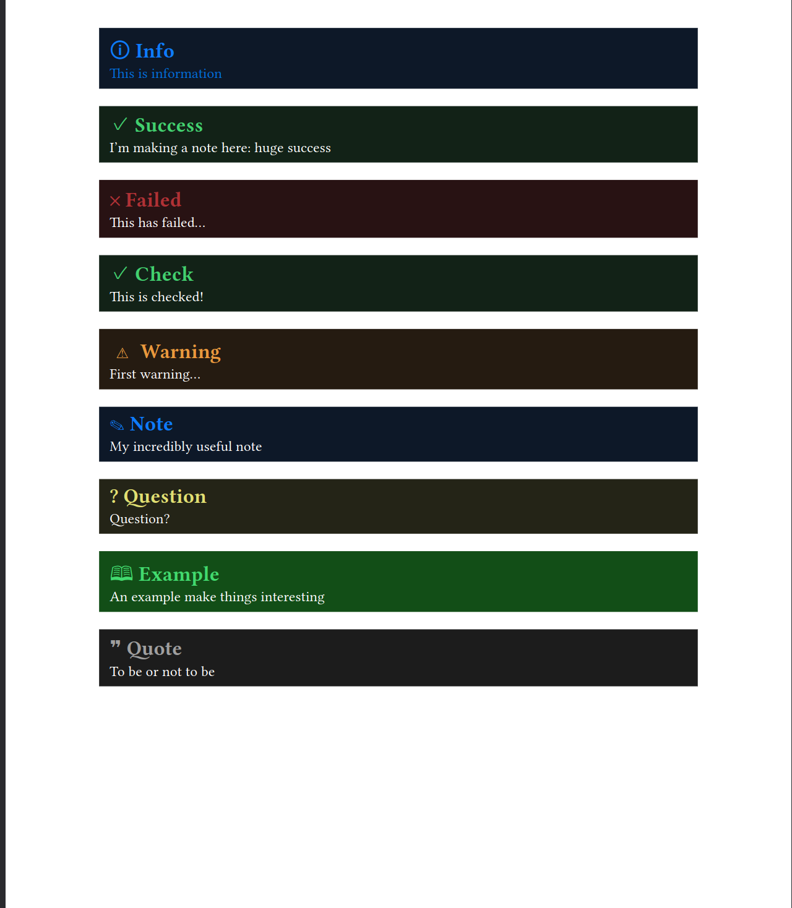

# typst-babble-bubbles

A package to create callouts in typst, inspired by the [Obsidan](https://obsidian.md/) callouts.

Use preset callouts, or create your own!



## Usage

Import the package

```typst
#import "@preview/babble-bubbles:0.1.0": *
```

Or grab it locally and use:

```typst
#import "@local/babble-bubbles:0.1.0": *
```

## Presets

Here you can find a list of presets and an example usage of each.
You can customise them with the same parameters as the `callout` function. See the `Custom callouts` for more details.

```typst
#info[This is information]

#success[I'm making a note here: huge success]

#check[This is checked!]

#warning[First warning...]

#note[My incredibly useful note]

#question[Question?]

#example[An example make things interesting]

#quote[To be or not to be]
```

## Custom callouts

### `callout`

Create a default callout.
Tweak the parameters to create your own!

```typst
callout(
  body,
  title: "Callout",
  fill: blue,
  title-color: white,
  body-color: black,
  icon: none)
```

### Tips

You can create aliases to more easily handle your
newly create callouts or customise presets by using [with](https://typst.app/docs/reference/types/function/#methods-with).

```
#let mycallout = callout.with(title: "My callout")

#mycallout[Hey this is my custom callout!]
```
