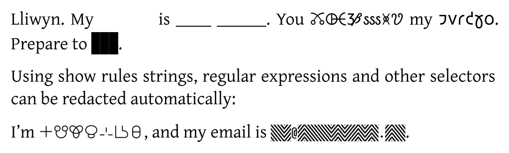
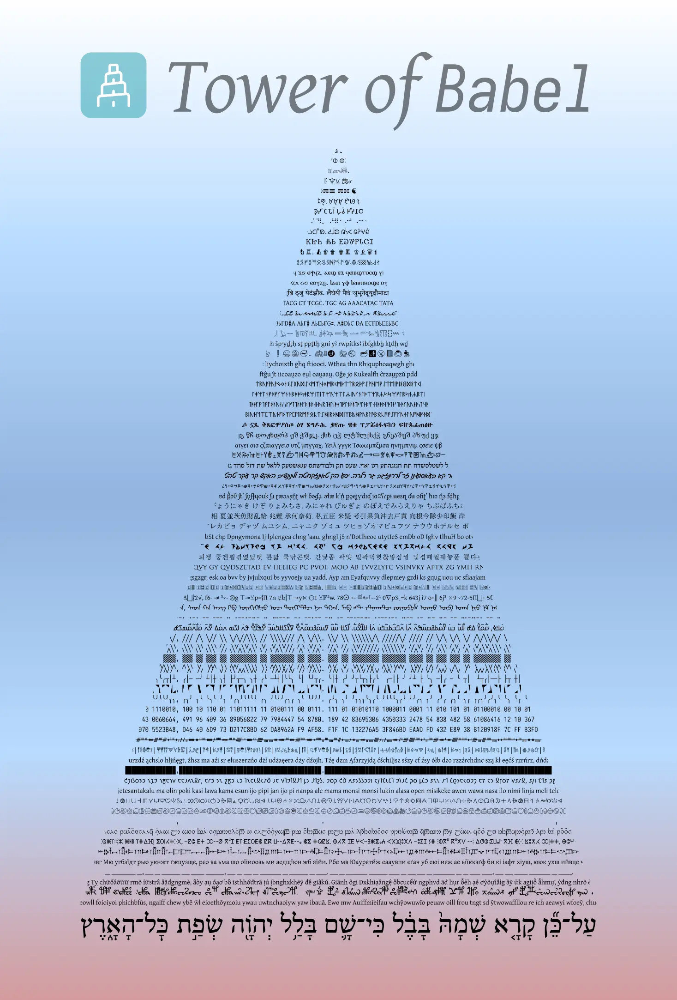

#  <span style="font-variant: small-caps; color: #239dad">Babel</span>: Redact text by replacing it with random characters in Typst

[](https://typst.app/universe/package/babel)
[](https://codeberg.org/afiaith/babel)
[](./docs/manual.pdf)
[](./LICENSE)
[](https://codeberg.org/afiaith/babel/releases/)
[](https://codeberg.org/afiaith/babel/stars)

This package provides functions that replace actual text with random characters, which is useful for redacting confidential information or sharing the design and structure of an existing document without disclosing the content itself.
A variety of ready-made sets of characters for replacement are available (75 in total; termed *alphabets*), representing diverse writing systems, codes, notations and symbols.
Some of these are more conservative (such as emulating redaction using a wide black pen) and many are more whimsical, as demonstrated by the following example:

```typ
#baffle(alphabet: "welsh")[Hello]. My #tippex[name] is #baffle(alphabet: "underscore")[Inigo Montoya]. You #baffle(alphabet: "alchemy")[killed] my #baffle(alphabet: "shavian")[father]. Prepare to #redact[die].

Using show rules strings, regular expressions and other selectors can be redacted automatically:

#show "jan Maja": baffle.with(alphabet: "sitelen-pona")
#show regex("[a-zA-Z0-9.!#$%&’*+/=?^_`{|}~-]+@[a-zA-Z0-9-]+(?:\.[a-zA-Z0-9-]+)*"): baffle.with(alphabet: "maze-3") 

I’m jan Maja, and my email is `foo@digitalwords.net`.
```



## 📖 The manual

Using <span style="font-variant: small-caps; color: #239dad">Babel</span> is quite straightforward.
A [**comprehensive manual**](./docs/manual.pdf) covers:

- Introductory background.
- How to use the provided functions (`baffle()`, `redact()` and `tippex()`).
- A list of the provided alphabets, each demonstrated by a line of random text.

If the version of the precompiled manual doesn’t match the version of the package, it means no difference between the two versions is reflected in the manual.

## 🗼 The Tower of <span style="font-variant: small-caps; color: #239dad">Babel</span>

A poster demonstrating the provided alphabets:

[](./assets/poster.webp)

## 🔨 Complementary tools

If you wish to share the Typst source files of your document, not just the precompiled output, a tool called [_Typst Mutilate_](https://github.com/frozolotl/typst-mutilate) might be useful for you.
Unlike <span style="font-variant: small-caps; color: #239dad">Babel</span>, it is not a Typst package but an external tool, written in Rust.
It replaces the content of a Typst document with random words selected from a wordlist or random characters (similarly to <span style="font-variant: small-caps; color: #239dad">Babel</span>), changing the document in place (so make sure to run it on a *copy*!).
As a package for Typst, <span style="font-variant: small-caps; color: #239dad">Babel</span> cannot change your source files.
