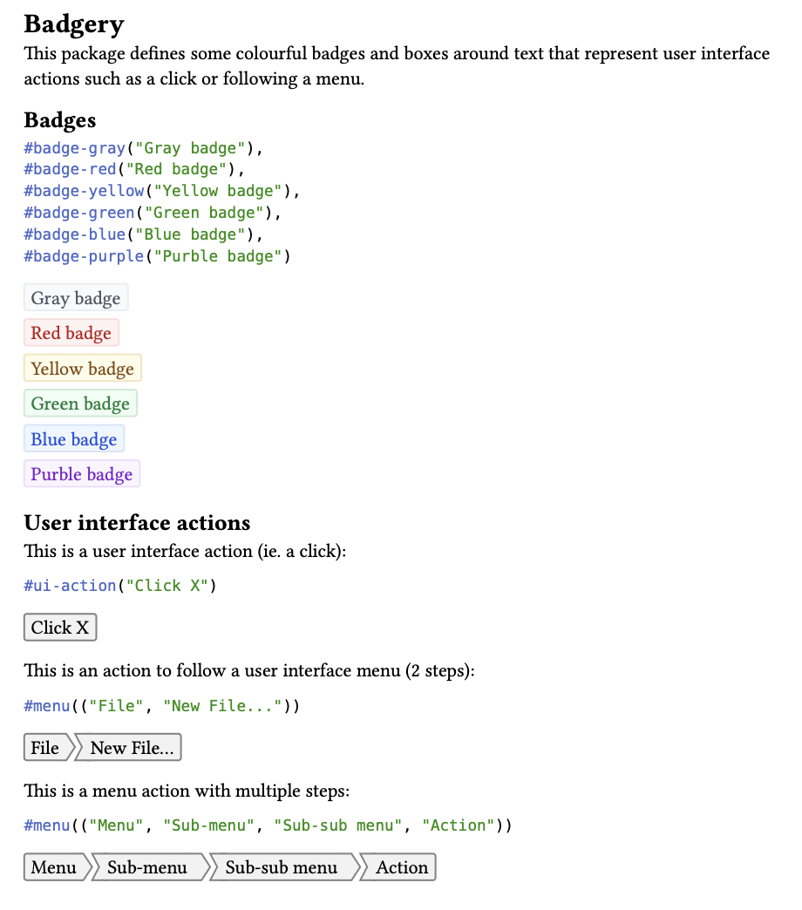

# Badgery

This package defines some colourful badges and boxes around text that represent user interface actions such as a click or following a menu.

For examples have a look at the example [main.typ](./example/main.typ), [main.pdf](./exmaple/main.pdf).



## Badges

```typ
#badge-gray("Gray badge"),
#badge-red("Red badge"),
#badge-yellow("Yellow badge"),
#badge-green("Green badge"),
#badge-blue("Blue badge"),
#badge-purple("Purple badge")
```

## User interface actions

This is a user interface action (ie. a click):

```typ
#ui-action("Click X")
```

This is an action to follow a user interface menu (2 steps):

```typ
#menu(("File", "New File..."))
```

This is a menu action with multiple steps:

```typ
#menu(("Menu", "Sub-menu", "Sub-sub menu", "Action"))
```
