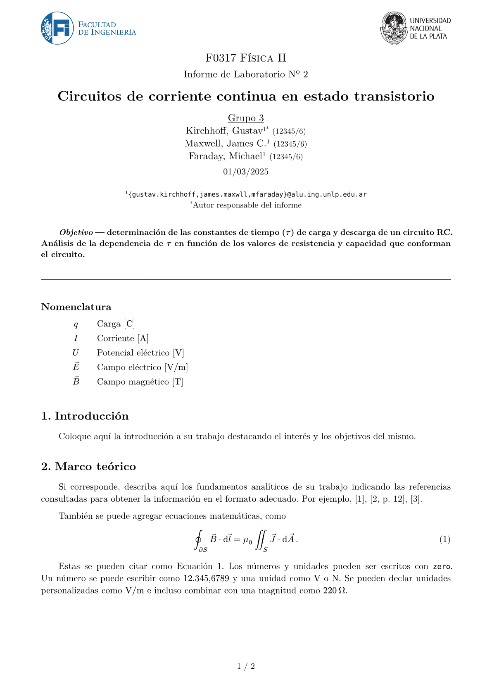
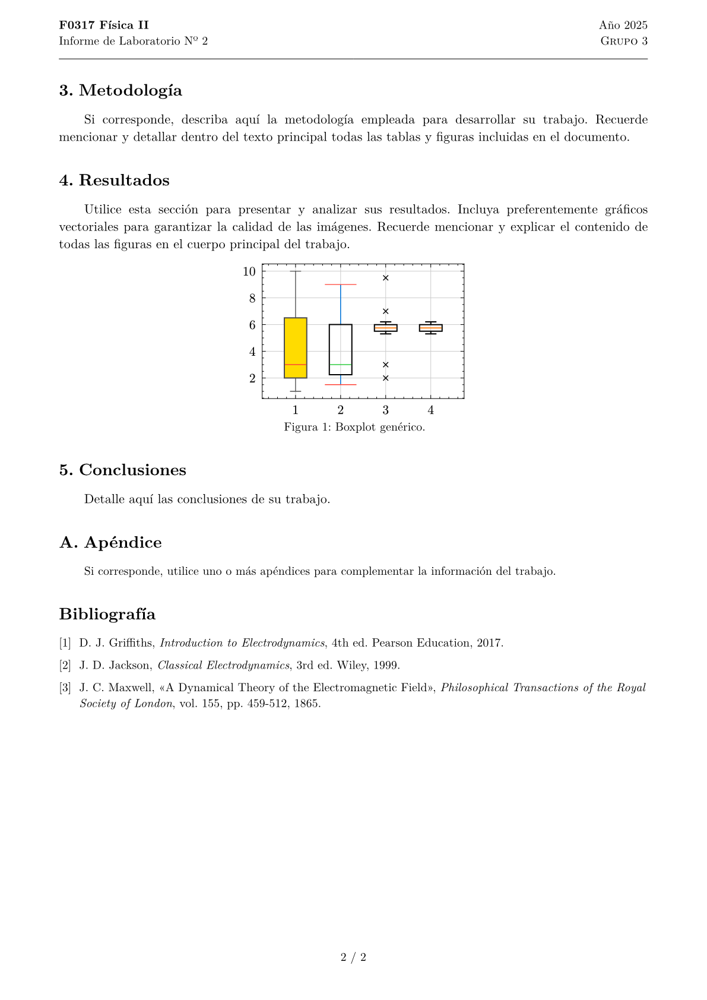

# barcala


A report template for UNLP students, specially for engineering. Not affiliated with the university.

---

Plantilla de informe para estudiantes de la Universidad Nacional de La Plata, especialmente para ingeniería. No está afiliada a la universidad.

<p align="center">
  
&nbsp; &nbsp; &nbsp; &nbsp;
  
</p>

## Uso

```typst
#import "@preview/barcala:0.1.4": informe

#show: informe.with(
  // parámetros del informe
)
```

- `institucion`: el logo de la institución del informe.
  - `"unlp"`: Universidad Nacional de La Plata (por defecto)
  - Si se desea usar un logo diferente, basta con pasar su ruta como `str` o directamente `bytes` usando `read`.
- `unidad-academica`: el logo de la unidad académica del informe. Opciones:
  - `"informática"`: Facultad de Informática
  - `"ingeniería"`: Facultad de Ingeniería
  - Si se desea usar un logo diferente, basta con pasar su ruta como `str` o directamente `bytes` usando `read`.
  - Si la unidad académica de la UNLP no está en la lista, [creá un reporte](https://github.com/JuanM04/barcala/issues/new) con el link al logo y lo agregamos a la plantilla.
- `asignatura`: el nombre de la asignatura (`str`).
- `titulo` (`content`, opcional): el título más formal del informe, como `[Trabajo Práctico Nº 3]`.
- `equipo` (`content`): el nombre del equipo, como `[Grupo 12]`.
- `autores` (`array`): los autores y autoras del proyecto. Cada autor/a tiene
  - `nombre` (`str`): el nombre del autor/a con el formato `Apellido, Nombre`; 
  - `email` (`str`, opcional): un email;
  - `legajo` (`str`, opcional): un legajo;
  - `notas` (`array` o `str`, opcional): otras notas, como `"Autor responsable del informe"`.
- `titulo-descriptivo` (`str`): el título del proyecto en sí, como `"Análisis de un sistema fluvial"`.
- `resumen` (`content`, opcional): un resumen del lo que trata el informe o el objetivo del proyecto. Es un campo libre para escribir con el formato que se desee.
- `fecha` (`date` o `str`): la fecha de entrega del informe, se puede escribir como `"2023-10-01"` (1 de octubre de 2023).
- `formato` (`dict`, opcional): otras configuraciones del informe:
  - `tipografia` (`str`, opcional): la tipografía del informe, _New Computer Modern_ por defecto;
  - `columnas` (`int`, opcional): la cantidad de columnas, una por defecto;
  - `margenes` (opcional): pueden ser
    - `"simétricos"`: los mismo márgenes de cada lado (por defecto),
    - `"anillado"`: márgenes más anchos donde iría el anillado.


### Apéndices

Para agregar apéndices al informe, se puede usar el comando `apendice` en el lugar empiezan los apéndices. Por ejemplo:

```typst
#import "@preview/barcala:0.1.4": informe, apendice

#show: informe.with(
  // parámetros del informe
)

// ... contenido del informe

#show: apendice

= Tablas de datos // Apéndice A
// ...

= Otra información // Apéndice B
// ...
```

### Tabla de símbolos

Para agregar una tabla de símbolos/nomenclatura al informe, se puede usar el comando `nomenclatura` en el lugar donde empieza la tabla. Por ejemplo:

```typst
#import "@preview/barcala:0.1.4": informe, nomenclatura

#show: informe.with(
  // parámetros del informe
)

#nomenclatura(
  ($S_1$, [Símbolo 1]),
  ($S_2$, [Símbolo 2]),
  ($S_3$, [Símbolo 3]),
)
```

## Desarrollo

Para generar el documento `main.pdf` y la imagen `thumbnails/1.png` de la portada, se debe cambiar

```diff
-  #import "@preview/barcala:0.1.4": ...
+  #import "../src/lib.typ": ...
```

y utilizar los siguientes comandos:

```bash
# Genera PDF
typst compile --root . --pdf-standard a-2b template/main.typ
# Genera thumbnail.png
typst compile --root . --format png template/main.typ "thumbnails/{p}.png"
oxipng -o 2 --strip safe thumbnails/*.png
```