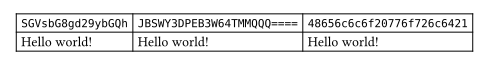

# based
A package for encoding and decoding in base64, base32, and base16.

## Usage
The package comes with three submodules: `base64`, `base32`, and `base16`. All of them have an `encode` and `decode` function. The package also provides the function aliases
- `encode64` / `decode64`,
- `encode32` / `decode32`, and
- `encode16` / `decode16`.

Both base64 and base32 allow you to choose whether to use padding or not (`pad` parameter). It is enabled by default. Base64 also allows you to encode with the URL-safe alphabet (`url` parameter), while base32 allows you to encode or decode with the "extended hex" alphabet (`hex` parameter). Both options are disabled by default. The base16 encoder uses lowercase letters, the decoder is case-insensitive.

You can encode strings, arrays and bytes. The `encode` function will return a string, while the `decode` function will return bytes.

```typ
#import "@preview/based:0.1.0": base64, base32, base16

#table(
  columns: 3,

  raw(base64.encode("Hello world!")),
  raw(base32.encode("Hello world!")),
  raw(base16.encode("Hello world!")),

  str(base64.decode("SGVsbG8gd29ybGQh")),
  str(base32.decode("JBSWY3DPEB3W64TMMQQQ====")),
  str(base16.decode("48656C6C6F20776F726C6421"))
)
```


