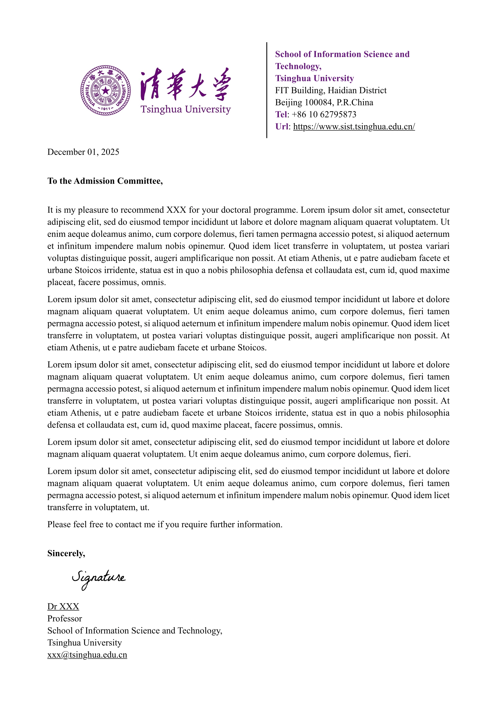
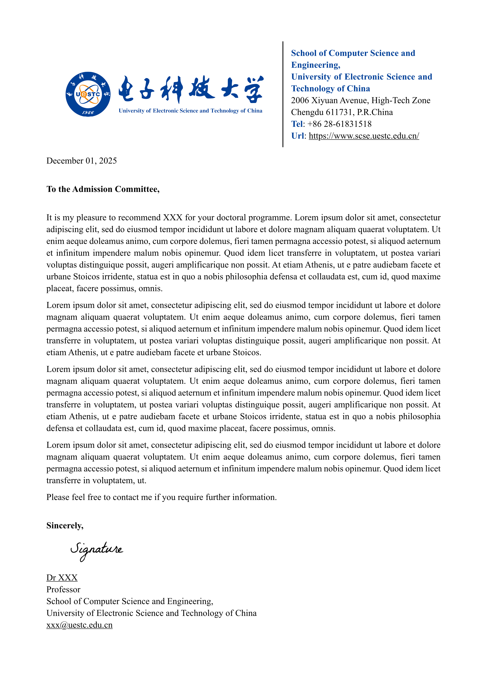
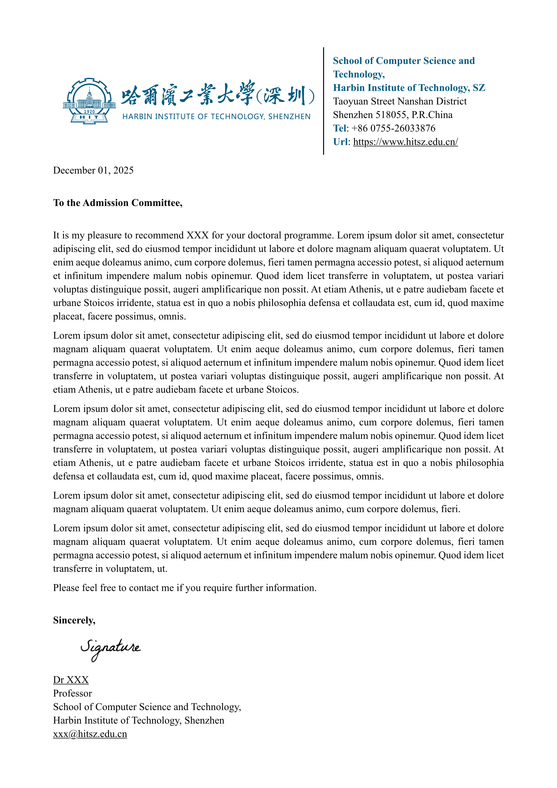

# Basic Academic Letter Typst Template

A clean and professional letter template for [Typst](https://typst.app/), designed for academic use.

- Extremely concise, no additional dependencies
- Professional layout
- Customizable margins and spacing
- Customizable main color

<table>
<tr>
  <td>
    <a href="examples/THU/THU.typ">
      
    </a>
  </td>
  <td>
    <a href="examples/UESTC/UESTC.typ">
      
    </a>
  </td>
  <td>
    <a href="examples/HITSZ/HITSZ.typ">
      
    </a>
  </td>
</tr>
<tr>
  <td style="text-align: center;">THU</td>
  <td style="text-align: center;">UESTC</td>
  <td style="text-align: center;">HIT</td>
</tr>
</table>

**Click the image to view source code**

## Usage
Use the following CLI command to directly install and start this template. Typst will automatically create the relevant directories and default to the THU template.

```bash
typst init @preview/basic-academic-letter
```

Or you can also search and use this template in [Typst Universe](https://typst.app/universe/) in an online manner.

## Configuration

```typst
#show: basic-academic-letter.with(
  // Institutional information
  main_color: rgb("#641C78"),
  logo_img: image("assets/logo.jpg", width: 80%),
  signature_img: image("assets/signature.png", height: 30pt),
  school: [School of Computer Science],
  university: [Your University],
  site: [123 University Ave, City, State 12345],
  phone: [+1 234 567 8900],
  website: [https://university.edu],

  // Personal information
  per_name: "Dr. Jane Smith",
  per_homepage: "https://university.edu/faculty/jane-smith",
  per_title: "Professor",
  per_school: "School of Computer Science",
  per_university: "Your University",
  per_email: "jane.smith@university.edu",

  // Letter content
  salutation: [To the Admission Committee,],
  closing: [Sincerely,]

  // ... other parameters ...

  // Spacing customization
  header_bottom_margin: 0cm,      // Space after header
  date_bottom_margin: 0.8cm,      // Space after date
  salutation_bottom_margin: 0.6cm, // Space after salutation
  body_bottom_margin: 0.8cm,      // Space after body
  closing_bottom_margin: 0cm,     // Space after closing
  signature_bottom_margin: 0cm,   // Space after signature
)

// Your letter content goes here
I am pleased to recommend [Student Name] for admission to your graduate program...
```

## Parameters Reference

### Required Parameters

| Parameter | Type | Description |
|-----------|------|-------------|
| `logo_img` | image | Institution logo |
| `signature_img` | image | Personal signature |
| `school` | content | School/department name |
| `university` | content | University name |
| `site` | content | Address |
| `phone` | content | Phone number |
| `website` | content | Website URL |
| `per_name` | str | Your name |
| `per_homepage` | str | Your homepage URL |
| `per_title` | str | Your title |
| `per_school` | str | Your school |
| `per_university` | str | Your university |
| `per_email` | str | Your email |

### Optional Parameters

| Parameter | Type | Default | Description |
|-----------|------|---------|-------------|
| `main_color` | color | navy | Primary color for text highlights |
| `logo_frac` | fraction | 1.2fr | Logo column width |
| `info_frac` | fraction | 1fr | Info column width |
| `date` | content | today | Letter date |
| `salutation` | str | "To Whom It May Concern," | Letter opening |
| `closing` | str | "Sincerely," | Letter closing |
| `header_bottom_margin` | length | 0cm | Space after header |
| `date_bottom_margin` | length | 0.5cm | Space after date |
| `salutation_bottom_margin` | length | 0.5cm | Space after salutation |
| `body_bottom_margin` | length | 0.5cm | Space after body |
| `closing_bottom_margin` | length | 0cm | Space after closing |
| `signature_bottom_margin` | length | 0cm | Space after signature |

## Contributing
Contributions are welcome! Please feel free to submit issues and pull requests.
