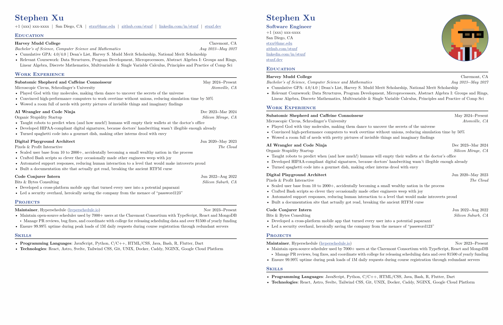

# Basic CV with Photo

<div align="center">Version 0.2.10</div>

This is a template for a simple resume with an optional photo. The original template is taken from [stuxf](https://github.com/stuxf/basic-typst-resume-template) which in turn has taken inspiration from [Jake's Resume](https://github.com/jakegut/resume) and [guided-resume-starter-cgc](https://typst.app/universe/package/guided-resume-starter-cgc/). I hope this template can be useful to others as well. The original author does not seem to be taking pull requests anymore.

This fork adds the option for a photo. Additionally, it contains [PR#40](https://github.com/stuxf/basic-typst-resume-template/pull/40) fixing the em dashes in the dates.

Install this locally (instead of the official version) by running `just install-preview`.

## Sample Resume



## Quick Start

A barebones resume looks like this, which you can use to get started.

```typst
#import "@preview/basic-cv-with-photo:0.2.10": *

// Put your personal information here, replacing mine
#let name = "Stephen Xu"
#let location = "San Diego, CA"
#let email = "stxu@hmc.edu"
#let github = "github.com/stuxf"
#let linkedin = "linkedin.com/in/stuxf"
#let phone = "+1 (xxx) xxx-xxxx"
#let personal-site = "stuxf.dev"

#show: resume.with(
  author: name,
  // All the lines below are optional.
  // For example, if you want to to hide your phone number:
  // feel free to comment those lines out and they will not show.
  location: location,
  email: email,
  github: github,
  linkedin: linkedin,
  phone: phone,
  personal-site: personal-site,
  accent-color: "#26428b",
  font: "New Computer Modern",
  paper: "us-letter",
  author-position: left,
  personal-info-position: left,
  // Uncomment the lines below for a European-style CV header: your name,
  // job title and contact info on the left, with a circular profile photo
  // on the right.
  // jobtitle: "Software Engineer",
  // header: "vertical",
  // profile-image: read("profile.jpg", encoding: none),
)

/*
* Lines that start with == are formatted into section headings
* You can use the specific formatting functions if needed
* The following formatting functions are listed below
* #edu(dates: "", degree: "", gpa: "", institution: "", location: "")
* #work(company: "", dates: "", location: "", title: "")
* #project(dates: "", name: "", role: "", url: "")
* #extracurriculars(activity: "", dates: "")
* There are also the following generic functions that don't apply any formatting
* #generic-two-by-two(top-left: "", top-right: "", bottom-left: "", bottom-right: "")
* #generic-one-by-two(left: "", right: "")
*/
== Education

#edu(
  institution: "Harvey Mudd College",
  location: "Claremont, CA",
  dates: dates-helper(start-date: "Aug 2023", end-date: "May 2027"),
  degree: "Bachelor's of Science, Computer Science and Mathematics",
)
- Cumulative GPA: 4.0\/4.0 | Dean's List, Harvey S. Mudd Merit Scholarship, National Merit Scholarship
- Relevant Coursework: Data Structures, Program Development, Microprocessors, Abstract Algebra I: Groups and Rings, Linear Algebra, Discrete Mathematics, Multivariable & Single Variable Calculus, Principles and Practice of Comp Sci

== Work Experience

#work(
  title: "Subatomic Shepherd and Caffeine Connoisseur",
  location: "Atomville, CA",
  company: "Microscopic Circus, Schrodinger's University",
  dates: dates-helper(start-date: "May 2024", end-date: "Present"),
)
- more bullet points go here

// ... more headers and stuff below
```

## Profile Photo Header

Setting `header: "vertical"` switches to a two-column header — name, job
title and contact info on the left, with a circular profile photo on the
right.

```typst
#show: resume.with(
  author: name,
  jobtitle: "Software Engineer",
  header: "vertical",
  profile-image: read("profile.jpg", encoding: none),
  // ... the rest of your options
)
```

`profile-image` defaults to `none` (no photo), and is only valid together
with `header: "vertical"`.
