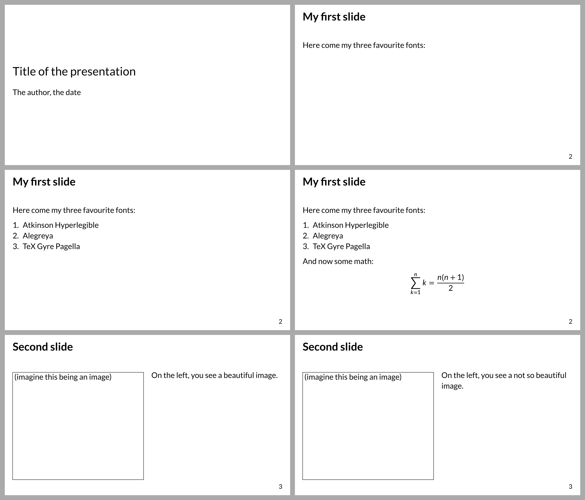

# Polylux starter template

A starter template for creating presentation slides with Typst and
[Polylux](https://github.com/polylux-typ/polylux/).

Use via
```sh
typst init @preview/basic-polylux:0.1.0 your-cool-project
```

A `slides.typ` file will be created for you and contains some suggestions for
how you might set up your slides.

By default, it uses the fonts [Lato](https://www.latofonts.com/lato-free-fonts/)
and [Lete Sans Math](https://github.com/abccsss/LeteSansMath/releases).
I think this is a good suggestion to start with.
Either make sure you have them installed or specify other fonts in the template.



