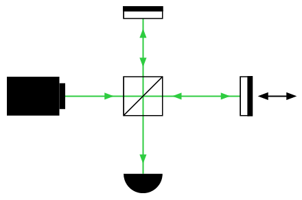
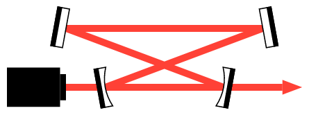
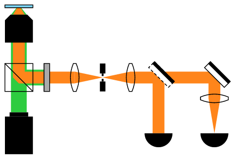

# beam for typst

**beam** aims to simplify the creation of schematics for experiment setups in the field of optics.

Spin up the canvas just like when using [CeTZ](https://typst.app/universe/package/cetz/) or [zap](https://typst.app/universe/package/zap):
```typst
#import "@preview/beam:0.1.1"

#beam.setup({
    import beam: *

    // draw your setup here
})
```

## Documentation
Please refer to the [manual](manual.pdf?raw=true) for proper documentation.

## Examples
Be sure to check out the [examples](./examples) for inspiration!

### Michselson Interferometer


### Mode Cleaner Cavity


### Photoluminescence Microscopy


## Credits
I built this package on the foundations of the fabulous [zap](https://typst.app/universe/package/zap/).
