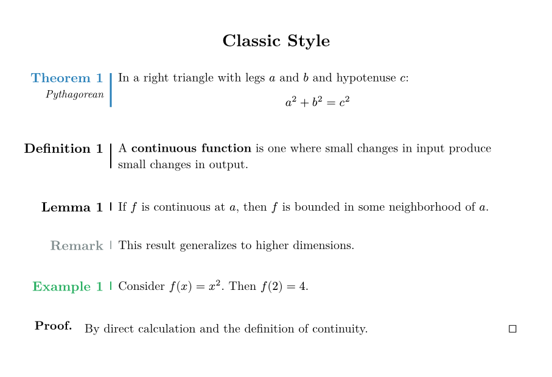
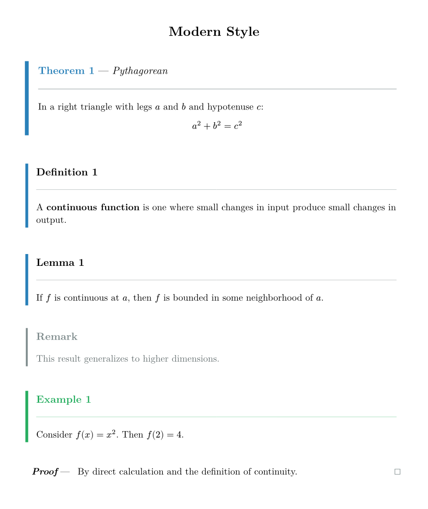
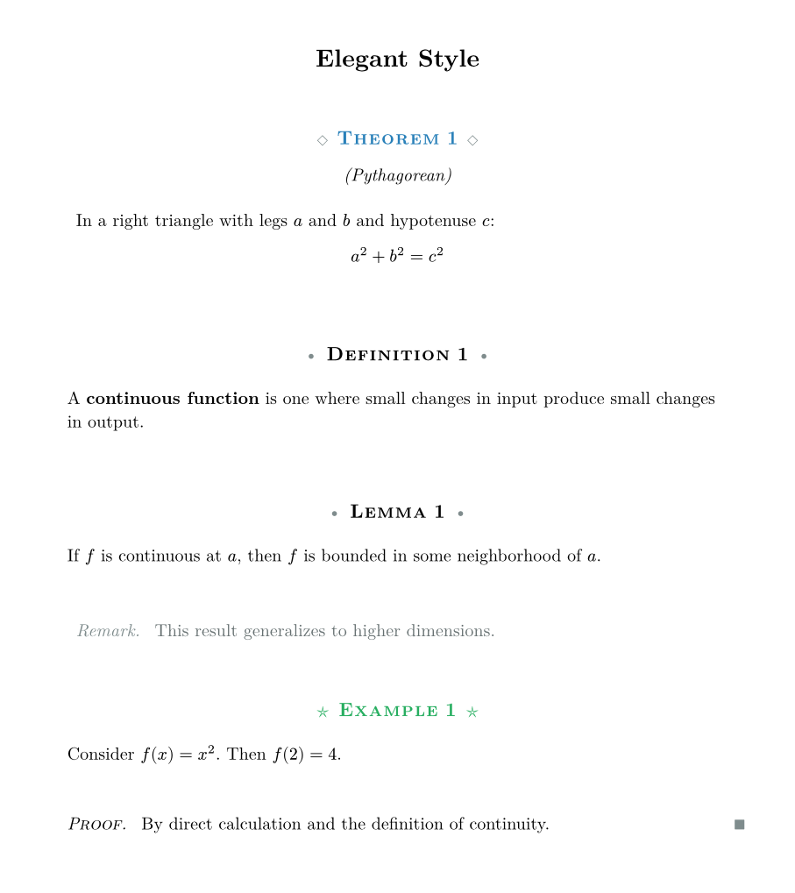
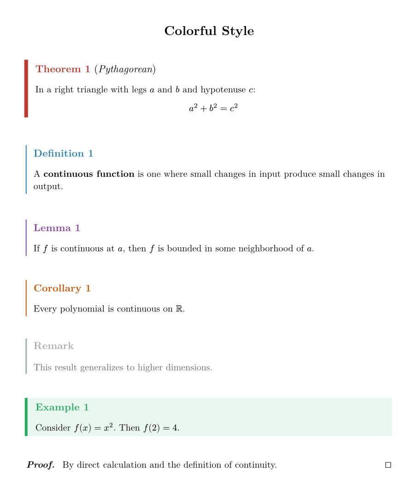
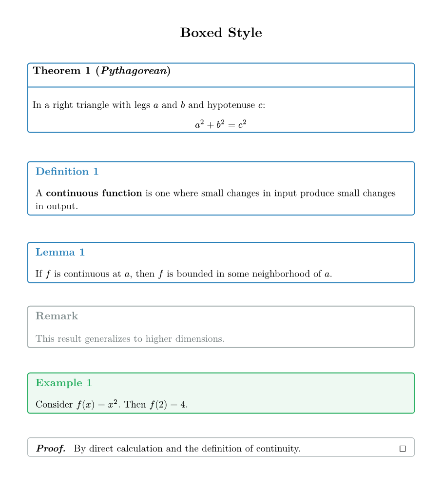
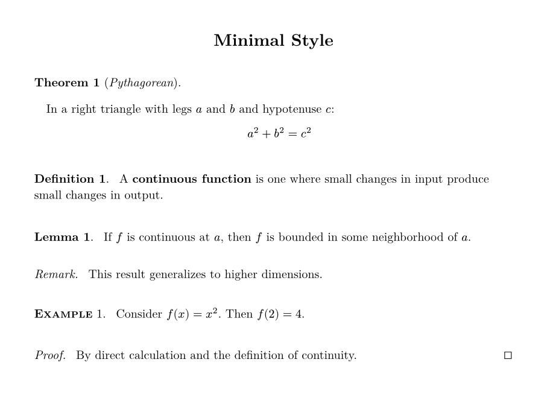
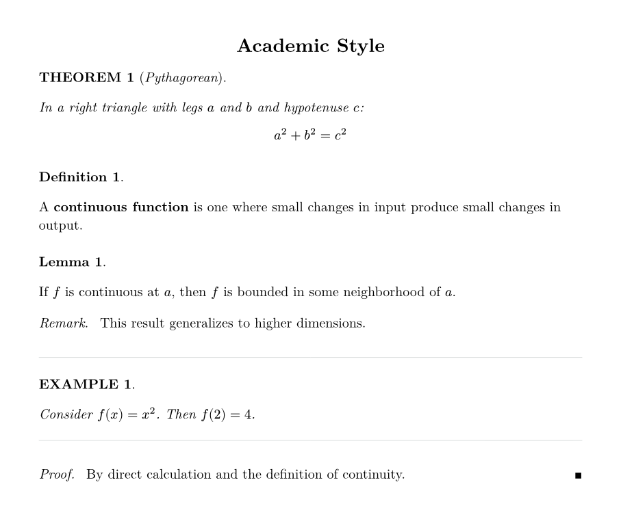
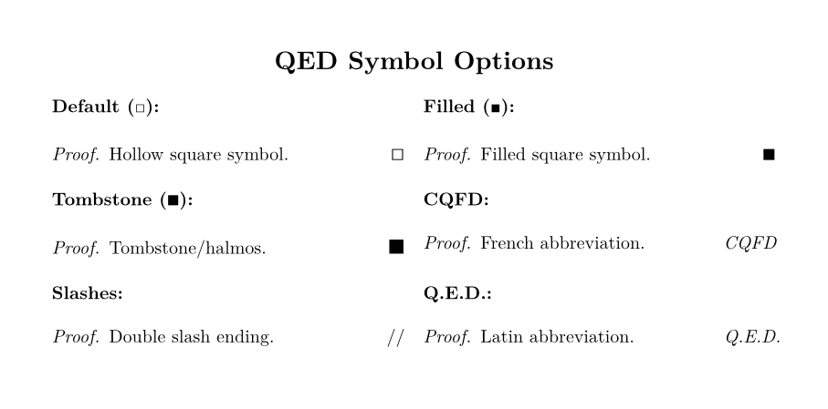

# Beautiframe

Beautiful theorem-like environments for Typst with 7 distinctive styles.

📖 **[Full Manual](docs/manual.pdf)** · 🎨 **[Gallery](#gallery)**

## Gallery

<table>
<tr>
<td width="50%"><strong>Classic</strong><br></td>
<td width="50%"><strong>Modern</strong><br></td>
</tr>
<tr>
<td><strong>Elegant</strong><br></td>
<td><strong>Colorful</strong><br></td>
</tr>
<tr>
<td><strong>Boxed</strong><br></td>
<td><strong>Minimal</strong><br></td>
</tr>
<tr>
<td><strong>Academic</strong><br></td>
<td><strong>QED Symbols</strong><br></td>
</tr>
</table>

## Features

- **7 distinct styles**: classic, modern, elegant, colorful, boxed, minimal, academic
- **6 variants per style**: prominent, standard, subtle, accent, minimal, inline
- **Flexible mapping**: Assign any variant to any environment type
- **Independent counters**: Each environment type has its own counter
- **Customizable labels**: Change "Theorem" to "Théorème", "Satz", etc.
- **QED symbol presets**: □, ■, ∎, CQFD, //, Q.E.D.
- **Color themes**: Pre-built themes (ocean, forest, sunset, lavender)
- **Language presets**: French, German, Spanish
- **Print-friendly modes**: color, grayscale, black & white

## Quick Start

```typst
#import "@preview/beautiframe:0.1.0": *

#theorem(name: "Pythagorean")[
  In a right triangle: $a^2 + b^2 = c^2$
]

#definition[
  A *limit* is the value that a function approaches.
]

#proof[
  The proof is left as an exercise.
]
```

## Environments

| Environment | Default Variant | Counter | Notes |
|-------------|-----------------|---------|-------|
| `theorem`   | prominent       | Optional | Main results |
| `definition`| standard        | Optional | Foundational concepts |
| `lemma`     | standard        | Optional | Supporting results |
| `proposition`| standard       | Optional | Secondary results |
| `corollary` | standard        | Optional | Consequences |
| `remark`    | subtle          | Optional | Commentary |
| `example`   | accent          | Optional | Illustrations |
| `proof`     | (special)       | No       | Ends with QED |

All environments support optional numbering via the `number` parameter.

### Numbering Control

```typst
// Automatic numbering (default for most)
#theorem[Theorem 1]
#theorem[Theorem 2]

// No numbering
#theorem(number: none)[Unnumbered theorem]
#definition(number: none)[Unnumbered definition]

// Custom number
#theorem(number: "A")[Special theorem A]

// Numbered remark (default is unnumbered for remarks)
#remark(number: auto)[Numbered remark]
```

## Style Selection

```typst
#beautiframe-setup(style: "modern")    // or: classic, elegant, colorful, boxed, minimal, academic
```

## Variant Mapping

Assign any variant to any environment type:

```typst
#beautiframe-setup(
  theorem-variant: "prominent",   // Strongest emphasis
  definition-variant: "standard", // Normal styling
  remark-variant: "inline",       // Flows with text
  example-variant: "accent",      // Uses environment color
)
```

Available variants: `prominent`, `standard`, `subtle`, `accent`, `minimal`, `inline`

Boxed style has 4 additional variants: `titled`, `centered`, `corner`, `corner2`

## QED Symbols

```typst
#qed-square()     // □ (default)
#qed-filled()     // ■
#qed-tombstone()  // ∎
#qed-cqfd()       // CQFD
#qed-slashes()    // //
#qed-text()       // Q.E.D.
#qed-none()       // (none)

// Custom symbol (use size: 1.4em for consistency)
#beautiframe-setup(qed-symbol: text(size: 1.4em, fill: green, sym.checkmark))
```

## Language Presets

```typst
#preset-french()   // Théorème, Définition, Preuve...
#preset-german()   // Satz, Definition, Beweis...
#preset-spanish()  // Teorema, Definición, Demostración...
```

## Color Themes

```typst
#theme-ocean()     // Blue tones
#theme-forest()    // Green tones
#theme-sunset()    // Red/orange tones
#theme-lavender()  // Purple tones
```

## Print-Friendly Modes

```typst
#beautiframe-setup(color-mode: "color")      // Full color (default)
#beautiframe-setup(color-mode: "grayscale")  // Grayscale
#beautiframe-setup(color-mode: "bw")         // Pure black and white
```

## Configuration Reference

See the [full manual](docs/manual.pdf) for complete API documentation.

```typst
#beautiframe-setup(
  style: "classic",

  // Variant mapping
  theorem-variant: "prominent",
  definition-variant: "standard",
  lemma-variant: "standard",
  remark-variant: "subtle",
  example-variant: "accent",

  // Colors
  accent-color: rgb("#2980b9"),
  theorem-color: rgb("#c0392b"),
  definition-color: rgb("#2980b9"),

  // Typography
  label-size: 11pt,
  label-weight: "bold",

  // Layout (classic style)
  line-position: 2cm,
  label-extra: 1cm,
  border-width: 1pt,

  // Labels
  theorem-label: "Theorem",
  proof-label: "Proof",

  // QED
  qed-symbol: sym.square.stroked,

  // Print mode
  color-mode: "color",
)
```

## Utility Functions

```typst
#beautiframe-reset()  // Reset all counters to 0
```

## Changelog

### v0.1.0 (2026-01-28)

- Initial release
- 7 styles: classic, modern, elegant, colorful, boxed, minimal, academic
- 6 core variants: prominent, standard, subtle, accent, minimal, inline
- Boxed style extras: titled, centered, corner, corner2
- QED symbol presets: square, filled, tombstone, CQFD, slashes, Q.E.D.
- Language presets: French, German, Spanish
- Color themes: ocean, forest, sunset, lavender
- Print modes: color, grayscale, bw
- Optional numbering for all environments

## License

MIT
