# Beautiframe

Beautiful theorem-like environments for Typst with 9 distinctive styles and a French math preset.

📖 **[Full Manual](https://github.com/nathan-ed/typst-package-beautiframe/blob/5a593dd4042382ee962238947925a4e686732745/docs/manual.pdf)** · 🎨 **[Gallery](#gallery)**

## Gallery

<table>
<tr>
<td width="50%"><strong>Classic</strong><br>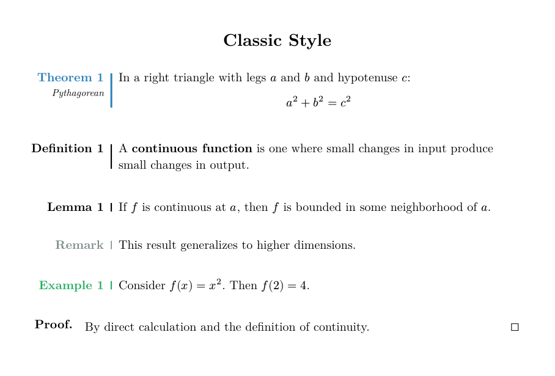</td>
<td width="50%"><strong>Modern</strong><br>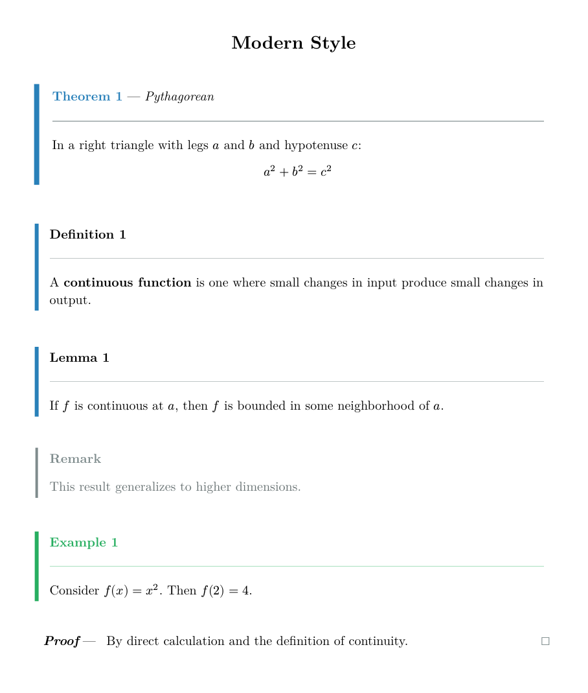</td>
</tr>
<tr>
<td><strong>Elegant</strong><br>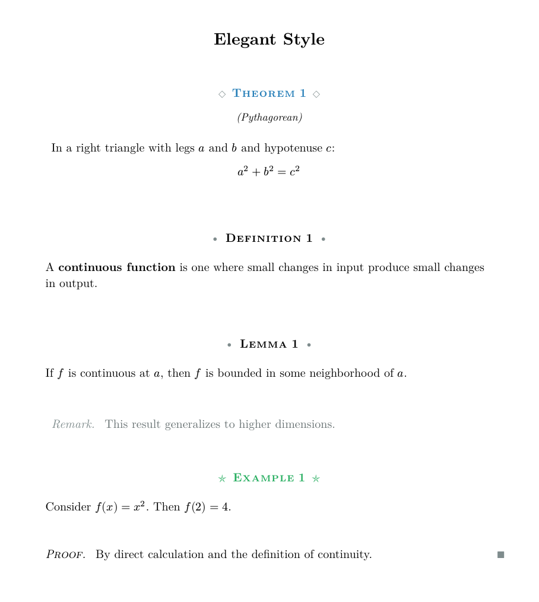</td>
<td><strong>Colorful</strong><br>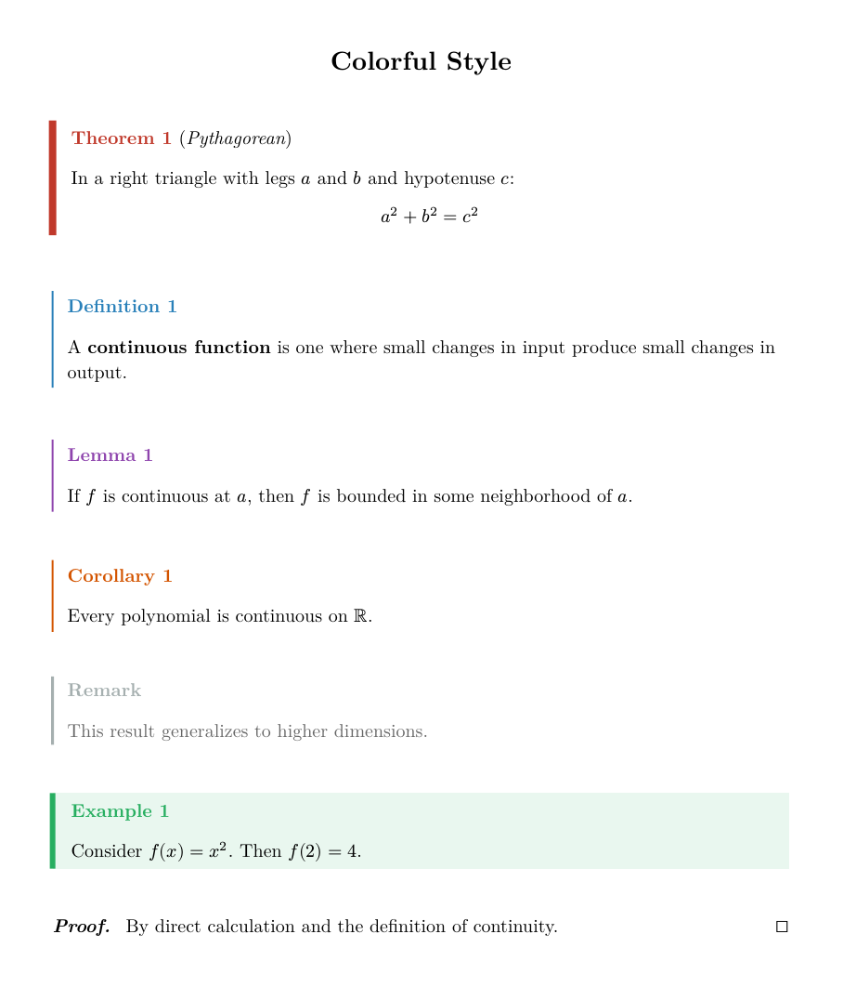</td>
</tr>
<tr>
<td><strong>Boxed</strong><br>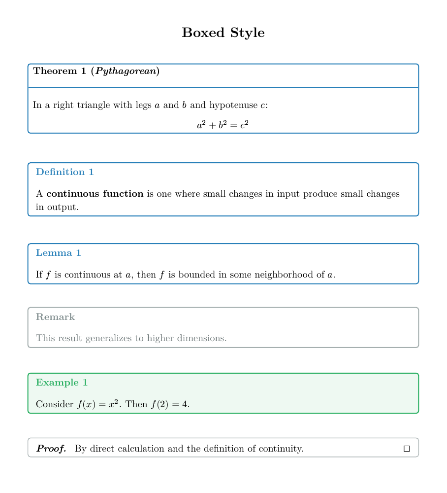</td>
<td><strong>Minimal</strong><br>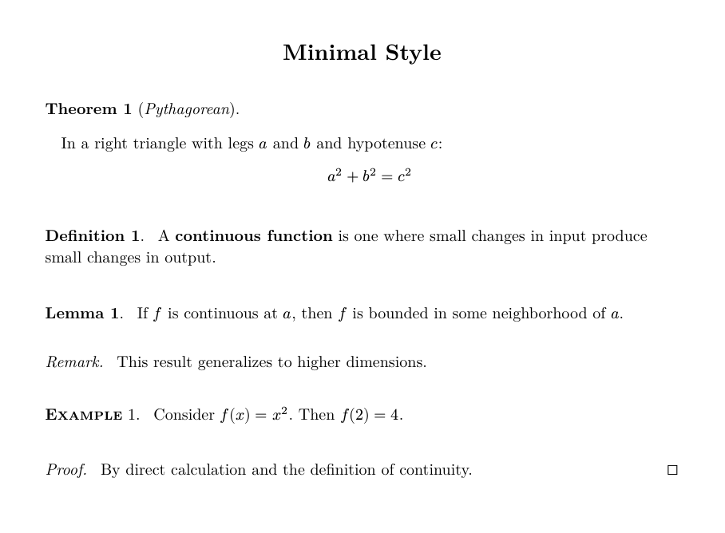</td>
</tr>
<tr>
<td><strong>Academic</strong><br>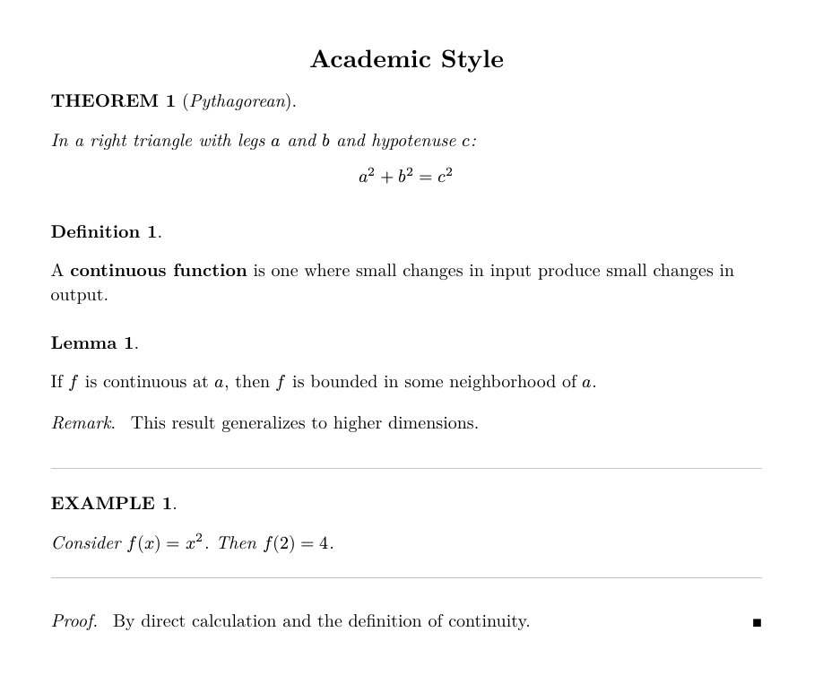</td>
<td><strong>QED Symbols</strong><br>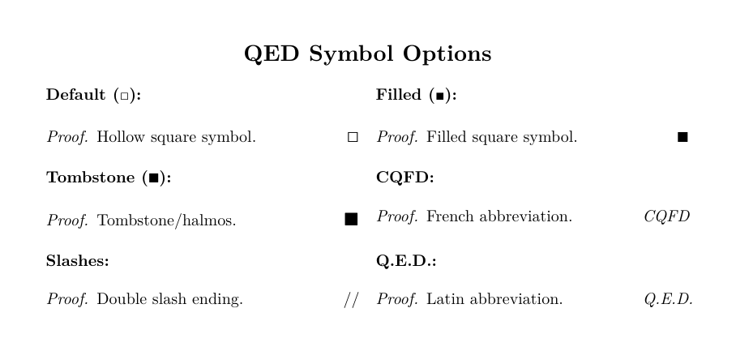</td>
</tr>
<tr>
<td><strong>BW</strong> (French B&amp;W course)<br>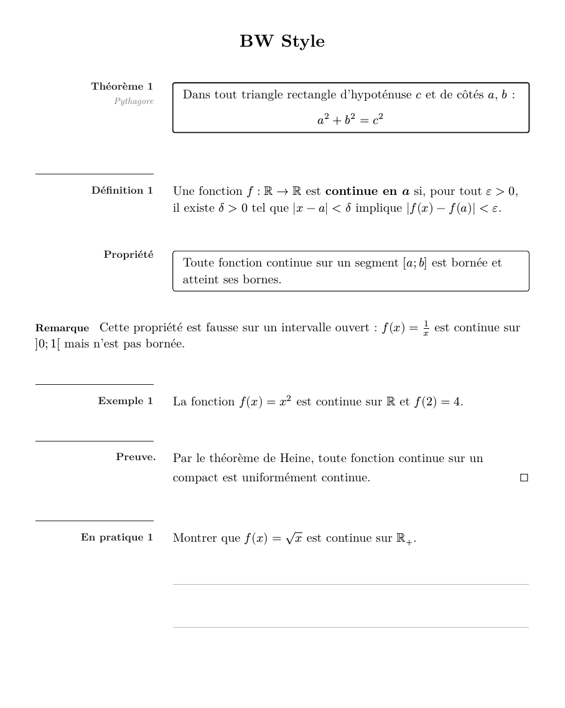</td>
<td><strong>Cours</strong> (French course)<br>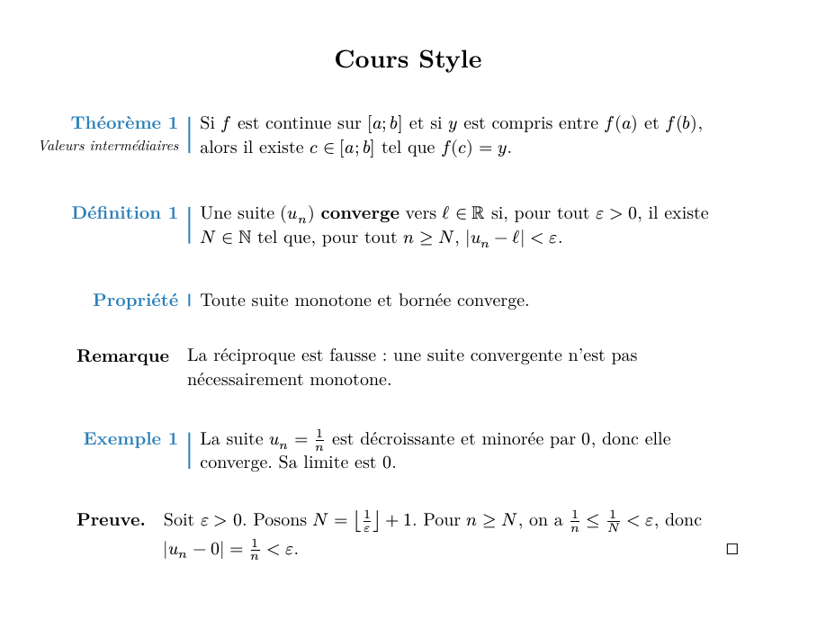</td>
</tr>
<tr>
<td colspan="2"><strong>French Math Preset &amp; New Features</strong><br>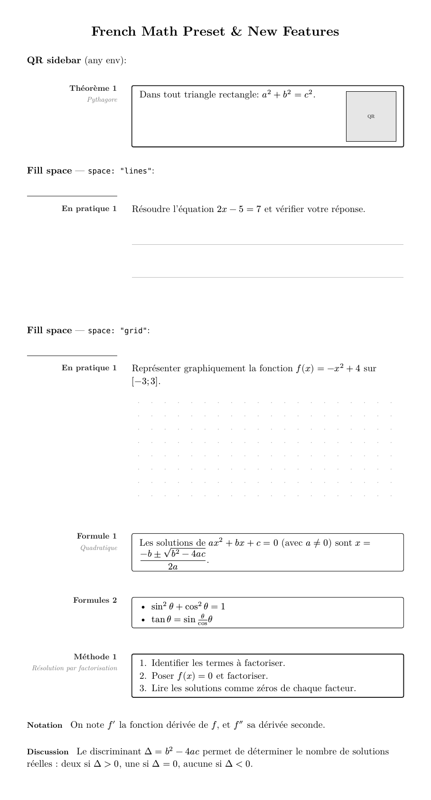</td>
</tr>
</table>

## Features

- **9 distinct styles**: classic, modern, elegant, colorful, boxed, minimal, academic, **bw**, **cours**
- **6 variants per style**: prominent, standard, subtle, accent, minimal, inline
- **Flexible mapping**: Assign any variant to any environment type
- **Independent counters**: Each environment type has its own counter
- **Customizable labels**: Change "Theorem" to "Théorème", "Satz", etc.
- **QED symbol presets**: □, ■, ∎, CQFD, //, Q.E.D.
- **Color themes**: Pre-built themes (ocean, forest, sunset, lavender)
- **Language presets**: French, German, Spanish
- **French Math Preset**: one-call setup for French secondary math courses
- **QR sidebar**: attach a QR code column to any environment
- **Student fill space**: blank, ruled lines, or dot grid appended inside any environment
- **Print-friendly modes**: color, grayscale, black & white

## Quick Start

```typst
#import "@preview/beautiframe:0.3.0": *

#theorem(name: "Pythagorean")[
  In a right triangle: $a^2 + b^2 = c^2$
]

#definition[
  A *limit* is the value that a function approaches.
]

#proof[
  The proof is left as an exercise.
]
```

## Environments

| Environment | Default Variant | Counter | Notes |
|-------------|-----------------|---------|-------|
| `theorem`   | prominent       | Optional | Main results |
| `definition`| standard        | Optional | Foundational concepts |
| `lemma`     | standard        | Optional | Supporting results |
| `proposition`| standard       | Optional | Secondary results |
| `corollary` | standard        | Optional | Consequences |
| `remark`    | subtle          | Optional | Commentary |
| `example`   | accent          | Optional | Illustrations |
| `proof`     | (special)       | No       | Ends with QED |

All environments support optional numbering via the `number` parameter.
All environments accept `title:` as a synonym for `name:` (backward compat).

### French Math Environments

The following environments are available after `#preset-french-math()` or `#preset-french-math-bw()`:

| Environment | Label | Base | Numbered |
|-------------|-------|------|---------|
| `theoreme`  | Théorème | theorem | Yes |
| `definitionfr` | Définition | definition | Yes |
| `propositionfr` | Proposition | proposition | Yes |
| `exemplefr` / `exemple` | Exemple | example | Yes |
| `remarque`  | Remarque | remark | No |
| `corollaire` | Corollaire | corollary | Yes |
| `preuve`    | Preuve | proof | No |
| `pratique`  | En pratique | example | Yes |
| `propriete` | Propriété | corollary | No |
| `formule`   | Formule | lemma | Yes |
| `formules(...)` | Formules (plural) | lemma | Yes |
| `methode`   | Méthode | proposition | Yes |
| `notation(...)` | Notation | remark | No |
| `discussion(...)` | Discussion | remark | No |

### Numbering Control

```typst
// Automatic numbering (default for most)
#theorem[Theorem 1]
#theorem[Theorem 2]

// No numbering
#theorem(number: none)[Unnumbered theorem]

// Custom number
#theorem(number: "A")[Special theorem A]

// title: alias for name:
#theorem(title: "Pythagorean")[...]
```

## Style Selection

```typst
#beautiframe-setup(style: "modern")
// Available: classic, modern, elegant, colorful, boxed, minimal, academic, bw, cours
```

## French Math Preset

One-call setup for French secondary math courses:

```typst
#import "@preview/beautiframe:0.3.0": *

// Color version (cours style, blue accent, bold labels, QED square)
#preset-french-math()

// Black-and-white version (bw style, 8.4pt labels, luma palette)
#preset-french-math-bw()

// Reset all counters (including custom French envs)
#beautiframe-reset-french-math()

// Use French environments
#theoreme(name: "Pythagore")[Dans un triangle rectangle: $a^2 + b^2 = c^2$]
#definitionfr[Une fonction continue préserve les limites.]
#pratique[Calculer la dérivée de $f(x) = x^3 - 2x$.]
#formule[Les solutions de $a x^2 + b x + c = 0$ sont $x = (-b plus.minus sqrt(b^2 - 4ac)) / (2a)$.]
#preuve[Par définition de la continuité.]
```

## QR Sidebar

Attach a QR code (or any content) in a right sidebar to any environment:

```typ
// Configure once in your preamble (using tiaoma or any renderer):
#beautiframe-setup(
  qr-renderer: url => image(tiaoma.qrcode(url), format: "svg", width: 1.85cm),
  qr-width: 1.85cm,
)

// Then use qr: on any environment:
#theorem(qr: "https://example.com/proof")[
  In a right triangle: $a^2 + b^2 = c^2$
]
```

The `qr-renderer` receives the URL string and returns content placed in a right sidebar column of width `qr-width`.

## Student Fill Space

Append blank space for students to write in, inside any environment:

```typst
// Blank area
#pratique(space: "empty", space-height: 3cm)[Solve for x.]

// 8mm ruled lines
#pratique(space: "lines", space-height: 4cm)[Show your work.]

// 5mm dot grid
#exemple(space: "grid", space-height: 5cm)[Sketch the function.]
```

`space:` values: `"empty"` (blank), `"lines"` (8mm ruled lines), `"grid"` (5mm dot grid).
Default `space-height` is 3cm.

## Variant Mapping

Assign any variant to any environment type:

```typst
#beautiframe-setup(
  theorem-variant: "prominent",   // Strongest emphasis
  definition-variant: "standard", // Normal styling
  remark-variant: "inline",       // Flows with text
  example-variant: "accent",      // Uses environment color
)
```

Set **all 7 variants at once** with `default-variant`; individual params override it:

```typst
// All environments use boxed, except theorems which stay prominent
#beautiframe-setup(default-variant: "boxed", theorem-variant: "prominent")
```

Available variants: `prominent`, `standard`, `subtle`, `accent`, `minimal`, `inline`

BW style has additional variants: `boxed` (light rect), `prominent` (thicker rect), `accent` (env-color)

Boxed style has 4 additional variants: `titled`, `centered`, `corner`, `corner2`

## QED Symbols

```typst
#qed-square()     // □ (default)
#qed-filled()     // ■
#qed-tombstone()  // ∎
#qed-cqfd()       // CQFD
#qed-slashes()    // //
#qed-text()       // Q.E.D.
#qed-none()       // (none)

// Custom symbol (use size: 1.4em for consistency)
#beautiframe-setup(qed-symbol: text(size: 1.4em, fill: green, sym.checkmark))
```

## Language Presets

```typst
#preset-french()   // Théorème, Définition, Preuve...
#preset-german()   // Satz, Definition, Beweis...
#preset-spanish()  // Teorema, Definición, Demostración...
```

## Color Themes

```typst
#theme-ocean()     // Blue tones
#theme-forest()    // Green tones
#theme-sunset()    // Red/orange tones
#theme-lavender()  // Purple tones
```

## Print-Friendly Modes

```typst
#beautiframe-setup(color-mode: "color")      // Full color (default)
#beautiframe-setup(color-mode: "grayscale")  // Grayscale
#beautiframe-setup(color-mode: "bw")         // Pure black and white
```

## Configuration Reference

See the [full manual](https://github.com/nathan-ed/typst-package-beautiframe/blob/5a593dd4042382ee962238947925a4e686732745/docs/manual.pdf) for complete API documentation.

```typst
#beautiframe-setup(
  style: "classic",              // classic, modern, elegant, colorful, boxed, minimal, academic, bw, cours

  // Variant mapping (default-variant sets all 7; individual params override)
  default-variant: none,
  theorem-variant: "prominent",
  definition-variant: "standard",
  lemma-variant: "standard",
  remark-variant: "subtle",
  example-variant: "accent",

  // Colors
  accent-color: rgb("#2980b9"),
  theorem-color: rgb("#c0392b"),
  definition-color: rgb("#2980b9"),

  // Typography
  label-size: 1em,               // Defaults to body font size
  label-weight: "bold",

  // Layout (classic style)
  line-position: 2cm,
  label-extra: 1cm,
  border-width: 1pt,

  // Labels
  theorem-label: "Theorem",
  proof-label: "Proof",

  // QED
  qed-symbol: sym.square.stroked,

  // Print mode
  color-mode: "color",

  // QR sidebar
  qr-renderer: none,             // url => content function, or none
  qr-width: 1.85cm,              // Width of the QR sidebar column
)
```

## Utility Functions

```typst
#beautiframe-reset()                // Reset all built-in counters to 0
#beautiframe-reset-french-math()    // Reset built-in + French env counters
#reset-env("Conjecture")            // Reset a specific custom env counter
```

## Changelog

### v0.3.0

- **`default-variant`**: new parameter on `beautiframe-setup()` — sets all 7 environment variants at once; individual `*-variant` params override it
- **Documentation**: comprehensive manual expansion — full API reference with all spacing params, `title:` alias documentation, `notation`/`discussion`/`pratique` live examples, `default-variant` section with live gallery

### v0.2.0

- **New styles**: `bw` (Gymnomath black-and-white two-column) and `cours` (French course style with margin overhang)
- **French Math Preset**: `#preset-french-math()` and `#preset-french-math-bw()` for one-call setup
- **French environments**: `theoreme`, `definitionfr`, `propositionfr`, `exemplefr`, `remarque`, `corollaire`, `preuve`, `pratique`, `propriete`, `formule`, `formules`, `methode`, `notation`, `discussion`
- **QR sidebar**: `qr-renderer` config + `qr:` parameter on all environments
- **Student fill space**: `space: "empty"|"lines"|"grid"` and `space-height:` on all environments
- **`title:` alias**: synonym for `name:` on all environments
- **Default label-size**: changed from `11pt` to `1em` (inherits document body font)
- **`beautiframe-reset-french-math()`**: resets all counters including French custom envs
- Bug fix: fill-space lines calculation with length arithmetic

### v0.1.0 (2026-01-28)

- Initial release
- 7 styles: classic, modern, elegant, colorful, boxed, minimal, academic
- 6 core variants: prominent, standard, subtle, accent, minimal, inline
- Boxed style extras: titled, centered, corner, corner2
- QED symbol presets: square, filled, tombstone, CQFD, slashes, Q.E.D.
- Language presets: French, German, Spanish
- Color themes: ocean, forest, sunset, lavender
- Print modes: color, grayscale, bw
- Optional numbering for all environments

## License

MIT
