# beautiframe

[](https://typst.app/universe/package/beautiframe)
[](https://github.com/nathan-ed/typst-package-beautiframe/blob/48882d454fc52d02e61b06c96197a4eb5245064d/docs/manual.pdf)
[](LICENSE)

Beautiful theorem-like environments with 9 distinctive styles and a French math preset.

## Gallery

<table>
<tr>
<td width="50%"><strong>Classic</strong><br>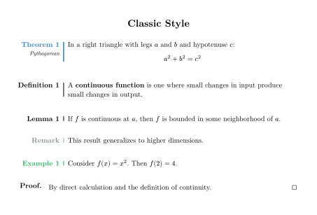</td>
<td width="50%"><strong>Modern</strong><br>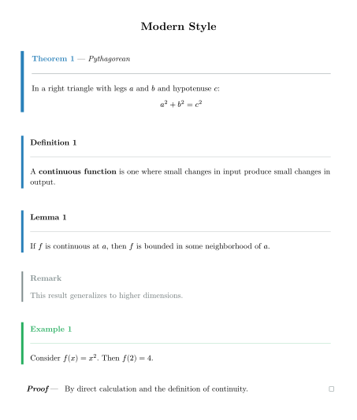</td>
</tr>
<tr>
<td><strong>Elegant</strong><br>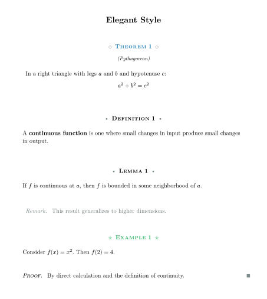</td>
<td><strong>Colorful</strong><br>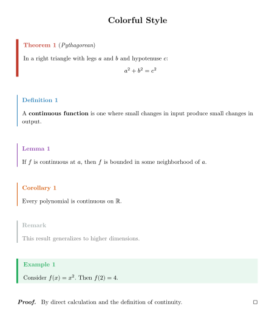</td>
</tr>
<tr>
<td><strong>Boxed</strong><br>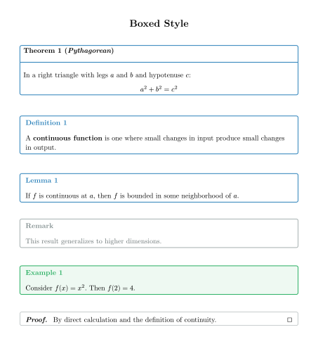</td>
<td><strong>Minimal</strong><br>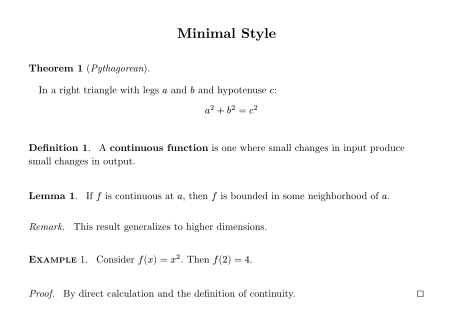</td>
</tr>
<tr>
<td><strong>Academic</strong><br>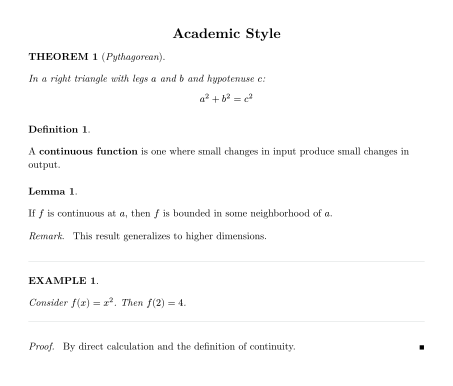</td>
<td><strong>QED Symbols</strong><br>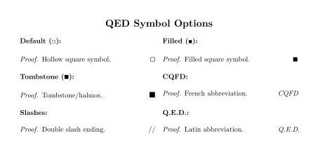</td>
</tr>
<tr>
<td><strong>BW</strong> (French B&amp;W course)<br>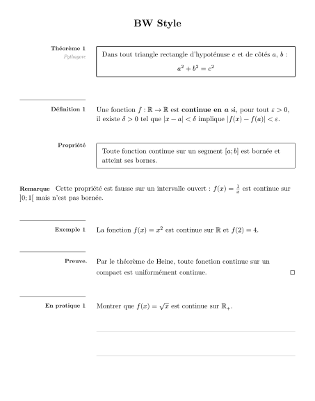</td>
<td><strong>Cours</strong> (French course)<br>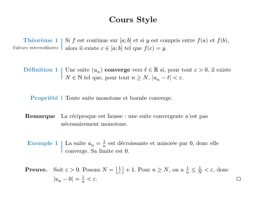</td>
</tr>
<tr>
<td colspan="2"><strong>French Math Preset &amp; New Features</strong><br>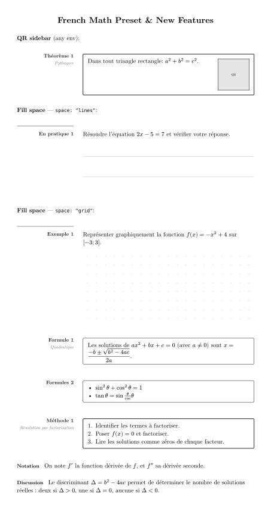</td>
</tr>
</table>

## Features

- **9 distinct styles**: classic, modern, elegant, colorful, boxed, minimal, academic, **bw**, **cours**
- **6 variants per style**: prominent, standard, subtle, accent, minimal, inline
- **Flexible mapping**: Assign any variant to any environment type
- **Independent counters**: Each environment type has its own counter
- **Customizable labels**: Change "Theorem" to "Théorème", "Satz", etc.
- **QED symbol presets**: □, ■, ∎, CQFD, //, Q.E.D.
- **Color themes**: Pre-built themes (ocean, forest, sunset, lavender)
- **Language presets**: French, German, Spanish
- **French Math Preset**: one-call setup for French secondary math courses
- **QR sidebar**: attach a QR code column to any environment
- **Environment references**: label theorem-like blocks and link back to their page
- **Section-linked numbering**: LaTeX `\numberwithin`-style "Theorem 2.1.3" with per-section reset (opt-in)
- **Instructor mode**: one source, two documents — corrections and instructor-only blocks hidden in the student build
- **Student fill space**: blank, ruled lines, or dot grid appended inside any environment
- **Print-friendly modes**: color, grayscale, black & white

## Quick Start

```typst
#import "@preview/beautiframe:0.4.0": *

#theorem(name: "Pythagorean")[
  In a right triangle: $a^2 + b^2 = c^2$
]

#definition[
  A *limit* is the value that a function approaches.
]

#proof[
  The proof is left as an exercise.
]
```

## Environments

| Environment | Default Variant | Counter | Notes |
|-------------|-----------------|---------|-------|
| `theorem`   | prominent       | Optional | Main results |
| `definition`| standard        | Optional | Foundational concepts |
| `lemma`     | standard        | Optional | Supporting results |
| `proposition`| standard       | Optional | Secondary results |
| `corollary` | standard        | Optional | Consequences |
| `remark`    | subtle          | Optional | Commentary |
| `example`   | accent          | Optional | Illustrations |
| `proof`     | (special)       | No       | Ends with QED |

All environments support optional numbering via the `number` parameter.
All environments accept `title:` as a synonym for `name:` (backward compat).
All environments accept `label:` for cross-references with `env-ref`.

### French Math Environments

The following environments are available after `#preset-french-math()` or `#preset-french-math-bw()`:

| Environment | Label | Base | Numbered |
|-------------|-------|------|---------|
| `theoreme`  | Théorème | theorem | Yes |
| `definitionfr` | Définition | definition | Yes |
| `propositionfr` | Proposition | proposition | Yes |
| `exemplefr` / `exemple` | Exemple | example | Yes |
| `remarque`  | Remarque | remark | No |
| `corollaire` | Corollaire | corollary | Yes |
| `preuve`    | Preuve | proof | No |
| `pratique`  | En pratique | example | Yes |
| `guided-example` | Exemple guidé | example | Yes |
| `propriete` | Propriété | corollary | No |
| `formule`   | Formule | lemma | Yes |
| `formules(...)` | Formules (plural) | lemma | Yes |
| `methode`   | Méthode | proposition | Yes |
| `notation(...)` | Notation | remark | No |
| `discussion(...)` | Discussion | remark | No |

### Numbering Control

```typst
// Automatic numbering (default for most)
#theorem[Theorem 1]
#theorem[Theorem 2]

// No numbering
#theorem(number: none)[Unnumbered theorem]

// Custom number
#theorem(number: "A")[Special theorem A]

// title: alias for name:
#theorem(title: "Pythagorean")[...]
```

Section-linked numbering (LaTeX `\numberwithin` style) is opt-in and also applies
to `new-env` custom environments such as `formule`:

```typst
#set heading(numbering: "1.1.")
#beautiframe-setup(
  link-to-section: true,      // true = 1 heading level; an int N = N levels ("2.1.3")
  counter-reset: "section",   // restart counters at each heading up to that depth
)

= Première section
#formule[$a^2 + b^2 = c^2$]   // Formule 1.1
#formule[$e^(i pi) = -1$]     // Formule 1.2
= Deuxième section
#formule[$sin^2 + cos^2 = 1$] // Formule 2.1
```

`env-ref`/`env-refs` display the same section-linked numbers.

### References

Add a Typst label to any environment, then reference it with `#env-ref(<label>)`.
The reference text includes the environment label, number, and target page, and the whole text links to the labelled block.

```typst
#theorem(label: <thm-pythagore>, title: "Pythagore")[
  Dans un triangle rectangle: $a^2 + b^2 = c^2$.
]

Voir #env-ref(<thm-pythagore>).
// -> Théorème 1 (p. 3)

#remark(label: <rem-unites>)[Attention aux unités.]
Voir #env-ref(<rem-unites>).
// -> Remark (p. 3)
```

Use `page: false` to hide the page number: `#env-ref(<thm-pythagore>, page: false)`.
Use `page-style: "comma"` when the reference already sits inside parentheses:
`(voir #env-ref(<thm-pythagore>, page-style: "comma"))`.

Use `env-refs` for several environments. Consecutive references with the same label are compacted:

```typst
#pratique(label: <prac-3>)[...]
#pratique(label: <prac-4>)[...]
#pratique(label: <prac-5>)[...]
#pratique(label: <prac-6>)[...]

Voir #env-refs(<prac-3>, <prac-4>, <prac-5>, <prac-6>, page: false).
// -> En pratique 3-6

Voir #env-refs(<prac-3>, <prac-4>, <prac-5>, <prac-6>, page-style: "comma").
// -> En pratique 3-6, pp. 4-5

#definition(label: <def-limite>)[...]
#proposition(label: <prop-limite>)[...]

Voir #env-refs(<def-limite>, <prop-limite>, page: false).
// -> Définition 1 et Proposition 2
```

## Style Selection

```typst
#beautiframe-setup(style: "modern")
// Available: classic, modern, elegant, colorful, boxed, minimal, academic, bw, cours
```

## French Math Preset

One-call setup for French secondary math courses:

```typst
#import "@preview/beautiframe:0.4.0": *

// Color version (cours style, blue accent, bold labels, QED square)
#preset-french-math()

// Black-and-white version (bw style, 8.4pt labels, luma palette)
#preset-french-math-bw()

// Reset all counters (including custom French envs)
#beautiframe-reset-french-math()

// Use French environments
#theoreme(name: "Pythagore")[Dans un triangle rectangle: $a^2 + b^2 = c^2$]
#definitionfr[Une fonction continue préserve les limites.]
#pratique[Calculer la dérivée de $f(x) = x^3 - 2x$.]
#worked-exercise(correction: [On obtient $f'(x)=3x^2$.])[
  Calculer la dérivée de $f(x)=x^3$.
]
#guided-example(title: "Méthode guidée")[On détaille chaque étape.]
#formule[Les solutions de $a x^2 + b x + c = 0$ sont $x = (-b plus.minus sqrt(b^2 - 4ac)) / (2a)$.]
#preuve[Par définition de la continuité.]
```

`worked-exercise` displays its `correction:` only when `beautiframe-setup(instructor-mode: true)` is active. Configure `correction-renderer: (title, body) => ...` to use a custom correction style.

## QR Sidebar

Attach a QR code (or any content) in a right sidebar to any environment:

```typ
// Configure once in your preamble (using tiaoma or any renderer):
#beautiframe-setup(
  qr-renderer: url => image(tiaoma.qrcode(url), format: "svg", width: 1.85cm),
  qr-width: 1.85cm,
)

// Then use qr: on any environment:
#theorem(qr: "https://example.com/proof")[
  In a right triangle: $a^2 + b^2 = c^2$
]
```

The `qr-renderer` receives the URL string and returns content placed in a right sidebar column of width `qr-width`.

## Student Fill Space

Append blank space for students to write in, inside any environment:

```typst
// Blank area
#pratique(space: "empty", space-height: 3cm)[Solve for x.]

// 8mm ruled lines
#pratique(space: "lines", space-height: 4cm)[Show your work.]

// 5mm dot grid
#exemple(space: "grid", space-height: 5cm)[Sketch the function.]
```

`space:` values: `"empty"` (blank), `"lines"` (8mm ruled lines), `"grid"` (5mm dot grid).
Default `space-height` is 3cm.

## Variant Mapping

Assign any variant to any environment type:

```typst
#beautiframe-setup(
  theorem-variant: "prominent",   // Strongest emphasis
  definition-variant: "standard", // Normal styling
  remark-variant: "inline",       // Flows with text
  example-variant: "accent",      // Uses environment color
)
```

Set **all 7 variants at once** with `default-variant`; individual params override it:

```typst
// All environments use boxed, except theorems which stay prominent
#beautiframe-setup(default-variant: "boxed", theorem-variant: "prominent")
```

Available variants: `prominent`, `standard`, `subtle`, `accent`, `minimal`, `inline`

BW style has additional variants: `boxed` (light rect), `prominent` (thicker rect), `accent` (env-color)

Boxed style has 4 additional variants: `titled`, `centered`, `corner`, `corner2`

## QED Symbols

```typst
#qed-square()     // □ (default)
#qed-filled()     // ■
#qed-tombstone()  // ∎
#qed-cqfd()       // CQFD
#qed-slashes()    // //
#qed-text()       // Q.E.D.
#qed-none()       // (none)

// Custom symbol (use size: 1.4em for consistency)
#beautiframe-setup(qed-symbol: text(size: 1.4em, fill: green, sym.checkmark))
```

## Language Presets

```typst
#preset-french()   // Théorème, Définition, Preuve...
#preset-german()   // Satz, Definition, Beweis...
#preset-spanish()  // Teorema, Definición, Demostración...
```

## Color Themes

```typst
#theme-ocean()     // Blue tones
#theme-forest()    // Green tones
#theme-sunset()    // Red/orange tones
#theme-lavender()  // Purple tones
```

## Print-Friendly Modes

```typst
#beautiframe-setup(color-mode: "color")      // Full color (default)
#beautiframe-setup(color-mode: "grayscale")  // Grayscale
#beautiframe-setup(color-mode: "bw")         // Pure black and white
```

## Configuration Reference

See the [full manual](https://github.com/nathan-ed/typst-package-beautiframe/blob/8f3e0082ed704a4e2941a1ee50e18658c8acf2c7/docs/manual.pdf) for complete API documentation.

```typst
#beautiframe-setup(
  style: "classic",              // classic, modern, elegant, colorful, boxed, minimal, academic, bw, cours

  // Variant mapping (default-variant sets all 7; individual params override)
  default-variant: none,
  theorem-variant: "prominent",
  definition-variant: "standard",
  lemma-variant: "standard",
  remark-variant: "subtle",
  example-variant: "accent",

  // Colors
  accent-color: rgb("#2980b9"),
  theorem-color: rgb("#c0392b"),
  definition-color: rgb("#2980b9"),

  // Typography
  label-size: 1em,               // Defaults to body font size
  label-weight: "bold",

  // Layout (classic style)
  line-position: 2cm,
  label-extra: 1cm,
  border-width: 1pt,

  // Labels
  theorem-label: "Theorem",
  proof-label: "Proof",

  // QED
  qed-symbol: sym.square.stroked,

  // Print mode
  color-mode: "color",

  // QR sidebar
  qr-renderer: none,             // url => content function, or none
  qr-width: 1.85cm,              // Width of the QR sidebar column
)
```

## Utility Functions

```typst
#beautiframe-reset()                // Reset all built-in counters to 0
#beautiframe-reset-french-math()    // Reset built-in + French env counters
#reset-env("Conjecture")            // Reset a specific custom env counter
```

## Changelog

### [0.4.0] - 2026-07-14

#### Added
- References: `env-ref(<label>)` and `env-refs(<a>, <b>, ...)` link to any labelled environment, displaying its label, number and page ("théorème 2, p. 5"). Consecutive references of the same type are compacted into ranges ("formule 1.1-1.2"). Options: `page`, `page-style`, `page-prefix`, `lower-label`, `missing`, `separator`, `last-separator`. Aliases `envref`/`envrefs`.
- Section-linked numbering (LaTeX `\numberwithin` style), opt-in:
  - `link-to-section` now accepts an integer depth in addition to `true`: `true` = one heading level ("Théorème 2.3"), `N` = first N levels ("Formule 2.1.3" with `link-to-section: 2`).
  - `counter-reset: "section"` is now implemented: every environment counter restarts after each heading up to the `link-to-section` depth (level 1 when the prefix is off). Default `"manual"` unchanged.
  - Both settings now also apply to `new-env` custom environments (`formule`, `methode`, `pratique`, ...), which previously ignored them.
  - `env-ref`/`env-refs` display the same section-linked numbers.
- `instructor: false` parameter on every environment (built-ins and `new-env` customs): the whole block is only rendered when `instructor-mode: true`, in addition to the existing per-`correction` gating.

#### Fixed
- `bw` style: boxed/prominent variants now honour the configured `inset` instead of a hardcoded value.

### [0.3.1] - 2026-05-27

#### Added
- **`worked-exercise`**: new environment for instructor-controlled correction reveal — shows correction only when `beautiframe-setup(instructor-mode: true)` is active; customizable via `correction-renderer`
- **`guided-example`**: new "Exemple guidé" environment for step-by-step demonstrations
- **`instructor-mode`** / **`correction-label`** / **`correction-renderer`**: new `beautiframe-setup` parameters for worked exercise support
- **`lower-label`** parameter on `env-ref` / `env-refs`: renders environment label in lowercase (e.g. "le théorème 3" vs "Théorème 3")
- Manual: document `defi`/`défi` challenge callout with parameter table and live examples
- Manual: document `formule-end` / `formules-recap` formula recap workflow
- Manual: document `objectifs`, `concepts`, `glossaire` course meta-environments

#### Fixed
- Replace deprecated `pattern` with `tiling` (removed in Typst 0.15.0)
- Remove "Typst" from package description (redundant on Typst Universe)

### v0.3.0

- **`default-variant`**: new parameter on `beautiframe-setup()` — sets all 7 environment variants at once; individual `*-variant` params override it
- **Documentation**: comprehensive manual expansion — full API reference with all spacing params, `title:` alias documentation, `notation`/`discussion`/`pratique` live examples, `default-variant` section with live gallery

### v0.2.0

- **New styles**: `bw` (Gymnomath black-and-white two-column) and `cours` (French course style with margin overhang)
- **French Math Preset**: `#preset-french-math()` and `#preset-french-math-bw()` for one-call setup
- **French environments**: `theoreme`, `definitionfr`, `propositionfr`, `exemplefr`, `remarque`, `corollaire`, `preuve`, `pratique`, `propriete`, `formule`, `formules`, `methode`, `notation`, `discussion`
- **QR sidebar**: `qr-renderer` config + `qr:` parameter on all environments
- **Student fill space**: `space: "empty"|"lines"|"grid"` and `space-height:` on all environments
- **`title:` alias**: synonym for `name:` on all environments
- **Default label-size**: changed from `11pt` to `1em` (inherits document body font)
- **`beautiframe-reset-french-math()`**: resets all counters including French custom envs
- Bug fix: fill-space lines calculation with length arithmetic

### v0.1.0 (2026-01-28)

- Initial release
- 7 styles: classic, modern, elegant, colorful, boxed, minimal, academic
- 6 core variants: prominent, standard, subtle, accent, minimal, inline
- Boxed style extras: titled, centered, corner, corner2
- QED symbol presets: square, filled, tombstone, CQFD, slashes, Q.E.D.
- Language presets: French, German, Spanish
- Color themes: ocean, forest, sunset, lavender
- Print modes: color, grayscale, bw
- Optional numbering for all environments

## License

MIT
