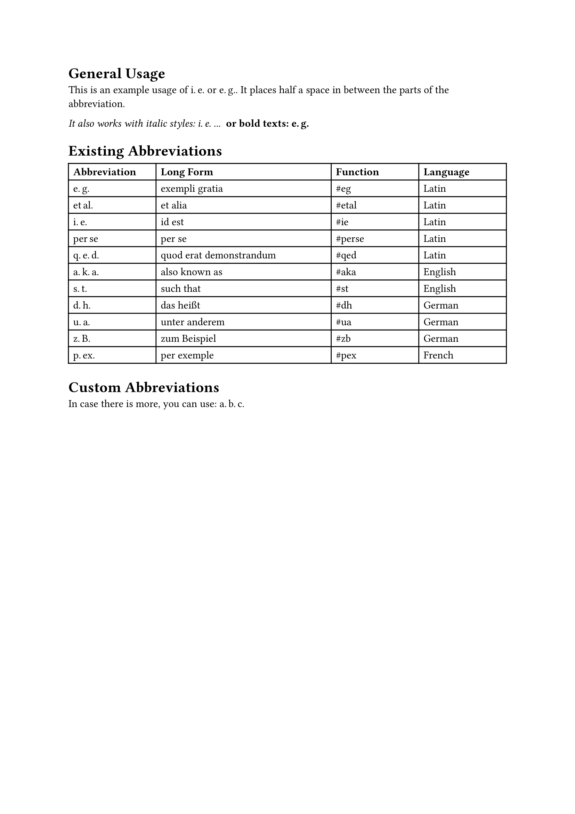

# Beautiful Abs

Beatiful abs is a package that allows to have a beautify standard abbreviations like i.e. or e.g. by adding half a space in between.

## Getting Started

```typst
typst init @preview/beautiful-abs
```

## Configuration

```typst
#import "@preview/beautiful-abs:0.1.0": *

This is a sentence that includes #ie or #eg. These will be replaced with their corresponding abbreviations.
```

### List of Existing Abbreviations

The following abbreviations are implemented:

| Abbreviation | Long Form | Function | Language |
| -------------|-----------|----------|----------|
| e. g. | exempli gratia | #eg | Latin |
| et al. | et alia | #etal | Latin |
| i. e. | id est | #ie | Latin |
| per se | per se | #perse | Latin |
| q. e. d. | quod erat demonstrandum | #qed | Latin |
| a. k. a. | also known as | #aka | English |
| s. t. | such that | #st | English |
| d. h. | das heißt | #dh | German |
| u. a. | unter anderem | #ua | German |
| z. B. | zum Beispiel | #zb | German |
| p. ex. | per exemple | #pex | French |


### Custom Abbreviations

For not existing abbreviations, one can use the `customab` function by supplying the chunks in an array:

```typst
#customab(("a.", "b.", "c."))
```

## You like this package? Consider supporting!

[](https://coff.ee/robert.richter)


