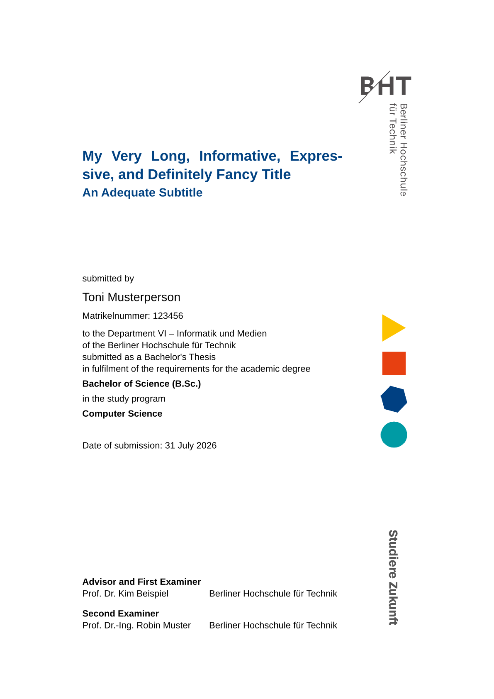

# BHT Thesis Template for Typst

A [Typst](https://typst.app/home/) template from and for students at [Berliner Hochschule für Technik (BHT)](https://www.bht-berlin.de/) writing their Bachelor's or Master's thesis.

> This repository is a fork of the [OTH Regensburg Thesis Template](https://github.com/korbinianhutter/oth-regensburg-template) by Korbinian Hutter, which itself is a fork of the [HPI Thesis Template](https://github.com/felixhoffmnn/hpi-thesis-template) by Felix Hoffmann.
> The cover and declaration are ported from the [BHT LaTeX template](https://prof.bht-berlin.de/tschirley/latex-werkzeuge) by Prof. Dr. Sebastian Tschirley.

## Disclaimer

- This template is not official.
- Official BHT guidelines may differ from the ones used in this template.

## Logo Usage

Please note the [corporate design guidelines](https://www.bht-berlin.de/corporate-design) of the Berliner Hochschule für Technik. The BHT logo and design elements are subject to copyright of the Berliner Hochschule für Technik.

## Example



The title page above is the first page of the [example document](example/main.typ), which showcases all template features. The fully rendered version is available as [example.pdf](example.pdf).

## Features

- BHT-style title page with logo, design elements, and corporate colors.
- Support for both English and German language.
- Suitable for both Bachelor's and Master's theses.
- Ready-made front-matter sections in the example, including the BHT declaration (Erklärung / plagiarism statement) with a signature line, freely orderable via `pre-toc`.
- Highly customizable metadata: title, optional subtitle, student name, student ID (Matrikelnummer), date, department (Fachbereich), study program, degree, and a freely ordered committee with per-person roles and institutions.
- Flexible `pre-toc` front matter before the table of contents: a list of titled sections (e.g. confidentiality clause, statement on the use of AI tools, abstract, acknowledgements). Each section starts its own page unless it sets `own-page: false` (e.g. Kurzfassung and Abstract sharing one page).
- Optional `pre-body` and `post-body` content around the main body plus `list-of-figures()` and `list-of-tables()` helpers. For a list of abbreviations, packages like [glossarium](https://typst.app/universe/package/glossarium) work well.
- Optional `appendix` content after the bibliography with "A.1.1.1"-style numbering.
- Sensible defaults for tables (bold header row, thin horizontal rules) and figure captions, with configurable text sizes.
- Configurable typography and layout options:
    - `margin`: Set custom page margins (left, right, top, bottom).
    - `chapter-pagebreak`: Start new chapters (level 1 headings) on a new page (default: true).
    - `for-print`: Optimize for printing with blank pages on odd numbers.
    - `toc-depth`: Control table of contents depth.
    - `show-header`: Display chapter title in page header.

## Getting Started

```bash
typst init @preview/bht-thesis-unofficial
```

On [typst.app](https://typst.app), choose "Start from template" and search for `bht-thesis-unofficial`.

### Local development

Run `just install-local` to install the working copy as a [local package](https://github.com/typst/packages/?tab=readme-ov-file#local-packages), then start a thesis from any directory:

```bash
typst init @local/bht-thesis-unofficial:0.1.0
```

To test in the [typst.app](https://typst.app) web editor without the released package: run `just webapp-bundle` and upload the files from `dist/webapp/` into an empty project. If the cover falls back to a serif font, also upload a sans font (e.g. [Liberation Sans](https://github.com/liberationfonts/liberation-fonts)).

## Configuration

An example configuration is located in [`example/`](./example/main.typ).

```typst
#import "@preview/bht-thesis-unofficial:0.1.0": *

#show: project.with(
  title: "My Very Long, Informative, Expressive, and Definitely Fancy Title",
  subtitle: "An Adequate Subtitle",  // Optional
  name: "Toni Musterperson",
  student-id: "123456",
  date: "31 July 2026",
  degree: "Bachelor",
  // field: "Engineering",  // "Science" (B.Sc./M.Sc.) (default), "Engineering" (B.Eng./M.Eng.), "Arts" (B.A./M.A.)
  study-program: "Computer Science",
  department: "VI – Informatik und Medien",
  committee: (  // Shown on the cover in this order, entries with the same role share one header
    (role: "Advisor and First Examiner", name: "Prof. Dr. Kim Beispiel", institution: "Berliner Hochschule für Technik"),
    (role: "Second Examiner", name: "Prof. Dr.-Ing. Robin Muster", institution: "Berliner Hochschule für Technik"),
  ),
  pre-toc: (  // Front-matter sections shown before the table of contents
    (title: "Kurzfassung", body: kurzfassung),
    (title: "Abstract", body: abstract, own-page: false),  // Continues on the Kurzfassung page
    // (title: "Statement on the Use of AI Tools", body: ai-statement),
    (title: "Plagiarism Statement", body: declaration),  // "Erklärung" in German theses
  ),
  // pre-body: [  // Optional content to be placed between the table of contents and the main body
  //   #list-of-figures()
  //   #list-of-tables()
  // ],
  bibliography: bibliography("references.bib"),
  // appendix: [  // Optional appendix, rendered after the bibliography with A.1.1.1 numbering
  //   = Additional Material
  //   ...
  // ],
  // post-body: [  // Optional back matter at the very end
  //   #list-of-figures()
  //   #list-of-tables()
  // ],
  // lang: "de",  // Switch all labels to German defaults
  // labels: (date-label: "Handed in on"),  // Override any label
  // typography: (font: "STIX Two Text", body-text-size: 12pt),
  // layout: (
  //   margin: (left: 35mm, right: 35mm, top: 30mm, bottom: 30mm),
  //   chapter-pagebreak: false,
  //   for-print: true,  // Optimize for printing (blank pages before odd-numbered ones)
  //   toc-depth: 2,
  //   show-header: false,
  // ),
  // appearance: (
  //   accent-color: bht-colors.blue,
  //   bht-logo-width: 2.25cm,
  // ),
)

... your content ...
```

### Label keys

Every text the template renders on its own can be overridden via `labels:`, per language defaults are selected with `lang`:

`contents`, `bibliography`, `submitted-by`, `student-id-label`, `department-prefix`, `university-prefix`, `university`, `thesis-submission`, `thesis-purpose`, `study-program-label`, `date-label`, `bachelor-thesis-kind`, `bachelor-degree`, `bachelor-abbreviation`, `master-thesis-kind`, `master-degree`, `master-abbreviation`, `chapter-supplement`, `appendix-supplement`

## Credits

- [Prof. Dr. Sebastian Tschirley](https://prof.bht-berlin.de/tschirley/): author of the [BHT LaTeX template](https://prof.bht-berlin.de/tschirley/latex-werkzeuge) this template's design is based on.
- [Korbinian Hutter](https://github.com/korbinianhutter): author of the [OTH Regensburg Thesis Template](https://github.com/korbinianhutter/oth-regensburg-template) this repository is forked from.
- [Felix Hoffmann](https://github.com/felixhoffmnn): author of the original [HPI Thesis Template](https://github.com/felixhoffmnn/hpi-thesis-template).
- [Jonathan Weth](https://github.com/hansegucker): appendix support and table/caption defaults adopted from the [HPI BP2025 fork](https://github.com/hpi-sam/BP2025HG1-hpi-thesis-typst-template).