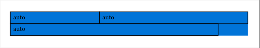
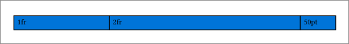
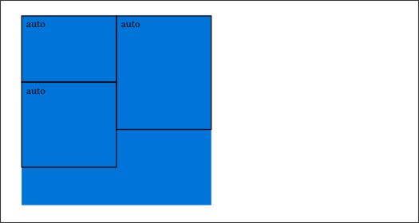
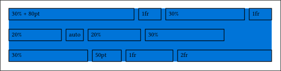

# Biceps 💪

A layout algorithm to reproduce the CSS-style flex wrapping behavior in Typst.

The Typst `grid` function provides most of the flexbox functionality, but it is insufficient when wrapping behavior is desired.

## Usage

Import your desired version of the package.
```typst
import "@preview/biceps:<version>": *
```

By default, biceps will layout items from left to right, top to bottom, respecting the item's intrinsic size (`auto`):
```typst
#box(
  fill: blue,
  flexwrap(
    rect(width: 150pt, height: 20pt)[auto],
    rect(width: 250pt, height: 20pt)[auto],
    rect(width: 350pt, height: 20pt)[auto],
  ),
)
```


Use the `flex` argument to override each item's flex behavior. You may use values of type `fraction`, `length`, `ratio`, `relative` or `auto`:
```typst
#box(
  fill: blue,
  flexwrap(
    flex: (1fr, 2fr, auto),
    rect(width: 100%, height: 20pt)[1fr],
    rect(width: 100%, height: 20pt)[2fr],
    rect(width: 50pt, height: 20pt)[50pt],
  ),
)
```


The flow directions can be set via the `main-dir` (default `ltr`) and `cross-dir` (default `ttb`) properties:
```typst
#box(
  fill: blue,
  height: 200pt,
  flexwrap(
    main-dir: ttb,
    cross-dir: ltr,
    rect(width: 100pt, height: 70pt)[auto],
    rect(width: 100pt, height: 90pt)[auto],
    rect(width: 100pt, height: 120pt)[auto],
  ),
)
```


Use the `main-spacing` or `cross-spacing` properties to create complex layouts!
```typst
#box(
  fill: blue,
  flexwrap(
    flex: (30% + 80pt, 1fr, 30%, 1fr, 20%, auto, 20%, 30%, 30%, 50pt, 1fr, 2fr),
    main-dir: ltr,
    main-spacing: 8pt,
    cross-dir: ttb,
    cross-spacing: 16pt,
    rect(width: 100%, height: 20pt)[30% + 80pt],
    rect(width: 100%, height: 20pt)[1fr],
    rect(width: 100%, height: 20pt)[30%],
    rect(width: 100%, height: 20pt)[1fr],
    rect(width: 100%, height: 20pt)[20%],
    rect(width: 30pt, height: 20pt)[auto],
    rect(width: 100%, height: 20pt)[20%],
    rect(width: 100%, height: 20pt)[30%],
    rect(width: 100%, height: 20pt)[30%],
    rect(width: 100%, height: 20pt)[50pt],
    rect(width: 100%, height: 20pt)[1fr],
    rect(width: 100%, height: 20pt)[2fr],
  ),
)
```

