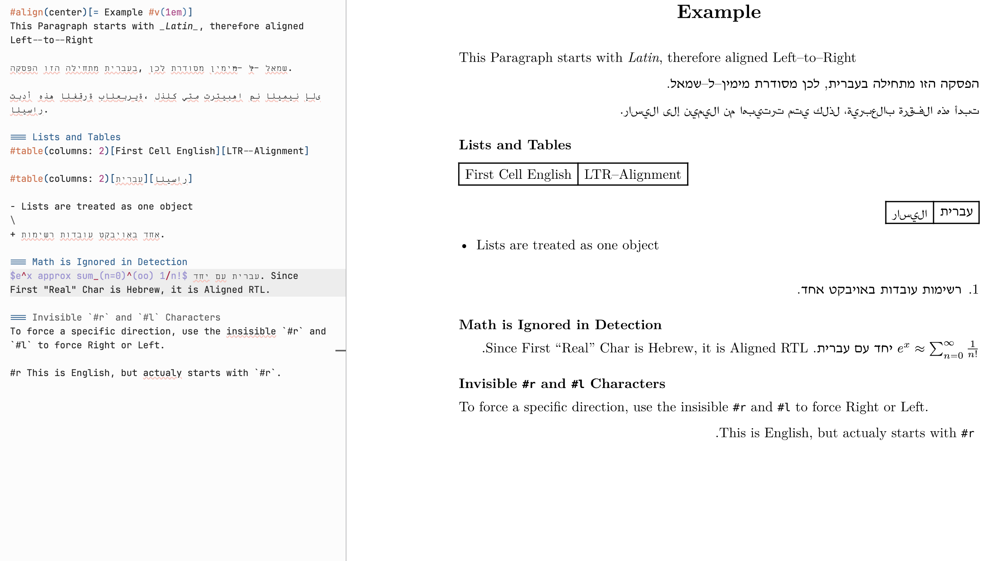

# bidi-flow

Automatic RTL/LTR direction detection for mixed-direction Typst documents.

Sets `text.dir` per block using the **first strong character** rule — the same heuristic used by most editors and the Unicode Bidi Algorithm. No manual tagging needed for most content.

## Import

```typst
// Published package import
#import "@preview/bidi-flow:0.1.0": *
```

## Quick start

```typst
#import "@preview/bidi-flow:0.1.0": *
#show: bidi-flow

= Hello        // → LTR heading
= שלום         // → RTL heading automatically

English paragraph here.

פסקה בעברית מופיעה אוטומטית מימין לשמאל.

- English list
- items here

- רשימה בעברית
- מוצגת מימין לשמאל
```

For a longer real-world example, see [`test.typ`](test.typ).



## API

### `bidi-flow`

Document-level show rule. Detects direction for `par`, `heading`, `list`, `enum`, and `table` automatically.

```typst
#show: bidi-flow
```

### `detect-dir(body)`

Inspect a content block and return its detected direction (`ltr` or `rtl`).
Useful for building your own show rules or templates.

```typst
let d = detect-dir(heading.body)
// d == rtl  or  d == ltr
set text(dir: d)
```

### Inline spans — `#rl[...]` / `#lr[...]`

Force direction for a mixed-direction fragment:

```typst
The price is #rl[₪ 100] today.       // force RTL around the price
בסוף המשפט יש מילה #lr[inline] כך.  // force LTR inside Hebrew
```

### Scope override — `#show: setrl` / `#show: setlr`

Force direction for the rest of a scope:

```typst
#show: setrl   // everything below is RTL
```

### Directional seeds — `#r` / `#l`

Zero-width invisible characters that seed the bidi shaping context.
Useful for fixing punctuation and number alignment in mixed runs:

```typst
המחיר הוא 100 #r ₪     // nudge shekel sign to correct side
```

## Local installation

```sh
mkdir -p ~/.local/share/typst/packages/local/bidi-flow/0.1.0
cp -r . ~/.local/share/typst/packages/local/bidi-flow/0.1.0/
```

Then import with `@local/bidi-flow:0.1.0`.

## Notes

- Requires Typst ≥ 0.14.0
- Direction detection ignores `math.equation` and `raw` blocks
- Works with `strong`, `emph`, `link`, and other inline wrappers
- `#r` / `#l` are content values, not functions — do not call them with brackets
