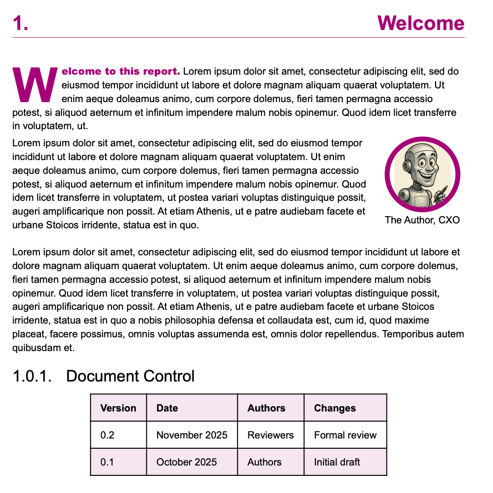

# Business Report 

This is a business report template in Typst

## Location

The source for this guide is held in an Github repository. Clone it from: 

https://github.com/garethwebber/business-report

## Editing

It is recommended to us Visual Studio code to edit the document. It can manage the connection to
the git repository and if you install _Tintmist Typst_ as a module you will get auto complete, syntax highlighting, and best of all, live preview. https://marketplace.visualstudio.com/items?itemName=myriad-dreamin.tinymist

## Dependencies

Typst must of course be installed (https://github.com/typst/typst/releases/download/v0.14.0/typst-x86_64-pc-windows-msvc.zip). The template makes use of two fonts which must be installed on the local machine:

- Font Awesome (free version): https://fontawesome.com/download

## Supporting tools 

- Producing final output is done on the command line typst compile main.typ
- Live-edit.sh will give you live previewing providing you have zathura.
- Spell-check.sh will run ispell with a custom dictionary (dictionary.txt) over all the chapters
