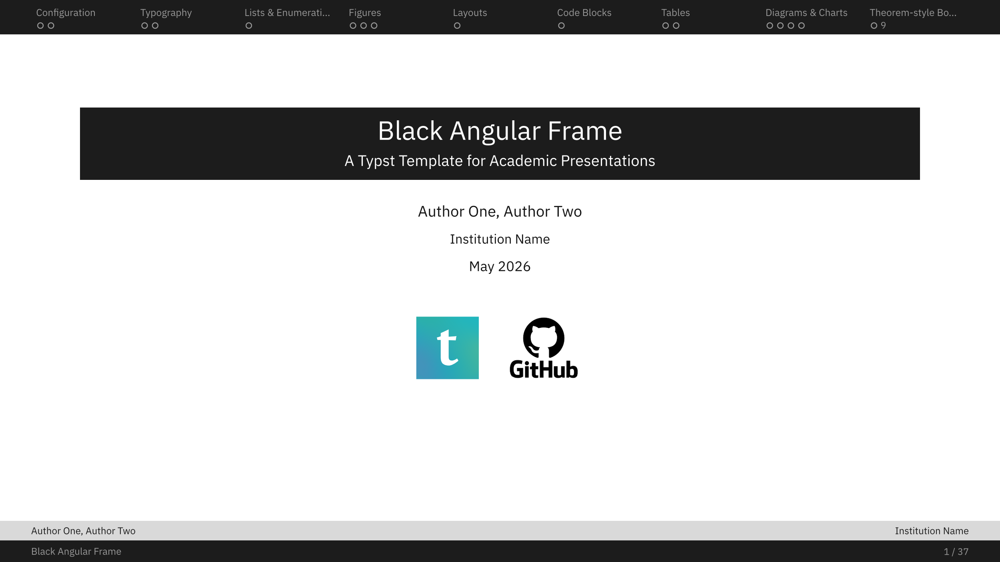

# black-angular-frame

[](https://github.com/mntsx/black-angular-frame)
[](LICENSE)

A Typst presentation template with a square, minimal, academic design language: a solid navigation bar on top, a two-level footer with page number, a tinted title strip for regular content slides, and compact box environments without wasted whitespace.



For a complete rendered demo, check the full example PDF: [example.pdf](https://github.com/mntsx/black-angular-frame/blob/570c86b53110eb6c61930ebbf3ca3f6b77ed0f9e/example.pdf).

---

## Quick start

```typst
#import "@preview/black-angular-frame:0.1.0": *

#let presentation-config = (
  title: "My Presentation",
  subtitle: "An optional subtitle",
  authors: "Alice, Bob",
  institution: "Institution Name",
  date: "May 2026",
  final-message: "Thank you for your attention",
  TOC: true,
)

#show: black-angular-frame.with(config: presentation-config)

#new-section("Introduction")

#slide(title: "First slide")[
  - Bullet one
  - Bullet two
]

#thank-you-slide
```

Initialize from the template after publication with:

```bash
typst init @preview/black-angular-frame:0.1.0
```

For local development in this repository, compile the demo with:

```bash
typst compile example.typ example.pdf --font-path assets/fonts
```

The source file is `example.typ` and the output path should be exactly `example.pdf`; this repository keeps only that generated PDF.

The local demo imports `black-angular-frame.typ` directly and uses the fonts in `assets/fonts/`. If you use VS Code + Tinymist, configure the font path manually if you want IBM Plex to be discovered from `assets/fonts/`.

---

## Template configuration

Pass configuration through `#show: black-angular-frame.with(config: presentation-config)`.

| Name | Expected value | Default | Description |
|------|----------------|---------|-------------|
| `title` | String | `""` | Presentation title. |
| `subtitle` | String | `""` | Presentation subtitle. |
| `authors` | String | `""` | Author line shown on the cover and footer. |
| `institution` | String | `""` | Institution shown on the cover and footer. |
| `date` | String | `""` | Date shown on the cover. |
| `final-message` | String | `""` | Message shown on the last slide. |
| `primary-color` | Color | `rgb("#1C1C1C")` | Main bars, highlights, numbering, and accents. |
| `secondary-color` | Color | `rgb("#D9D9D9")` | Secondary header and footer bands. |
| `background-color` | Color | `rgb("#FFFFFF")` | Slide background color. |
| `font-color` | Color | `luma(20)` | Default body text color. |
| `header-font-color-1` | Color | `_muted-nav(primary-color)` | Inactive text in the primary header band and text in the lower footer band. |
| `header-font-color-2` | Color | `primary-color` | Text in the secondary header and footer bands. |
| `header-font-color-1-highlight` | Color | `rgb("#FFFFFF")` | Active text in the primary header band. |
| `content-center` | Float 0-1 | `0.3` | Vertical position used to center content; `0` starts at the top, `1` at the bottom. |
| `content-upper-padding` | Float 0-1 | `0.05` | Top proportion of the available content area kept empty. |
| `content-lower-padding` | Float 0-1 | `0.05` | Bottom proportion of the available content area kept empty. |
| `logos` | `array[content]` | `()` | Logo images or custom content shown on the cover. |
| `TOC` | Bool | `true` | Whether to add the table of contents slide with links to each section's divider or first slide. |

The template still accepts the previous parameter names (`title-color`, `bg-color`, `cover-images`, `toc`, and related aliases) for existing documents, but new presentations should use the `config` object.

For cover logos, pass Typst content rather than path strings, for example `logos: (image("assets/logo.png", height: 45pt),)`. This keeps image paths resolved from the user document instead of from the package internals.

---

## Fonts

The template uses IBM Plex when available, with Liberation and DejaVu fallbacks. For local compilation with IBM Plex, install the fonts on your system or pass them with `--font-path`.

This repository keeps IBM Plex files in `assets/fonts/` so `example.typ` can compile locally with the intended typography. The package manifest excludes `assets/fonts/**` from the Typst Universe bundle, because Universe packages must not ship font files.

| Role | Font |
|------|------|
| Body text | IBM Plex Serif |
| Titles and UI elements | IBM Plex Sans |
| Code and verbatim | IBM Plex Mono |

Fallback chains include Liberation and DejaVu, so the template works even when IBM Plex is unavailable.

---

## Slide functions

### `#slide(title: "...", body)`

Standard content slide. Content is vertically centred in the available area.

```typst
#slide(title: "My Slide")[
  Content goes here.
]
```

### `#new-section("Name", slide-title: auto)`

Registers a section, increments the section counter, resets figure and theorem counters, updates the navigation bar label, and automatically renders the section intro slide. Use `slide-title:` when the intro slide should display a different title from the navigation label.

### `#section-slide("Name")`

Renders an extra full-page section divider manually. This is no longer needed for the normal `#new-section(...)` workflow.

### `#new-subsection("Name")`

Registers a subsection in the TOC without rendering a divider slide.

### `#thank-you-slide`

A centered italic final-message slide. Configure the displayed text with `final-message`. No parentheses — this is a content value, not a function call.

---

## Layout helpers

### `#two-col(left, right, left-width: 48%, gutter: 4%)`

Splits the slide into two columns.

```typst
#two-col(
  [Left column content],
  [Right column content],
  left-width: 55%,
)
```

---

## Figures

### `#baf-figure(caption: [...], body)`

Numbered figure. The counter resets at each `#new-section`. Reference by number in surrounding text.

```typst
#baf-figure(caption: [A diagram showing the architecture.])[
  #image("diagram.svg", width: 80%)
]
```

---

## Tables

### `#baf-table-cell(body, fill: ..., stroke: ..., pos: ...)`

Cell helper for tables built with `grid`. It applies the template table font, IBM Plex Sans by default.

```typst
#baf-table-cell(fill: luma(248), stroke: luma(200) + 0.6pt, pos: center)[88.9]
```

---

## Theorem-style boxes

All boxes display a colored header with `Kind N.M` (section.number) and an optional name panel.

| Function | Default color |
|----------|---------------|
| `#theorem(name: "...", body)` | `blue.darken(50%)` |
| `#lemma(name: "...", body)` | `blue.darken(30%)` |
| `#corollary(name: "...", body)` | `blue.darken(40%)` |
| `#proposition(name: "...", body)` | `teal.darken(30%)` |
| `#definition(name: "...", body)` | `purple.darken(20%)` |
| `#example(name: "...", body)` | `green.darken(30%)` |
| `#exercise(name: "...", body)` | `orange.darken(20%)` |
| `#remark(name: "...", body)` | `luma(90)` |
| `#proof(body)` | left-border style |
| `#baf-box("kind", name: "...", color: ..., body)` | any color |

The `color:` parameter can be overridden on any box. `#baf-box` accepts any string as the kind label.

```typst
#theorem(name: "Banach Fixed-Point Theorem")[
  Let $(M, d)$ be a complete metric space and $f$ a contraction. Then $f$ has a unique fixed point.
]

#baf-box("warning", name: "Careful!", color: red.darken(20%))[
  Do not confuse contractions with nonexpansive maps.
]
```

## Code and pseudo-code boxes

Code fragments and pseudo-code can use the same framed header style as theorem boxes, with a `type` label and optional `title`.

| Function | Purpose |
|----------|---------|
| `#code-box("...", type: "...", title: "...", lang: "...")` | Source code with optional syntax highlighting |
| `#pseudo-code("...", type: "...", title: "...")` | Pseudo-code with the same box chrome |

```typst
#code-box(
  "def train_step(x):\n  return model(x)",
  type: "Source Code",
  title: "Python",
  lang: "python",
)

#pseudo-code(
  "for t <- 1 to T\n  update theta\nend",
  title: "Training Loop",
)
```

---

## Example slides (`example.typ`)

The file `example.typ` is a complete demo presentation covering all template features. Below is a summary of each section.

### Section 1 — Configuration

- Template configuration table with name, expected value, default, and description.
- Exact Typst code used by the example presentation to import and configure the template.

### Section 2 — Typography

- Side-by-side comparison of the three IBM Plex families (Serif, Sans, Mono) with representative weight and style variants.
- Size scale from 8 pt to 18 pt; semantic use of bold, italic, color, and underline.

### Section 3 — Lists & Enumerations

- Unordered bullet list (3 levels) and ordered enumeration (3 levels) side by side in two columns.

### Section 4 — Figures

- Two numbered figures with placeholder rectangles and captions. Explains how to replace placeholders with real images.

### Section 5 — Layouts

- A two-column layout with explanatory text on the left and a content block on the right.

### Section 6 — Code Blocks

- Python source code and pseudo-code side by side, both rendered as framed boxes with a theorem-style `type | title` header.

### Section 7 — Tables

- Paper-style booktabs table (horizontal rules only) and grid-style table (full borders, colored header, alternating row shading) side by side.

### Section 8 — Diagrams & Charts

- Two block diagrams — a Transformer encoder block (matching the original color scheme: orange FFN, blue Add & Norm, green attention) and a state-space system block diagram.
- A linear-algebra kernel/image decomposition diagram and a three-state Markov chain transition graph with labeled arcs.
- A line chart of model accuracy vs. epoch (data from `assets/curves.csv`) and a grouped bar histogram of test scores by group and year (2020–2024).

### Section 9 — Theorem-style Boxes

- `#definition`, `#theorem`, `#lemma`, `#corollary`, and `#proof` environments demonstrated with the Banach fixed-point theorem and Picard–Lindelöf corollary.
- `#example`, `#exercise`, `#proposition`, and three `#baf-box` calls with custom kind labels ("note", "warning", "custom") and custom colors.

---

## Repository layout

```text
black-angular-frame/
├── typst.toml                 # Package manifest
├── black-angular-frame.typ    # Package entrypoint
├── template/
│   ├── main.typ               # typst init starter file
│   └── assets/                # Starter assets copied by typst init
│       ├── typst-logo.png     # Demo logo asset
│       └── github-logo.png    # Demo logo asset
├── thumbnail.png              # Universe thumbnail
├── example.typ                # Full local demo presentation
├── example.pdf                # Pre-compiled local demo PDF
├── assets/
│   ├── typst-logo.png         # Local demo logo asset
│   ├── github-logo.png        # Local demo logo asset
│   ├── fonts/                 # IBM Plex Serif / Sans / Mono TTF files
│   └── curves.csv             # Sample data for the line chart slide
└── README.md
```

The Typst Universe bundle is controlled by `exclude` in `typst.toml`. The local demo, generated PDFs, local fonts, Tinymist lockfile, and temporary files stay in the repository but are excluded from the published package archive.

---

## Acknowledgements

This template was visually inspired by academic Beamer themes, especially UChicago-style slide layouts. It is not affiliated with or endorsed by the University of Chicago. No University of Chicago logos or brand assets are included.

---

## License

The template code is released under the MIT License. The IBM Plex fonts kept for local demo builds are distributed under the SIL Open Font License 1.1; see `assets/fonts/OFL-1.1.txt`. Font files are excluded from the Typst Universe package bundle.
