# Blockcell

Composable block-and-cell diagrams for Typst.  
Quickly visualize memory layouts, protocol headers, register maps, cache hierarchies, and more by combining simple visual primitives.

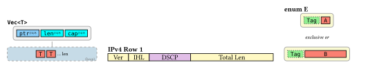

```typ
#import "@preview/blockcell:0.1.0": *

#schema(title: raw("Vec<T>"))[
  #region[
    #cell(fill: rgb("#87CEFA"))[`ptr`#sub-label[2/4/8]]
    #cell(fill: rgb("#00FFFF"))[`len`#sub-label[2/4/8]]
    #cell(fill: rgb("#00FFFF"))[`cap`#sub-label[2/4/8]]
  ]
  #connector()
  #target(fill: rgb("#C6DBE7"), label: "(heap)", width: 130pt)[
    #cell(fill: rgb("#FA8072"))[`T`]
    #cell(fill: rgb("#FA8072"))[`T`]
    #note[… len]
  ]
]
```

## Architecture

The API is organized into three composable layers:

| Layer | Purpose | Functions |
|-------|---------|-----------|
| **Layer 1 — Atoms** | Individual visual elements | `cell` `tag` `note` `badge` `sub-label` `span-label` `wrap` `brace` |
| **Layer 2 — Containers** | Grouping and structure | `region` `target` `connector` `divider` `detail` `entry-list` |
| **Layer 3 — Composites** | Complete diagram patterns | `schema` `linked-schema` `grid-row` `lane` `section` `legend` `bit-row` |

## Layer 1 — Atoms

### `cell` — Colored box

The core building block. A rectangular box with a label, color, and optional decorations.

```typ
#cell(body, fill: luma(220), width: auto, height: auto,
  stroke: 0.8pt + black, dash: none, radius: 0pt,
  inset: (x: 4pt, y: 2pt), expandable: false,
  phantom: false, overlay: none, baseline: 30%)
```

- `fill`: Background color.
- `stroke`: Border style. Accepts native Typst stroke (e.g. `3pt + gold`).
- `dash`: Border dash pattern: `none`, `"dashed"`, `"dotted"`.
- `expandable`: Shows `← ⋯ →` markers (indicates variable size).
- `phantom`: Semi-transparent + dashed border (indicates absent / zero-size).
- `overlay`: Top-right overlay marker (e.g. cache state letter).

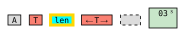

Use `.with()` to create domain-specific helpers:

```typ
#let mc = cell.with(width: 28pt, height: 20pt, inset: 2pt)
#let type-cell(body) = cell(body, fill: rgb("#FA8072"))
#let ptr-field(l: [ptr]) = cell(fill: rgb("#87CEFA"))[#l#sub-label[2/4/8]]
```

### `tag` — Marker cell

A `cell` with a dotted border and light green fill, for enum discriminants or tags.


```typ
#tag[`Tag`]
#tag(fill: rgb("#FFD700"))[`D`]
```

### `note` — Inline annotation

Small inline text for "… n times" style annotations.


```typ
#cell(fill: rgb("#FA8072"))[`T`]
#cell(fill: rgb("#FA8072"))[`T`]
#note[… n times]
```

### `badge` — Status indicator

Compact colored badge for states or alerts.


```typ
#badge[STALLED]
#badge(fill: rgb("#C8E6C9"), stroke: rgb("#2E7D32"))[HIT]
#badge(fill: rgb("#FFCDD2"), stroke: rgb("#C62828"))[MISS]
```

### `sub-label` — Subscript annotation

Field size annotation, typically used inside a `cell`.


```typ
#cell(fill: rgb("#87CEFA"))[`ptr`#sub-label[2/4/8]]
#cell(fill: rgb("#FFF9C4"))[`Length`#sub-label[2B]]
```

### `span-label` — Extent label

Horizontal span indicator `← label →`.

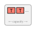

```typ
#region[
  #cell(fill: rgb("#FA8072"))[`T`]
  #cell(fill: rgb("#FA8072"))[`T`]
  #note[…]
  #span-label[capacity]
]
```

### `wrap` — Border wrapper

Adds a thick colored border around content for double-border effects (e.g. Rust's `Cell<T>`).

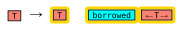

```typ
#wrap(stroke: 3pt + gold)[
  #cell(fill: salmon)[`T`]   // inner cell keeps its own thin black border
]
```

### `brace` — Horizontal brace

Marks a range of elements with a brace and label below.

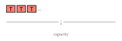

```typ
#brace(width: 160pt)[capacity]
```

## Layer 2 — Containers

### `region` — Bordered container

Groups multiple cells into a visual unit with a background and border.

```typ
#region(body, fill: luma(242), stroke: 1pt + gray, radius: 4pt,
  width: auto, content-align: center, danger: false, faded: false)
```

- `danger`: Thick red border (e.g. unsafe access).
- `faded`: Dashed border, semi-transparent (e.g. zero-size / absent).

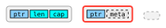

```typ
#region[
  #cell(fill: rgb("#87CEFA"))[`ptr`]
  #cell(fill: rgb("#00FFFF"))[`len`]
  #cell(fill: rgb("#00FFFF"))[`cap`]
]
```

### `target` — Referenced region

Dashed-border region with an optional bottom-right label. Represents a linked / referenced area (heap, static, etc.).

```typ
#target(body, fill: rgb("#FDECDC"), label: none, width: auto)
```

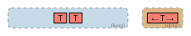

```typ
#target(fill: rgb("#C6DBE7"), label: "(heap)", width: 120pt)[
  #cell(fill: rgb("#FA8072"))[`T`]
  #cell(fill: rgb("#FA8072"))[`T`]
]
```

### `connector` — Vertical line

Links a region to its target.

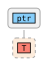

```typ
#connector(length: 8pt, stroke: 1pt + gray)
```

### `divider` — Text separator

Separates layout alternatives (e.g. enum variants).


```typ
#divider(body: [exclusive or])
```

### `detail` — Explanation bar

An explanation bar below a region.

```typ
#detail[Runtime borrow count tracked here.]
```

### `entry-list` — Vertical entry list

A vertical list of labeled entries inside a target (vtables, register maps, etc.).

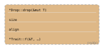

```typ
#entry-list(
  label: "(vtable)",
  ([`*Drop::drop(&mut T)`], [`size`], [`align`], [`*Trait::f(&T, …)`]),
)
```

## Layer 3 — Composites

### `schema` — Diagram container

Top-level inline container with a title and description. Multiple `schema` blocks placed adjacent flow horizontally.

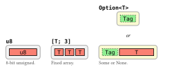

```typ
#schema(title: raw("u8"), desc: [8-bit unsigned.])[
  #region[#cell(fill: rgb("#FA8072"), width: 40pt)[`u8`]]
]#schema(title: raw("[T; 3]"), desc: [Fixed array.])[
  #region[
    #cell(fill: rgb("#FA8072"))[`T`]
    #cell(fill: rgb("#FA8072"))[`T`]
    #cell(fill: rgb("#FA8072"))[`T`]
  ]
]
```

### `linked-schema` — Fields + connector + target

The most common pattern: a top-level field region linked to a target region below.

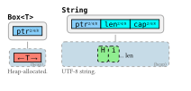

```typ
#linked-schema(
  title: raw("Box<T>"),
  desc: [Heap-allocated.],
  fields: (cell(fill: rgb("#87CEFA"))[`ptr`#sub-label[2/4/8]],),
  target-fill: rgb("#C6DBE7"),
  target-label: "(heap)",
  cell(fill: rgb("#FA8072"), expandable: true)[`T`],
)
```

### `grid-row` — Labeled row

A labeled row of cells for tabular, register, or cache diagrams. The label is vertically centered.


```typ
#grid-row(label: [Main Memory], label-width: 80pt)[
  #cell(fill: rgb("#FFE0B2"), width: 28pt, height: 20pt, inset: 2pt)[`03`]
  #cell(fill: rgb("#FFE0B2"), width: 28pt, height: 20pt, inset: 2pt)[`21`]
]
```

### `lane` — Horizontal track

Color-coded items on a horizontal track for thread or pipeline visualization.

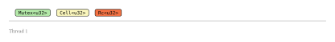

```typ
#lane(
  name: [Thread 1],
  items: (
    (label: [`Mutex<u32>`], fill: rgb("#B4E9A9")),
    (label: [`Cell<u32>`],  fill: rgb("#FBF7BD")),
    (label: [`Rc<u32>`],    fill: rgb("#F37142")),
  ),
)
```

### `section` — Titled card

A titled card container for grouping related diagrams.

```typ
#section[Cache Coherency][
  // diagrams go here
]
```

### `legend` — Color legend

One-line color legend mapping fills to labels.


```typ
#legend(
  (label: [Modified], fill: orange),
  (label: [Shared],   fill: green),
  (label: [Invalid],  fill: gray),
)
```

### `bit-row` — Proportional bit-field row

Fields scale proportionally by bit count. Designed for protocol headers and register maps.


```typ
#bit-row(total: 32, width: 400pt, fields: (
  (bits: 4,  label: [Ver],          fill: yellow),
  (bits: 4,  label: [IHL],          fill: yellow),
  (bits: 8,  label: [DSCP],         fill: purple),
  (bits: 16, label: [Total Length], fill: cyan),
))
```

- `total`: Total bit width of the row (e.g. 32).
- `width`: Total visual width.
- `fields`: Array of `(bits, label, fill)` dictionaries. Optional keys: `stroke`, `dash`.
- `show-bits`: Show bit widths as subscript (default: `true`).

## Usage Patterns

### Define a domain palette

The package has no built-in color semantics. Define your own palette per domain:

```typ
// Rust memory layout
#let C = (
  any: rgb("#FA8072"), ptr: rgb("#87CEFA"),
  sized: rgb("#00FFFF"), heap: rgb("#C6DBE7"),
  cell: rgb("#FFD700"),
)

// Network protocol
#let C = (
  header: rgb("#BBDEFB"), addr: rgb("#B2DFDB"),
  flag: rgb("#E1BEE7"), data: rgb("#DCEDC8"),
)
```

### Create helpers with `.with()`

Avoid repeating arguments:

```typ
#let mc = cell.with(width: 28pt, height: 20pt, inset: 2pt)
#let tc(body, ..args) = cell(body, fill: C.any, ..args)
#let ptr-field(l: [ptr]) = cell(fill: C.ptr)[#l#sub-label[2/4/8]]
```

### Horizontal layout

`schema` is an inline box. Place multiple `schema` blocks adjacent (no blank line between them) to flow horizontally:

```typ
#schema(title: [A])[...
]#schema(title: [B])[...    // ← immediately after the closing bracket
]#schema(title: [C])[...
]
```

If descriptions cause overflow, constrain with `width`:

```typ
#linked-schema(
  width: 160pt,
  desc: [A longer description wraps within this width.],
  // ... other arguments
)
```
