# Blockst - Scratch Blocks in Typst


Blockst renders Scratch-style programming blocks directly in Typst documents.
It is made for worksheets, tutorials, teaching material, and visual programming explanations.

## Features

- All major Scratch categories (events, motion, looks, sound, control, sensing, operators, data, custom)
- Nested control structures and custom block definitions
- Reporter/boolean/input pills and monitor widgets
- Two themes: normal and high-contrast
- Localized APIs: English, German, and French
- Optional scratch-run turtle-graphics helpers

## Quick Start

```typst
#import "@preview/blockst:0.1.0": blockst, scratch

#blockst[
  #import scratch.en: *

  #when-flag-clicked[
    #move(steps: 10)
    #say-for-secs("Hello!", secs: 2)
  ]
]
```

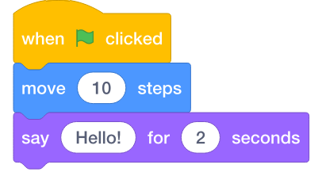

> **Font requirement:** Blockst uses **Helvetica Neue** (the same font Scratch itself uses).
> This font is pre-installed on macOS. On Linux and Windows you need to install it manually,
> or provide a compatible substitute (e.g. *Nimbus Sans* on Linux).
> Without the font, Typst will fall back to a system default and the blocks will look different.
> You can override the font globally with `set-blockst(font: "…")` — see [Custom Font example](#custom-font-set-blockst) below.

## Examples

### Events and Control Flow

```typst
#import "@preview/blockst:0.1.0": blockst, scratch

#set page(width: auto, height: auto, margin: 3mm, fill: white)

#blockst[
  #import scratch.en: *

  #when-flag-clicked[
    #set-variable-to("Score", 0)
    #repeat(times: 5)[
      #move(steps: 10)
      #if-then-else(
        touching-object("edge"),
        turn-right(degrees: 180),
        change-variable-by("Score", 1),
      )
    ]
    #say-for-secs(custom-input("Score"), secs: 2)
  ]
]
```

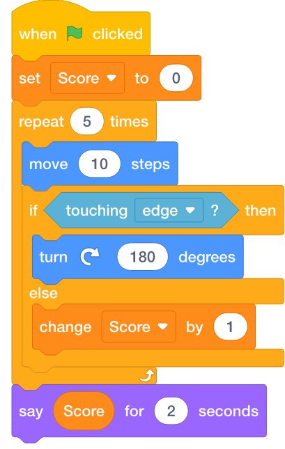

### Custom Block Definition

```typst
#import "@preview/blockst:0.1.0": blockst, scratch

#set page(width: auto, height: auto, margin: 3mm, fill: white)

#blockst[
  #import scratch.en: *

  #let draw-n-gon = custom-block(
    "draw ",
    (name: "n"),
    "-gon with side length ",
    (name: "s"),
  )

  #define(draw-n-gon, repeat(times: parameter("n"))[
    #move(steps: parameter("s"))
    #turn-right(degrees: divide(360, parameter("n")))
  ])

  #when-flag-clicked[
    #draw-n-gon(6, 40)
    #draw-n-gon(4, 60)
  ]
]
```

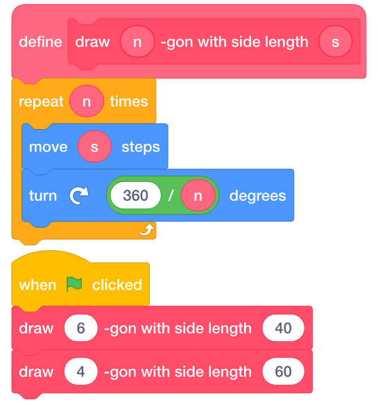

### Variable and List Monitors

```typst
#import "@preview/blockst:0.1.0": blockst, scratch

#set page(width: auto, height: auto, margin: 3mm, fill: white)

#blockst[
  #import scratch.en: *

  #when-flag-clicked[
    #set-variable-to("Highscore", 0)
    #add-to-list("Anna", "Players")
    #add-to-list("Ben", "Players")
    #add-to-list("Clara", "Players")
  ]

  // Visual monitors (like on the Scratch stage)
  #variable-display(name: "Highscore", value: 100)

  #list(
    name: "Players",
    items: ("Anna", "Ben", "Clara"),
  )
]
```

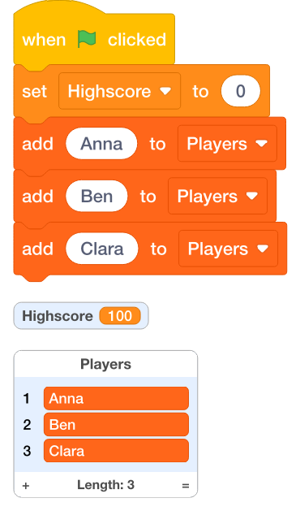

### Inline Usage (without `#blockst`)

`#blockst[]` only adds scaling. Blocks render at 1:1 size in normal document flow — useful for worksheets that mix explanatory text with individual blocks:

```typst
#import "@preview/blockst:0.1.0": scratch

#set page(width: auto, height: auto, margin: 5mm, fill: white)

#import scratch.en: *

*Without `#blockst` — 1:1 scale, place blocks anywhere in layout:*

#grid(
  columns: (auto, auto),
  gutter: 4mm,
  [*Step 1* \ Move the sprite forward.],
  when-flag-clicked[
    #move(steps: 10)
  ],

  [*Step 2* \ Repeat and turn.],
  repeat(times: 4)[
    #move(steps: 50)
    #turn-right(degrees: 90)
  ],
)
```


### Content Blocks: When to Use `[...]`

When a branch contains **multiple statements**, wrap them in a content block `[...]`.
When a branch contains only a **single statement**, pass it directly — no `[...]` needed.

```typst
#import "@preview/blockst:0.1.0": blockst, scratch

#set page(width: auto, height: auto, margin: 3mm, fill: white)

#blockst[
  #import scratch.en: *

  #when-flag-clicked[
    #if-then-else(
      touching-object("edge"),
      // Two statements → wrap in [...]
      [
        #turn-right(degrees: 180)
        #move(steps: 10)
      ],
      // Single statement → pass directly, no [...] needed
      change-variable-by("Score", 1),
    )
  ]
]
```


### Scratch-Run (Turtle Graphics)

`scratch-run` executes a list of turtle-graphics commands and renders them onto a canvas.
Import the executable API from `scratch.exec.en` (or `.de`, `.fr`).

```typst
#import "@preview/blockst:0.1.0": blockst, scratch, scratch-run, set-scratch-run

#set page(width: auto, height: auto, margin: 3mm, fill: white)

#import scratch.exec.en: *

// Simple square
#scratch-run(
  pen-down(),
  square(size: 70),
)

// Coloured square spiral — each side grows by 5 units
#set-scratch-run(show-grid: true, show-axes: true, show-cursor: false)

#scratch-run(
  set-pen-color(color: rgb("#4C97FF")),
  set-pen-size(size: 1),
  pen-down(),
  ..for i in range(1, 20) {
    (move(steps: i * 5), turn-right(degrees: 90))
  },
)

#set-scratch-run(show-grid: false, show-axes: false)
```


### Theme and Scale (`set-blockst`)

Use `set-blockst` to change the visual theme or scale of all following blocks.
Available themes: `"normal"` (default) and `"high-contrast"`.

```typst
#import "@preview/blockst:0.1.0": blockst, scratch, set-blockst

#set page(width: auto, height: auto, margin: 3mm, fill: white)

// Default: normal theme, 100% scale
#blockst[
  #import scratch.en: *

  #when-flag-clicked[
    #move(steps: 10)
    #say-for-secs("Hello!", secs: 2)
  ]
]

// High-contrast theme at 80% scale
#set-blockst(theme: "high-contrast", scale: 80%)

#blockst[
  #import scratch.en: *

  #when-flag-clicked[
    #move(steps: 10)
    #say-for-secs("Hello!", secs: 2)
  ]
]

// Reset to defaults
#set-blockst(theme: "normal", scale: 100%)
```

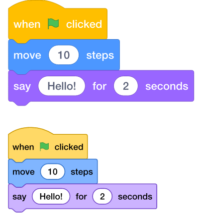

### Custom Font (`set-blockst`) {#custom-font-set-blockst}

<details>
<summary><strong>Example: Comic Sans MS</strong></summary>

```typst
#import "@preview/blockst:0.1.0": blockst, scratch, set-blockst

#set page(width: auto, height: auto, margin: 3mm, fill: white)

#set-blockst(font: "Comic Sans MS")

#blockst[
  #import scratch.en: *

  #when-flag-clicked[
    #say-for-secs("Look, Ma — Comic Sans!", secs: 2)
    #repeat(times: 3)[
      #move(steps: 10)
      #turn-right(degrees: 120)
    ]
  ]
]
```

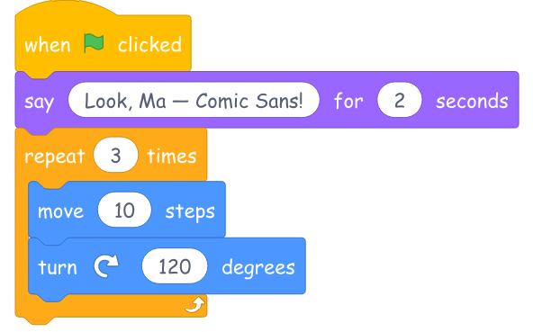

</details>

### German Localization

All block names, labels, and inputs are translated. Here the same control-flow pattern as example 1 in German:

```typst
#import "@preview/blockst:0.1.0": blockst, scratch

#set page(width: auto, height: auto, margin: 3mm, fill: white)

#blockst[
  #import scratch.de: *

  #wenn-gruene-flagge-geklickt[
    #setze-variable("Punkte", 0)
    #wiederhole(anzahl: 5)[
      #gehe(schritte: 10)
      #falls-sonst(
        wird-beruehrt("Rand"),
        drehe-rechts(grad: 180),
        aendere-variable("Punkte", 1),
      )
    ]
    #sage-fuer-sekunden(eigene-eingabe("Punkte"), sekunden: 2)
  ]
]
```

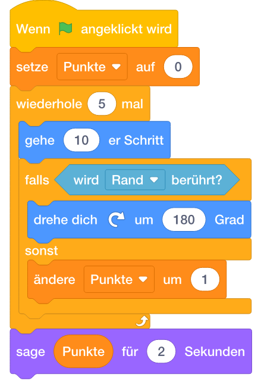

### Container and Settings

```typst
#blockst[ ... ]
#set-blockst(theme: "normal", scale: 100%, stroke-width: 1pt)
```

### Language Modules

```typst
#import scratch.en: *
#import scratch.de: *
#import scratch.fr: *
```

### scratch-run

```typst
#import "@preview/blockst:0.1.0": scratch-run, set-scratch-run
#import scratch.exec.en: *
```

## Complete English Block Catalog

<details>
<summary><strong>Events</strong></summary>

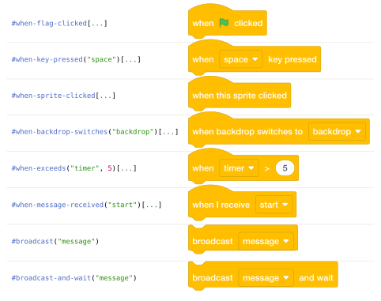

</details>

<details>
<summary><strong>Motion</strong></summary>

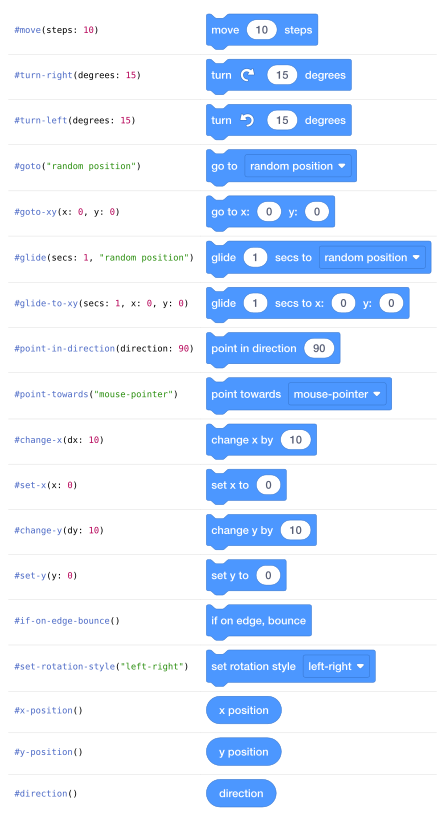

</details>

<details>
<summary><strong>Looks</strong></summary>

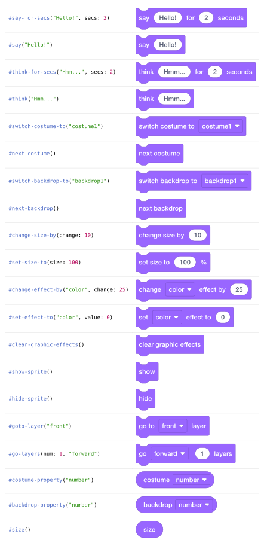

</details>

<details>
<summary><strong>Sound</strong></summary>

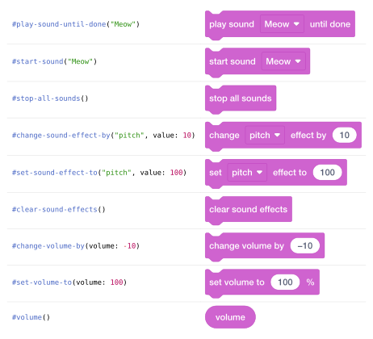

</details>

<details>
<summary><strong>Pen</strong></summary>

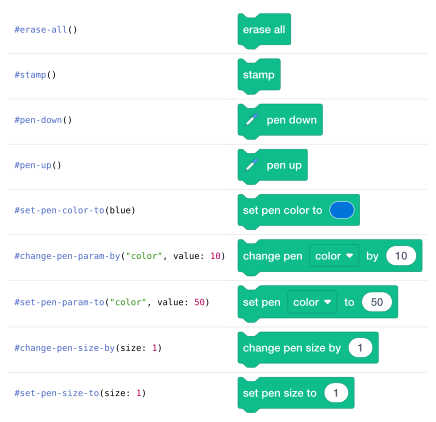

</details>

<details>
<summary><strong>Control</strong></summary>


</details>

<details>
<summary><strong>Sensing</strong></summary>

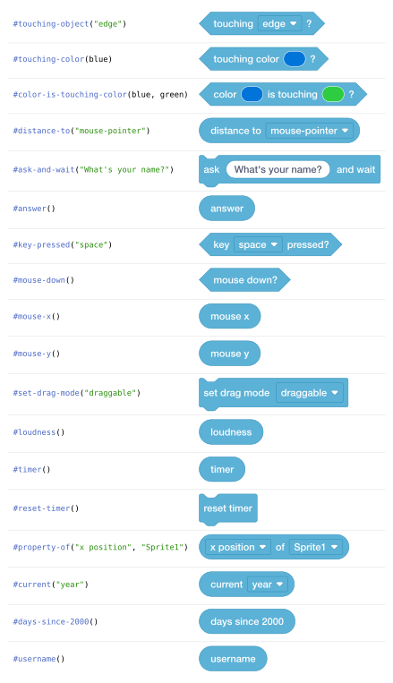

</details>

<details>
<summary><strong>Operators</strong></summary>

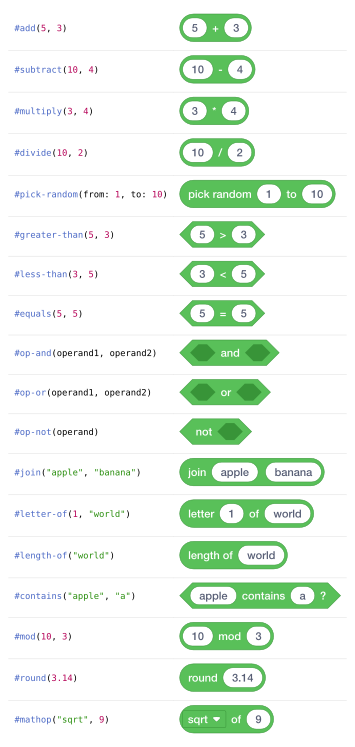

</details>

<details>
<summary><strong>Variables</strong></summary>

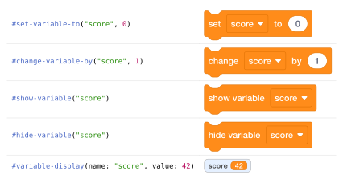

</details>

<details>
<summary><strong>Lists</strong></summary>

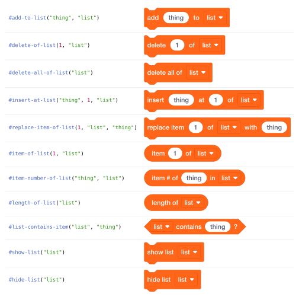

</details>

<details>
<summary><strong>Custom Blocks</strong></summary>


</details>

## Contributing

Contributions are welcome: bug reports, missing blocks, API polish, docs, and new localizations.
